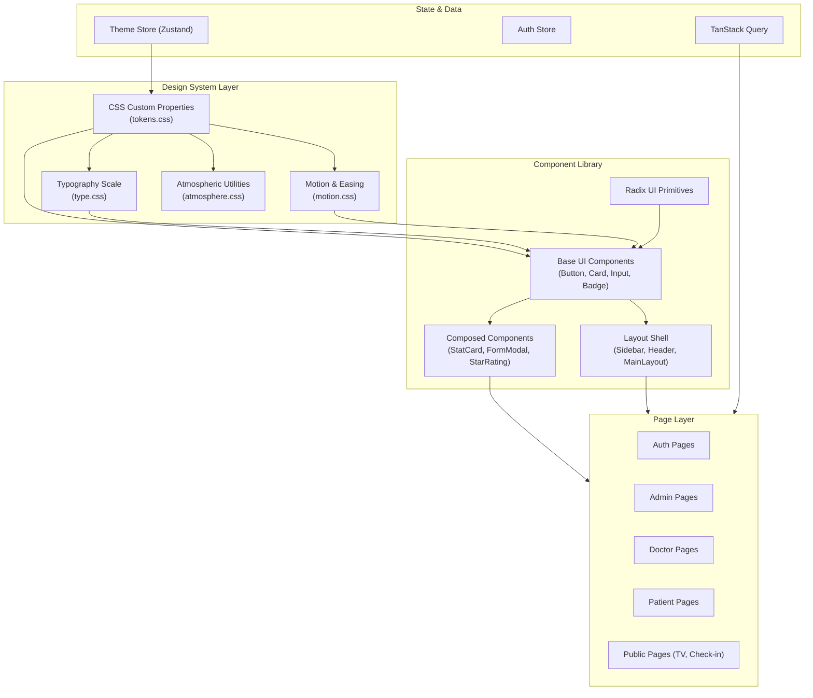
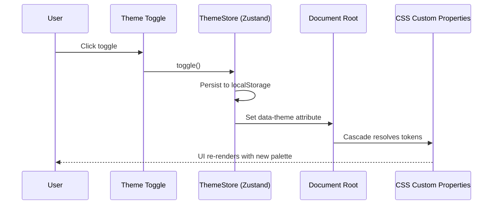
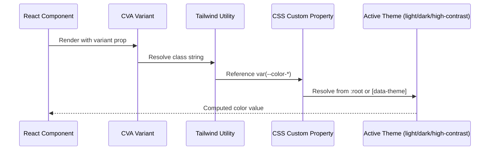

# Design Document: Frontend Design Migration

## Overview

This design covers the migration of MediQueue's frontend from its current generic Tailwind/Radix styling to a concept-led design system aligned with the project's aesthetic philosophy. The product mood is **"soft machine medical"** — a blend of editorial warmth (for trust and readability in a healthcare context) with bright modern product optimism (for the creator-tool feel of a smart queue system). The dark mode variant leans into high-contrast neon energy for the TV display and real-time queue surfaces.

The migration is non-destructive: existing functionality, routing, state management, and API layer remain untouched. We evolve the visual skin — typography, color tokens, spacing rhythm, component surfaces, interaction states, and atmospheric layers — without breaking the product.

The design system is built on CSS custom properties as the single source of truth, consumed by Tailwind utilities and CVA component variants. This ensures the system is framework-portable, theme-switchable, and maintainable at scale.

## Architecture



## Sequence Diagrams

### Theme Application Flow



### Design System Token Resolution



## Components and Interfaces

### Component 1: Design Token Provider

**Purpose**: Defines and manages the CSS custom property layer that all components consume. Replaces the current HSL-based token system with a semantic, concept-driven token architecture.

**Interface**:
```typescript
// tokens.css is the source of truth — no runtime JS needed
// Theme switching is handled via data-theme attribute on <html>

interface DesignTokens {
  // Surface hierarchy
  '--surface-ground': string      // Page background
  '--surface-raised': string      // Cards, panels
  '--surface-overlay': string     // Modals, popovers
  '--surface-sunken': string      // Inset areas, code blocks

  // Text hierarchy
  '--text-primary': string        // Headlines, primary content
  '--text-secondary': string      // Body text, descriptions
  '--text-tertiary': string       // Captions, metadata
  '--text-inverse': string        // Text on filled surfaces

  // Brand & semantic colors
  '--accent-primary': string      // Primary actions, links
  '--accent-secondary': string    // Secondary emphasis
  '--accent-success': string      // Positive states
  '--accent-warning': string      // Caution states
  '--accent-danger': string       // Destructive states
  '--accent-info': string         // Informational states

  // Category colors (stable across product)
  '--category-admin': string
  '--category-doctor': string
  '--category-patient': string
  '--category-queue': string

  // Typography
  '--font-display': string        // Headlines: Fraunces or Space Grotesk
  '--font-body': string           // Body: Plus Jakarta Sans (current)
  '--font-mono': string           // Code/data: JetBrains Mono

  // Spacing scale (8px base)
  '--space-1': string             // 4px
  '--space-2': string             // 8px
  '--space-3': string             // 12px
  '--space-4': string             // 16px
  '--space-6': string             // 24px
  '--space-8': string             // 32px
  '--space-12': string            // 48px
  '--space-16': string            // 64px

  // Radii
  '--radius-sm': string           // 6px — inputs, badges
  '--radius-md': string           // 12px — cards, buttons
  '--radius-lg': string           // 16px — panels, modals
  '--radius-full': string         // 9999px — pills, avatars

  // Motion
  '--ease-out': string            // cubic-bezier(0.22, 1, 0.36, 1)
  '--ease-spring': string         // cubic-bezier(0.34, 1.56, 0.64, 1)
  '--duration-fast': string       // 150ms
  '--duration-normal': string     // 250ms
  '--duration-slow': string       // 400ms

  // Elevation
  '--shadow-sm': string
  '--shadow-md': string
  '--shadow-lg': string
  '--shadow-glow': string         // Accent-colored glow
}
```

**Responsibilities**:
- Define all visual tokens as CSS custom properties
- Support light, dark, and high-contrast (TV display) themes
- Provide semantic naming that maps to design intent, not raw values

### Component 2: Typography System

**Purpose**: Establishes a type hierarchy that immediately communicates the product's identity — editorial warmth for trust, geometric precision for data.

**Interface**:
```typescript
interface TypographyScale {
  // Display — used for hero headlines, page titles
  'display-xl': { font: 'var(--font-display)'; size: 'clamp(2.5rem, 5vw, 3.5rem)'; weight: 700; lineHeight: 1.1; letterSpacing: '-0.03em' }
  'display-lg': { font: 'var(--font-display)'; size: 'clamp(2rem, 4vw, 2.75rem)'; weight: 700; lineHeight: 1.15; letterSpacing: '-0.025em' }

  // Heading — section headers, card titles
  'heading-lg': { font: 'var(--font-body)'; size: '1.5rem'; weight: 700; lineHeight: 1.3; letterSpacing: '-0.02em' }
  'heading-md': { font: 'var(--font-body)'; size: '1.25rem'; weight: 700; lineHeight: 1.35; letterSpacing: '-0.015em' }
  'heading-sm': { font: 'var(--font-body)'; size: '1rem'; weight: 600; lineHeight: 1.4; letterSpacing: '-0.01em' }

  // Body — readable content
  'body-lg': { font: 'var(--font-body)'; size: '1rem'; weight: 400; lineHeight: 1.6 }
  'body-md': { font: 'var(--font-body)'; size: '0.875rem'; weight: 400; lineHeight: 1.5 }
  'body-sm': { font: 'var(--font-body)'; size: '0.8125rem'; weight: 400; lineHeight: 1.5 }

  // Label — UI chrome, badges, navigation
  'label-lg': { font: 'var(--font-body)'; size: '0.875rem'; weight: 600; lineHeight: 1; letterSpacing: '0.01em' }
  'label-md': { font: 'var(--font-body)'; size: '0.75rem'; weight: 600; lineHeight: 1; letterSpacing: '0.02em' }
  'label-sm': { font: 'var(--font-body)'; size: '0.6875rem'; weight: 600; lineHeight: 1; letterSpacing: '0.04em'; textTransform: 'uppercase' }

  // Mono — queue numbers, data, timestamps
  'mono-xl': { font: 'var(--font-mono)'; size: 'clamp(3rem, 10vw, 6rem)'; weight: 800; lineHeight: 1 }
  'mono-lg': { font: 'var(--font-mono)'; size: '1.5rem'; weight: 700; lineHeight: 1.2 }
  'mono-md': { font: 'var(--font-mono)'; size: '0.875rem'; weight: 500; lineHeight: 1.4 }
}
```

### Component 3: Button (Migrated)

**Purpose**: Primary interactive element with tactile feedback, gradient CTAs, and concept-appropriate variants.

**Interface**:
```typescript
import { cva, type VariantProps } from 'class-variance-authority'

const buttonVariants = cva(
  // Base: tactile press, focus ring, disabled state
  'inline-flex items-center justify-center gap-2 font-semibold transition-all active:scale-[0.97] focus-visible:outline-none focus-visible:ring-2 focus-visible:ring-offset-2 disabled:pointer-events-none disabled:opacity-50',
  {
    variants: {
      variant: {
        primary: string    // Gradient CTA with glow shadow
        secondary: string  // Subtle filled surface
        outline: string    // Border-only, hover fill
        ghost: string      // No background, hover tint
        danger: string     // Destructive gradient
        success: string    // Positive gradient
        glass: string      // Frosted glass on dark surfaces
      },
      size: {
        sm: string         // h-8, text-xs, rounded-lg
        md: string         // h-10, text-sm, rounded-xl
        lg: string         // h-12, text-base, rounded-xl
        xl: string         // h-14, text-base, rounded-2xl
        icon: string       // square, rounded-xl
      }
    }
  }
)

interface ButtonProps extends React.ButtonHTMLAttributes<HTMLButtonElement>,
  VariantProps<typeof buttonVariants> {
  loading?: boolean
  leftIcon?: React.ReactNode
  rightIcon?: React.ReactNode
}
```

### Component 4: Card (Migrated)

**Purpose**: Primary content container with surface hierarchy, hover lift, and atmospheric variants.

**Interface**:
```typescript
const cardVariants = cva(
  'rounded-[var(--radius-lg)] transition-all',
  {
    variants: {
      surface: {
        raised: string     // Default card — subtle shadow, border
        glass: string      // Frosted glass — backdrop-blur
        elevated: string   // Stronger shadow, no border
        sunken: string     // Inset background for nested content
        interactive: string // Hover lift + border glow
      },
      padding: {
        none: string
        sm: string         // p-4
        md: string         // p-6
        lg: string         // p-8
      }
    }
  }
)

interface CardProps extends React.HTMLAttributes<HTMLDivElement>,
  VariantProps<typeof cardVariants> {
  as?: 'div' | 'article' | 'section'
}
```

### Component 5: StatCard (Migrated)

**Purpose**: Dashboard metric display with category color coding, number animation, and trend indicators.

**Interface**:
```typescript
interface StatCardProps {
  title: string
  value: string | number
  icon: LucideIcon
  category: 'admin' | 'doctor' | 'patient' | 'queue' | 'success' | 'warning'
  trend?: { value: number; direction: 'up' | 'down' | 'flat' }
  animate?: boolean  // Number pop-in animation
}
```

## Data Models

### Theme Configuration Model

```typescript
type ThemeMode = 'light' | 'dark' | 'high-contrast'

interface ThemeConfig {
  mode: ThemeMode
  accentHue: number           // Allow per-role accent customization
  reducedMotion: boolean      // Respect prefers-reduced-motion
  fontScale: number           // Accessibility: 0.875 | 1 | 1.125 | 1.25
}

// Extended theme store
interface ThemeState {
  config: ThemeConfig
  setMode: (mode: ThemeMode) => void
  toggleMode: () => void
  setFontScale: (scale: number) => void
  setReducedMotion: (reduced: boolean) => void
}
```

**Validation Rules**:
- `accentHue` must be 0-360
- `fontScale` must be one of [0.875, 1, 1.125, 1.25]
- `mode` must be one of the defined ThemeMode values
- System preference (prefers-color-scheme) is respected on first load

### Design Token Schema

```typescript
interface TokenSchema {
  colors: {
    surface: Record<'ground' | 'raised' | 'overlay' | 'sunken', string>
    text: Record<'primary' | 'secondary' | 'tertiary' | 'inverse', string>
    accent: Record<'primary' | 'secondary' | 'success' | 'warning' | 'danger' | 'info', string>
    category: Record<'admin' | 'doctor' | 'patient' | 'queue', string>
  }
  typography: {
    families: Record<'display' | 'body' | 'mono', string>
    scale: Record<string, { size: string; weight: number; lineHeight: number; letterSpacing?: string }>
  }
  spacing: Record<string, string>
  radii: Record<'sm' | 'md' | 'lg' | 'full', string>
  motion: {
    easing: Record<'out' | 'spring' | 'bounce', string>
    duration: Record<'fast' | 'normal' | 'slow', string>
  }
  elevation: Record<'sm' | 'md' | 'lg' | 'glow', string>
}
```

## Algorithmic Pseudocode

### Theme Resolution Algorithm

```typescript
function resolveTheme(config: ThemeConfig): void {
  const root = document.documentElement

  // Step 1: Set theme attribute for CSS cascade
  root.setAttribute('data-theme', config.mode)

  // Step 2: Apply font scale
  root.style.setProperty('--font-scale', String(config.fontScale))

  // Step 3: Apply reduced motion preference
  if (config.reducedMotion) {
    root.setAttribute('data-reduced-motion', 'true')
  } else {
    root.removeAttribute('data-reduced-motion')
  }

  // Step 4: Apply accent hue override if non-default
  if (config.accentHue !== DEFAULT_ACCENT_HUE) {
    root.style.setProperty('--accent-hue', String(config.accentHue))
  }
}
```

**Preconditions:**
- `config` is a valid ThemeConfig object
- DOM is available (not SSR context)

**Postconditions:**
- `data-theme` attribute is set on `<html>`
- CSS custom properties cascade correctly for the chosen theme
- All components re-render with new token values via CSS cascade (no JS re-render needed)

### Stagger Animation Algorithm

```typescript
function applyStaggerReveal(
  container: HTMLElement,
  selector: string,
  options: { delay: number; duration: number; distance: number }
): void {
  const items = container.querySelectorAll(selector)

  // Precondition: items exist and IntersectionObserver is available
  if (items.length === 0) return

  const observer = new IntersectionObserver(
    (entries) => {
      entries.forEach((entry) => {
        if (entry.isIntersecting) {
          const index = Array.from(items).indexOf(entry.target as Element)
          const element = entry.target as HTMLElement

          element.style.transitionDelay = `${index * options.delay}ms`
          element.style.transitionDuration = `${options.duration}ms`
          element.classList.add('revealed')

          observer.unobserve(entry.target)
        }
      })
    },
    { threshold: 0.1, rootMargin: '0px 0px -50px 0px' }
  )

  items.forEach((item) => observer.observe(item))
}
```

**Preconditions:**
- Container element exists in DOM
- Items matching selector exist within container
- `options.delay` > 0, `options.duration` > 0

**Postconditions:**
- Each item receives a staggered reveal animation when scrolled into view
- Observer is cleaned up after all items are revealed
- Respects `prefers-reduced-motion` (skip animation, show immediately)

**Loop Invariant:**
- All previously observed items that entered the viewport have been revealed and unobserved

## Key Functions with Formal Specifications

### Function: createTokenCSS()

```typescript
function createTokenCSS(schema: TokenSchema, mode: ThemeMode): string
```

**Preconditions:**
- `schema` contains all required token categories
- `mode` is a valid ThemeMode

**Postconditions:**
- Returns a valid CSS string with all custom properties defined
- Properties are scoped to `[data-theme="${mode}"]` selector
- All color values are valid CSS color strings
- All spacing values use rem units

### Function: migrateComponent()

```typescript
function migrateComponent(
  component: 'button' | 'card' | 'input' | 'badge' | 'dialog',
  currentClasses: string
): string
```

**Preconditions:**
- `component` is a recognized component type
- `currentClasses` is a valid Tailwind class string

**Postconditions:**
- Returns updated class string using new design tokens
- Preserves all functional classes (layout, display, position)
- Replaces color/spacing/radius classes with token-based equivalents
- No visual regression in component dimensions or layout

### Function: getMotionConfig()

```typescript
function getMotionConfig(reducedMotion: boolean): MotionConfig {
  if (reducedMotion) {
    return { duration: '0ms', easing: 'linear', stagger: 0 }
  }
  return {
    duration: 'var(--duration-normal)',
    easing: 'var(--ease-out)',
    stagger: 40 // ms between items
  }
}
```

**Preconditions:**
- `reducedMotion` reflects user's system preference or manual override

**Postconditions:**
- Returns motion configuration that respects accessibility preferences
- When reduced motion is true, all animations are effectively disabled
- Stagger value is always non-negative

## Example Usage

### Token Usage in Components

```typescript
// Button using design tokens via Tailwind
<Button variant="primary" size="lg">
  Book Appointment
</Button>

// Renders with classes that reference tokens:
// bg-[var(--accent-primary)] text-[var(--text-inverse)]
// shadow-[var(--shadow-glow)] rounded-[var(--radius-md)]
// transition-all duration-[var(--duration-fast)]
// hover:brightness-110 active:scale-[0.97]
```

### Typography in Page Headers

```typescript
// Dashboard header with editorial display type
<header className="space-y-2">
  <h1 className="font-display text-display-lg text-[var(--text-primary)]">
    Selamat Pagi, Dr. Budi 👋
  </h1>
  <p className="text-body-lg text-[var(--text-secondary)]">
    4 pasien menunggu di antrian hari ini
  </p>
</header>
```

### Card with Interactive Surface

```typescript
// Stat card with category color and hover lift
<Card surface="interactive" padding="md">
  <div className="flex items-center justify-between">
    <div>
      <p className="text-label-md text-[var(--text-tertiary)]">Antrian Hari Ini</p>
      <p className="font-mono text-mono-lg text-[var(--text-primary)] mt-1">24</p>
    </div>
    <div className="p-3 rounded-[var(--radius-md)] bg-[var(--category-queue)]/10">
      <ClipboardList className="size-5 text-[var(--category-queue)]" />
    </div>
  </div>
</Card>
```

### Theme Store Usage

```typescript
// Extended theme store with design system support
const useThemeStore = create<ThemeState>()(
  persist(
    (set, get) => ({
      config: {
        mode: 'light',
        accentHue: 200,
        reducedMotion: false,
        fontScale: 1,
      },
      setMode: (mode) => {
        set({ config: { ...get().config, mode } })
        resolveTheme({ ...get().config, mode })
      },
      toggleMode: () => {
        const modes: ThemeMode[] = ['light', 'dark', 'high-contrast']
        const current = modes.indexOf(get().config.mode)
        const next = modes[(current + 1) % modes.length]
        get().setMode(next)
      },
      setFontScale: (fontScale) => {
        set({ config: { ...get().config, fontScale } })
        resolveTheme({ ...get().config, fontScale })
      },
      setReducedMotion: (reducedMotion) => {
        set({ config: { ...get().config, reducedMotion } })
        resolveTheme({ ...get().config, reducedMotion })
      },
    }),
    { name: 'mediqueue-theme' }
  )
)
```

## Correctness Properties

*A property is a characteristic or behavior that should hold true across all valid executions of a system — essentially, a formal statement about what the system should do. Properties serve as the bridge between human-readable specifications and machine-verifiable correctness guarantees.*

### Property 1: Token Completeness

*For any* component render in the system, all color, spacing, radius, and motion values used by that component SHALL reference a defined CSS custom property (no hardcoded values), and every referenced token SHALL exist in the active theme's token schema.

**Validates: Requirements 1.1, 1.2, 1.3, 1.4, 1.5**

### Property 2: Theme Consistency

*For any* theme T ∈ {light, dark, high-contrast}, switching to T SHALL cause the data-theme attribute to update and all CSS custom properties to resolve to T's defined values within a single paint frame, without triggering React component re-renders for color updates.

**Validates: Requirements 2.2, 2.3, 2.8, 12.1, 12.2**

### Property 3: Contrast Compliance

*For any* theme mode and any text/surface token pair (text-primary, text-secondary, text-tertiary on surface-ground, surface-raised, surface-overlay), the computed contrast ratio SHALL be ≥ 4.5:1 for body text and ≥ 3:1 for large text (display and heading scales).

**Validates: Requirements 9.1, 9.2, 9.3, 9.4**

### Property 4: Motion Safety

*For any* motion configuration where prefers-reduced-motion: reduce is active OR config.reducedMotion === true, the getMotionConfig function SHALL return duration of 0ms and stagger of 0, and no element SHALL have a computed animation-duration or transition-duration > 0ms (except opacity fades ≤ 150ms).

**Validates: Requirements 8.1, 8.2, 8.3, 8.4**

### Property 5: Layout Stability

*For any* page and any theme switch operation, the token changes SHALL affect only color, shadow, and opacity properties — never dimensions, padding, margin, or position — resulting in zero Cumulative Layout Shift. All animations SHALL use only transform and opacity properties.

**Validates: Requirements 2.8, 7.3, 12.4**

### Property 6: Category Color Stability

*For any* category C ∈ {admin, doctor, patient, queue} and any active theme mode, the color token --category-C SHALL resolve to a single stable value that is identical across all pages and components where C is referenced.

**Validates: Requirements 13.1, 13.2, 13.3, 6.2**

### Property 7: Font Loading Resilience

*For any* custom font failure scenario, the fallback font (system-ui) SHALL render without layout shift due to size-adjust in @font-face declarations, and font-display: swap SHALL be specified for all custom font declarations.

**Validates: Requirements 11.1, 11.2, 11.3, 11.4**

### Property 8: Interactive Feedback

*For any* interactive element (button, link, card with onClick) and any CVA variant, the element SHALL have distinct visual states for: default, hover, focus-visible, active/pressed, and disabled — with hover response using var(--duration-fast) and active state applying a pressed visual treatment.

**Validates: Requirements 14.1, 14.2, 14.3, 14.4, 14.5**

### Property 9: Theme Persistence Round-Trip

*For any* valid ThemeConfig object, persisting it to localStorage and then hydrating the Theme_Store SHALL produce an equivalent configuration. For any corrupted or invalid persisted data, hydration SHALL produce the default configuration (mode: 'light', fontScale: 1, reducedMotion: false).

**Validates: Requirements 2.4, 2.5, 2.6, 15.4**

### Property 10: Theme Configuration Validation

*For any* input value for accentHue, fontScale, or mode, the Theme_Store SHALL accept only values within their valid domains (accentHue: 0-360, fontScale: [0.875, 1, 1.125, 1.25], mode: ['light', 'dark', 'high-contrast']) and reject all others while maintaining the current valid state.

**Validates: Requirements 15.1, 15.2, 15.3, 3.7, 10.1, 10.3**

### Property 11: Font Scale Bounds

*For any* valid font scale value and any typography scale entry in the body category, the computed text size (base size × font scale) SHALL fall within the readable range of 12px to 48px, and the --font-scale CSS custom property SHALL reflect the active scale value.

**Validates: Requirements 3.6, 10.2, 10.4**

### Property 12: Stagger Delay Sequencing

*For any* stagger-reveal container with N child elements, the child at index i SHALL receive a transition-delay of exactly i × baseDelay milliseconds, producing a sequential reveal pattern from first to last.

**Validates: Requirements 7.2**

## Error Handling

### Error Scenario 1: Font Loading Failure

**Condition**: Google Fonts CDN is unreachable or font file fails to download
**Response**: System falls back to `font-display: swap` with system font stack. No layout shift occurs because font metrics are matched via `size-adjust` in @font-face.
**Recovery**: Fonts are cached by service worker on first successful load. Subsequent visits use cached fonts.

### Error Scenario 2: Theme Persistence Corruption

**Condition**: localStorage contains invalid theme config (corrupted JSON, invalid mode value)
**Response**: ThemeStore's `onRehydrateStorage` validates the persisted state. Invalid values fall back to defaults (`mode: 'light'`, `fontScale: 1`).
**Recovery**: Valid defaults are immediately persisted, overwriting corrupted data.

### Error Scenario 3: CSS Custom Property Undefined

**Condition**: A component references a token that doesn't exist in the current theme (e.g., new token added but not defined in all themes)
**Response**: CSS `var()` with fallback value: `var(--accent-primary, #38bdf8)`. Build-time linting catches undefined tokens.
**Recovery**: Token schema validation runs in CI to ensure all themes define all required tokens.

### Error Scenario 4: Reduced Motion Not Respected

**Condition**: Animation plays despite user's reduced-motion preference
**Response**: Global CSS rule `@media (prefers-reduced-motion: reduce) { *, *::before, *::after { animation-duration: 0.01ms !important; transition-duration: 0.01ms !important; } }` acts as safety net.
**Recovery**: Component-level motion hooks check `getMotionConfig()` before applying any animation.

## Testing Strategy

### Unit Testing Approach

- Test each CVA variant generates correct class strings
- Test ThemeStore state transitions (mode cycling, font scale bounds)
- Test token resolution function produces valid CSS
- Test motion config respects reduced-motion flag
- Use Vitest with React Testing Library

### Property-Based Testing Approach

**Property Test Library**: fast-check

- **Token completeness property**: For any randomly generated component render, all referenced CSS variables exist in the token schema
- **Contrast property**: For any random theme mode and text/surface pair, computed contrast meets WCAG AA
- **Idempotent theme switching**: Applying the same theme twice produces identical DOM state
- **Font scale bounds**: Any font scale value produces text sizes within readable range (12px–48px for body)

### Integration Testing Approach

- Visual regression tests using Playwright screenshots across all three themes
- Verify no layout shift (CLS) when toggling themes
- Verify stagger animations complete within expected timeframes
- Test responsive breakpoints maintain design intent at 320px, 768px, 1024px, 1440px

## Performance Considerations

- **Zero-runtime token system**: CSS custom properties cascade without JavaScript. Theme switching is a single DOM attribute change — no React re-renders needed for color updates.
- **Font loading strategy**: Use `font-display: swap` with preconnect hints. Critical fonts (body) loaded via `<link rel="preload">`. Display fonts loaded async.
- **Animation performance**: All animations use `transform` and `opacity` only (compositor-friendly). No layout-triggering properties animated.
- **Bundle impact**: Design system adds ~0 JS bytes (pure CSS). Font files add ~60-80KB total (woff2, subset to Latin + Latin Extended).
- **Tailwind v4 optimization**: Tailwind v4's engine tree-shakes unused utilities at build time. Token-based classes are statically analyzable.

## Security Considerations

- **No user-controlled CSS injection**: Theme tokens are predefined. User preferences (mode, font scale) are validated against allowlists before application.
- **Content Security Policy**: Font loading uses `font-src` directive. No inline styles generated from user input.
- **localStorage validation**: Theme persistence data is validated on hydration. Malformed data is discarded, not executed.

## Dependencies

| Dependency | Purpose | Status |
|---|---|---|
| `tailwindcss` v4 | Utility CSS framework | Already installed |
| `class-variance-authority` | Component variant management | Already installed |
| `clsx` + `tailwind-merge` | Class composition | Already installed |
| `@radix-ui/*` | Accessible primitives | Already installed |
| `lucide-react` | Icon system | Already installed |
| `zustand` | Theme state management | Already installed |
| Google Fonts (Space Grotesk, JetBrains Mono) | Typography | New — CDN link |
| `@fontsource/space-grotesk` (optional) | Self-hosted display font | New — optional |
| `@fontsource/jetbrains-mono` (optional) | Self-hosted mono font | New — optional |

No new runtime JS dependencies required. The migration is purely CSS + component class updates.
