# Design Document: Frontend Pages Overhaul

## Overview

This design covers the complete page-level overhaul of MediQueue's frontend — every authenticated and public page across Admin, Doctor, and Patient role groups — applying the "soft machine medical" design system established by the `frontend-design-migration` spec.

**Product Mood**: "Soft machine medical" — editorial warmth (Space Grotesk headlines, warm paper surfaces, serif-like gravitas) fused with modern product optimism (Plus Jakarta Sans body, bright category accents, tactile interactions). The result is a clinic application that feels authored, trustworthy, and alive.

**Layered Architecture**: This overhaul builds ON TOP of the existing foundation:
- Design tokens (CSS custom properties in `tokens.css`)
- CVA component primitives (Button, Card, StatCard)
- Theme system (light/dark/high-contrast via ThemeStore + ThemeResolver)
- Motion system (`use-stagger-reveal`, `motion.ts`, `interactive.css`)
- Typography scale (`type.css`)
- Font loading strategy (`fonts.css`)

**Non-Destructive Constraints**: The overhaul preserves:
- All react-router-dom route paths (bookmarked URLs remain valid)
- API_Client request/response contracts (no backend changes)
- Auth_Store, ThemeStore, ThemeResolver public interfaces
- TanStack Query key structure (`query-keys.ts`)
- WebSocket event names and payload shapes
- Existing Zustand store shapes (extended by addition only)


## Architecture

### High-Level System Architecture

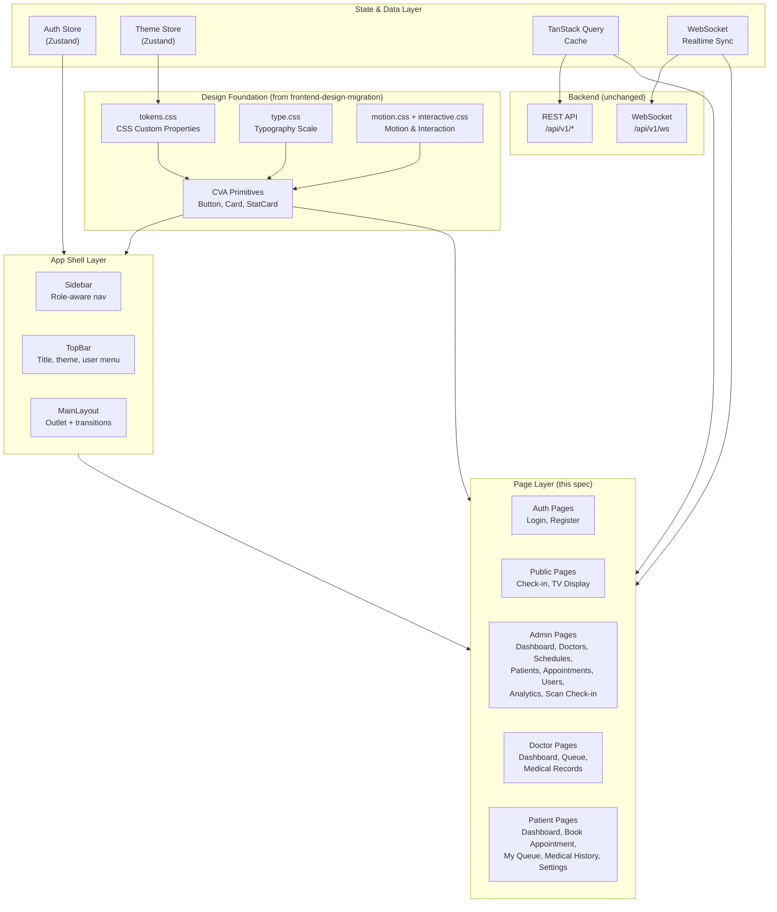


### Routing and Role Gate Architecture

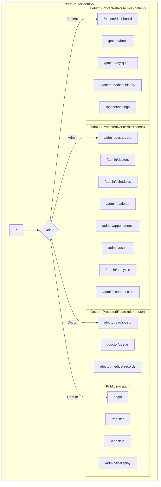


## Use Case Diagrams

### Admin Use Cases

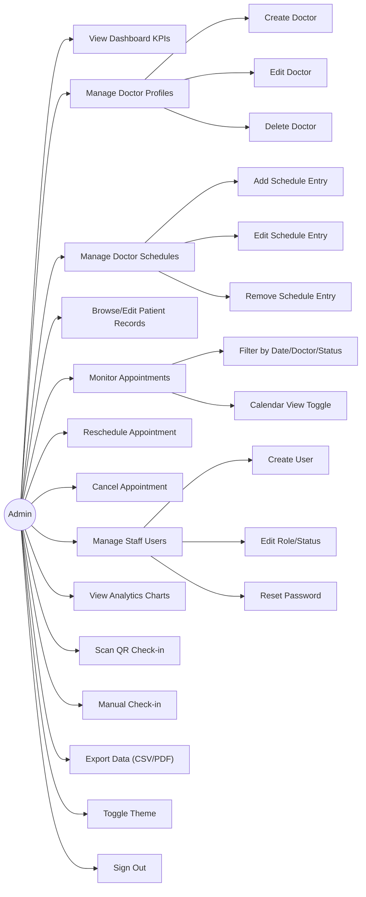

### Doctor Use Cases

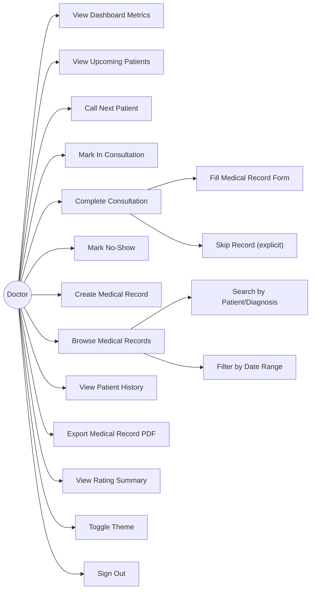

### Patient Use Cases

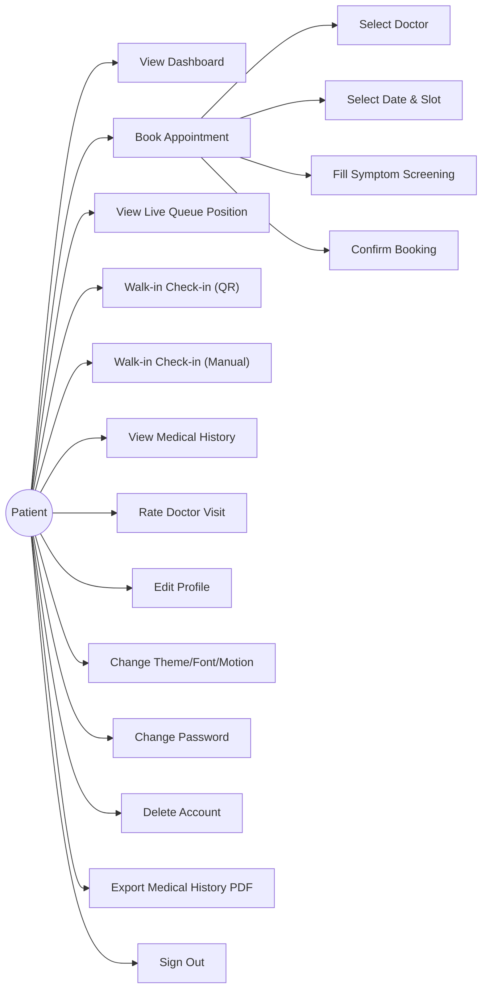


## Activity Diagrams

### Flow 1: Patient Appointment Booking (Requirement 17)

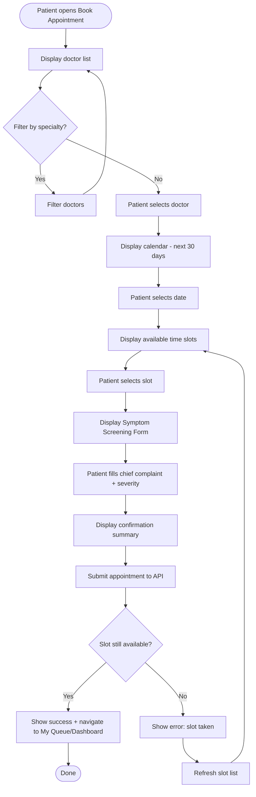

### Flow 2: Patient Walk-in Check-in (Requirement 3)

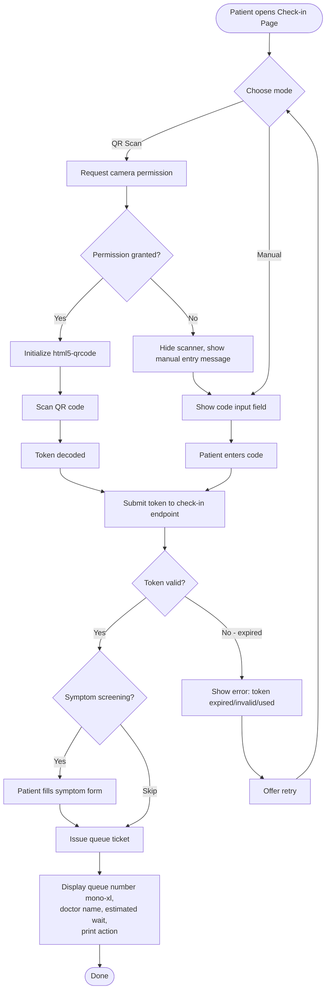

### Flow 3: Doctor Queue Call & Complete (Requirement 14)

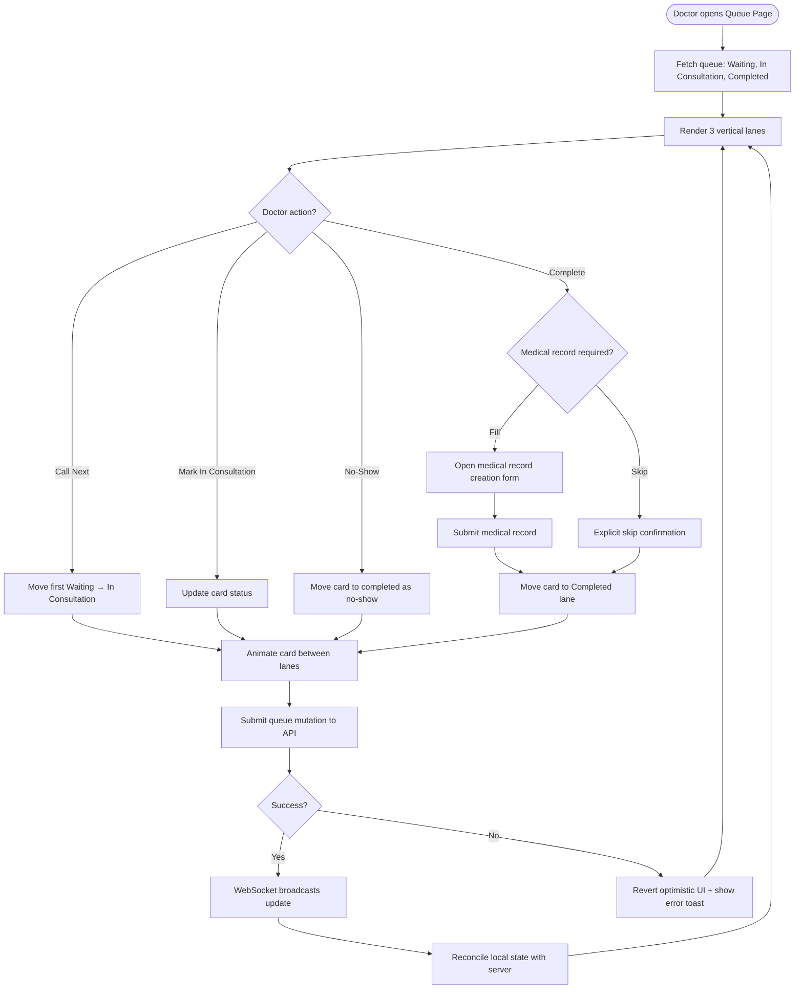

### Flow 4: Admin Scan Check-in (Requirement 12)

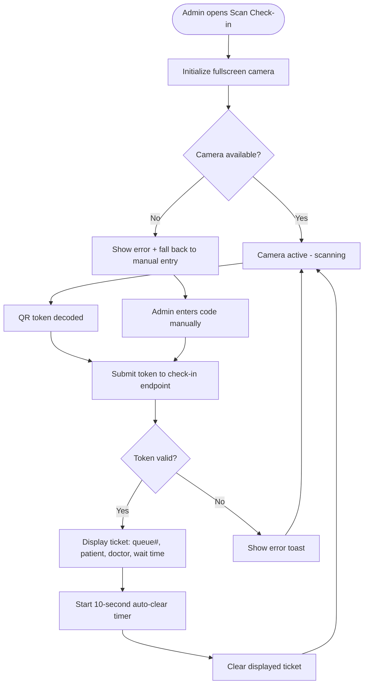

### Flow 5: Admin Appointment Reschedule (Requirement 9)

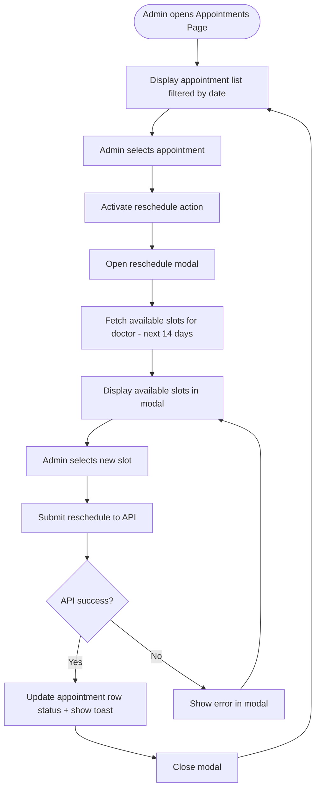


## Data Flow Diagrams

### Data Flow: Appointment Booking

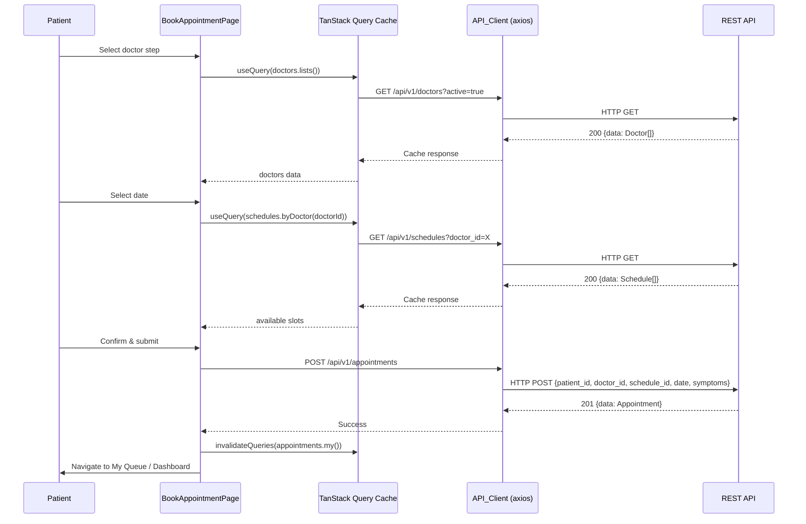

### Data Flow: Real-Time Queue Updates

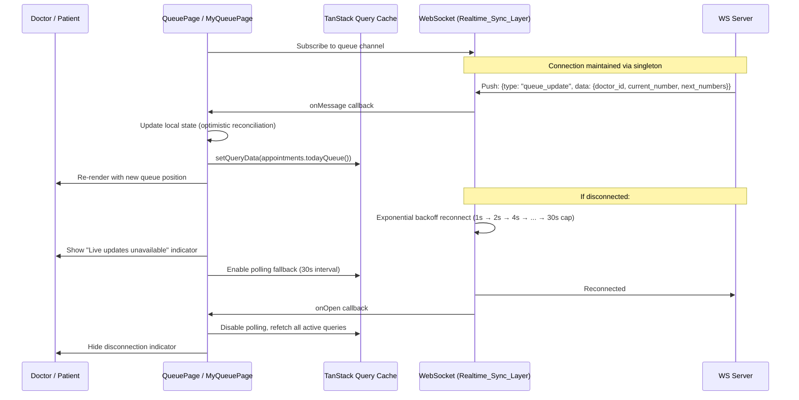

### Data Flow: Admin Dashboard Real-Time

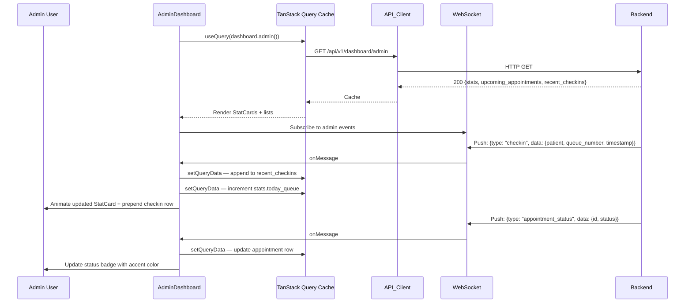


## Navigation Map

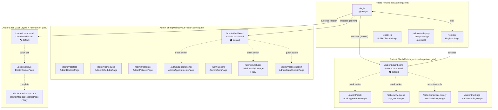


## State Ownership Map

| State | Owner | Scope | Persistence | Consumers |
|-------|-------|-------|-------------|-----------|
| Authenticated user + JWT | Auth_Store (Zustand) | Global | localStorage / sessionStorage | All pages, API_Client interceptor |
| Theme config (mode, fontScale, reducedMotion) | Theme_Store (Zustand) | Global | localStorage | ThemeResolver, all pages via CSS cascade |
| Doctor list | TanStack Query (`doctors.lists()`) | Cache | Memory (staleTime: 5min) | AdminDoctorsPage, BookAppointmentPage, AdminSchedulesPage |
| Schedule list | TanStack Query (`schedules.byDoctor(id)`) | Cache | Memory (staleTime: 5min) | AdminSchedulesPage, BookAppointmentPage |
| Appointment list | TanStack Query (`appointments.lists()`) | Cache | Memory (staleTime: 1min) | AdminAppointmentsPage |
| My appointments | TanStack Query (`appointments.my()`) | Cache | Memory (staleTime: 1min) | PatientDashboard, PatientMyQueuePage |
| Today's queue | TanStack Query (`appointments.todayQueue()`) | Cache | Memory (staleTime: 30s) | DoctorQueuePage, DoctorDashboard |
| Dashboard stats | TanStack Query (`dashboard.admin/doctor/patient()`) | Cache | Memory (staleTime: 30s) | Dashboard pages |
| Analytics data | TanStack Query (`analytics.all`) | Cache | Memory (staleTime: 5min) | AdminAnalyticsPage |
| Patient list | TanStack Query (`patients.lists()`) | Cache | Memory (staleTime: 5min) | AdminPatientsPage |
| User list | TanStack Query (`users.lists()`) | Cache | Memory (staleTime: 5min) | AdminUsersPage |
| Medical records | TanStack Query (`medicalRecords.*`) | Cache | Memory (staleTime: 5min) | DoctorMedicalRecordsPage, PatientMedicalHistoryPage |
| Ratings | TanStack Query (`ratings.*`) | Cache | Memory (staleTime: 10min) | DoctorDashboard, PatientMedicalHistoryPage |
| WebSocket connection state | `useWebSocket` hook ref | Singleton per tab | Memory | All real-time pages |
| Live queue position | Component-local + WS push | Component | Memory | PatientMyQueuePage, DoctorQueuePage, TVDisplayPage |
| Sidebar open/collapsed | Component-local (MainLayout) | Component | Memory | MainLayout |
| Sidebar scroll position | DOM (preserved across route) | Component | Memory | MainLayout |
| Form draft state | Component-local (react-hook-form) | Component | Memory | All form pages |
| Booking wizard step + data | Component-local (useState) | Component | Memory (lost on unmount) | BookAppointmentPage |
| Search/filter inputs | URL search params | URL | URL bar | List pages (debounced) |
| Date range filters | URL search params | URL | URL bar | AdminAppointmentsPage, AdminAnalyticsPage |
| Active route | react-router-dom | URL | URL bar | App_Shell active state |
| Page title | Derived from route | Computed | — | TopBar |
| Notification indicator count | TanStack Query (future) | Cache | Memory | TopBar |


## Components and Interfaces

### Component 1: App Shell (MainLayout)

**Purpose**: Persistent layout chrome wrapping all authenticated pages — sidebar, top bar, page content area with route transitions.

**Interface**:
```typescript
// MainLayout wraps <Outlet /> from react-router-dom
// No props — derives state from AuthStore and current route

interface MainLayoutState {
  sidebarOpen: boolean        // Desktop: always true; Mobile: toggle via menu button
  sidebarCollapsed: boolean   // Tablet (768-1023px): icon-only mode
}

// Sidebar navigation items derived from role
interface NavItem {
  label: string
  path: string
  icon: LucideIcon
  badge?: number              // Notification count (optional)
}

function getNavItems(role: 'admin' | 'doctor' | 'patient'): NavItem[]
```

**Responsibilities**:
- Render persistent sidebar (full on ≥1024px, icon-only on 768-1023px, drawer on <768px)
- Render top bar with page title, theme toggle, notification indicator, user menu
- Apply category color to active nav item (`--category-admin`, `--category-doctor`, `--category-patient`)
- Preserve sidebar scroll position across route changes
- Apply fade transition (`var(--duration-normal)`) to page content on route change
- Handle sign-out action (clear Auth_Store → redirect to /login within 300ms)
- Redirect unauthorized role access to role's default landing page + show notification

### Component 2: ProtectedRoute

**Purpose**: Role-gating wrapper that checks Auth_Store before rendering child routes.

**Interface**:
```typescript
interface ProtectedRouteProps {
  allowedRoles: Array<'admin' | 'doctor' | 'patient'>
}
```

**Behavior**:
- If not authenticated → redirect to `/login`
- If authenticated but role not in `allowedRoles` → redirect to role's default landing + show toast
- If authenticated and role matches → render `<Outlet />`

### Component 3: PageHeader

**Purpose**: Consistent page header with display typography, optional subtitle, and action slot.

**Interface**:
```typescript
interface PageHeaderProps {
  title: string
  subtitle?: string
  actions?: React.ReactNode
  category?: 'admin' | 'doctor' | 'patient' | 'queue'
}
```

### Component 4: DataTable

**Purpose**: Reusable paginated table for admin list pages with responsive card fallback.

**Interface**:
```typescript
interface Column<T> {
  key: keyof T | string
  label: string
  render?: (row: T) => React.ReactNode
  sortable?: boolean
  width?: string
}

interface DataTableProps<T> {
  columns: Column<T>[]
  data: T[]
  loading?: boolean
  pagination?: { page: number; totalPages: number; onPageChange: (p: number) => void }
  onRowClick?: (row: T) => void
  emptyState?: React.ReactNode
  searchValue?: string
  onSearchChange?: (value: string) => void
  searchPlaceholder?: string
}
```

**Responsive behavior**: At <768px, renders as stacked card list with same fields visible.

### Component 5: EmptyState

**Purpose**: Consistent empty state with illustration, message, and suggested action.

**Interface**:
```typescript
interface EmptyStateProps {
  icon: LucideIcon
  title: string
  description: string
  action?: { label: string; onClick: () => void }
}
```

### Component 6: ErrorState

**Purpose**: Consistent error display with message, category, and retry action.

**Interface**:
```typescript
interface ErrorStateProps {
  title?: string
  message: string
  category?: 'network' | 'forbidden' | 'server' | 'validation'
  onRetry?: () => void
  retryLabel?: string
}
```

### Component 7: LoadingSkeleton

**Purpose**: Skeleton placeholder matching the shape of the content being loaded.

**Interface**:
```typescript
interface LoadingSkeletonProps {
  variant: 'card' | 'table-row' | 'stat-card' | 'form' | 'list-item'
  count?: number
}
```

### Component 8: SymptomScreeningForm

**Purpose**: Shared form for capturing pre-visit symptoms during booking and check-in.

**Interface**:
```typescript
interface SymptomScreeningFormProps {
  onSubmit: (data: SymptomData) => void
  onSkip?: () => void
  loading?: boolean
}

interface SymptomData {
  chief_complaint: string
  severity: 'mild' | 'moderate' | 'severe'
  notes?: string
}
```

### Component 9: QueueTicketCard

**Purpose**: Displays issued queue ticket with mono-xl number, doctor, wait time.

**Interface**:
```typescript
interface QueueTicketCardProps {
  queueNumber: number
  doctorName: string
  estimatedWaitMinutes: number
  patientName?: string
  onPrint?: () => void
}
```

### Component 10: StarRating

**Purpose**: 1-5 star input/display component for patient ratings.

**Interface**:
```typescript
interface StarRatingProps {
  value: number
  onChange?: (value: number) => void
  readonly?: boolean
  size?: 'sm' | 'md' | 'lg'
}
```


## Page Composition Specs

### Login Page

**Component Tree**:
```
LoginPage
├── AtmosphericBackground (design tokens only)
├── BrandMark (MediQueue logo)
├── DisplayHeadline (font-display, display-lg)
├── LoginForm (react-hook-form + zod)
│   ├── EmailInput (label + input + error)
│   ├── PasswordInput (label + input + error)
│   ├── RememberMeCheckbox
│   └── Button[variant=primary, size=lg, loading]
├── InlineError (non-dismissive, preserves email)
└── LinkToRegister
```

**Data Dependencies**: None (form submission only)
**Real-time**: None

### Admin Dashboard

**Component Tree**:
```
AdminDashboard
├── PageHeader[title="Dashboard", category=admin]
├── StatCardGrid (6 cards, stagger reveal)
│   ├── StatCard[total appointments, category=admin]
│   ├── StatCard[total check-ins, category=queue]
│   ├── StatCard[completed visits, category=admin]
│   ├── StatCard[no-shows, category=danger]
│   ├── StatCard[avg wait time, category=queue]
│   └── StatCard[active doctors, category=doctor]
├── QuickActionBar
│   ├── Button → /admin/scan-checkin
│   ├── Button → /admin/appointments
│   └── Button → /admin/analytics
├── UpcomingAppointmentsList (next 10 today)
│   └── AppointmentRow[patient, doctor, time, status badge]
└── RecentCheckInsList (last 30 min)
    └── CheckInRow[patient, queue#, timestamp]
```

**Data Dependencies**: `useQuery(dashboard.admin())`
**Real-time**: WebSocket `checkin` and `appointment_status` events → update stats + lists

### Doctor Queue Page

**Component Tree**:
```
DoctorQueuePage
├── PageHeader[title="Antrian Pasien", category=doctor]
├── QueueLanes (3-column grid, responsive to stack)
│   ├── Lane[label="Menunggu", color=queue]
│   │   └── PatientCard[] (animated transitions)
│   │       ├── QueueNumber (mono-lg)
│   │       ├── PatientName
│   │       ├── ScheduledTime
│   │       ├── ChiefComplaint (truncated)
│   │       └── ActionMenu[Call, Mark IC, No-Show]
│   ├── Lane[label="Konsultasi", color=doctor]
│   │   └── PatientCard[]
│   │       └── ActionMenu[Complete]
│   └── Lane[label="Selesai", color=success]
│       └── PatientCard[] (read-only)
├── CallNextButton[variant=primary, size=xl]
└── MedicalRecordModal (on complete)
```

**Data Dependencies**: `useQuery(appointments.todayQueue())`
**Real-time**: WebSocket `queue_update` events → reconcile lanes within 1000ms

### Patient My Queue Page

**Component Tree**:
```
PatientMyQueuePage
├── PageHeader[title="Antrian Saya", category=patient]
├── QueueHeroCard (when active ticket exists)
│   ├── QueueNumber (mono-xl, animated)
│   ├── DoctorName
│   ├── CurrentPosition
│   ├── EstimatedWait
│   ├── ProgressVisualization (transform + opacity only)
│   └── "You are next" notice (when position === 1)
├── InConsultationConfirmation (when status = in_consultation)
└── EmptyState (when no active ticket)
    └── Actions → Book Appointment / Walk-in Check-in
```

**Data Dependencies**: `useQuery(appointments.my())`
**Real-time**: WebSocket `queue_update` events → update position within 1000ms, aria-live announcement

### TV Display Page

**Component Tree**:
```
TVDisplayPage (no App Shell)
├── FullscreenContainer[dark/high-contrast theme]
├── ClinicHeader[logo, date, time]
├── DoctorQueueGrid
│   └── DoctorColumn[] (per active doctor)
│       ├── DoctorName
│       ├── CurrentlyServing (mono-xl, highlight animation)
│       └── NextThree[queue numbers]
├── ReconnectionIndicator (when WS disconnected)
└── IdleAnimation (clock + date after 60s no change)
```

**Data Dependencies**: WebSocket-driven (no REST polling unless disconnected)
**Real-time**: WebSocket `queue_update` → update numbers within 1000ms + highlight animation
**Audio**: Chime on queue call if URL param `sound=on`

### Patient Book Appointment Page

**Component Tree**:
```
BookAppointmentPage
├── PageHeader[title="Buat Janji", category=patient]
├── StepIndicator[current step 1/2/3]
├── Step1: SelectDoctor
│   ├── SpecialtyFilter
│   └── DoctorCardGrid
│       └── DoctorCard[name, specialty, rating, next available]
├── Step2: SelectDateTime
│   ├── CalendarGrid[next 30 days, slot count annotations]
│   └── TimeSlotList[available slots for selected day]
├── Step3: ConfirmAndSubmit
│   ├── SymptomScreeningForm
│   ├── BookingSummary[doctor, date, time, symptoms]
│   └── Button[variant=primary, "Konfirmasi"]
└── ErrorState (slot taken → refresh + return to step 2)
```

**Data Dependencies**: `useQuery(doctors.lists())`, `useQuery(schedules.byDoctor(id))`
**Real-time**: None (slot availability checked at submit time)


## Real-Time Integration Design

### WebSocket Singleton Architecture

The existing `useMediQueueWebSocket` hook provides a per-component WebSocket connection. For the overhaul, we introduce a **singleton pattern** at the App level:

```typescript
// Singleton WebSocket manager (extends existing hook pattern)
interface RealtimeSyncLayer {
  // Connection state
  isConnected: boolean
  reconnectAttempt: number

  // Channel subscription
  subscribe(channel: string, handler: (data: any) => void): () => void
  unsubscribe(channel: string): void

  // Connection management
  connect(): void
  disconnect(): void
}
```

**Design decisions**:
1. **Single connection per tab** — regardless of how many pages subscribe (Req 25.1)
2. **Channel-based subscription** — pages subscribe on mount, unsubscribe on unmount (Req 25.2)
3. **Exponential backoff reconnect** — 1s → 2s → 4s → 8s → 16s → 30s cap (Req 25.3)
4. **Polling fallback** — when disconnected, affected queries poll at 30s interval (Req 25.4)
5. **Reconnect refetch** — on reconnect, all active query caches are refetched once (Req 25.5)

### Event Types and Consumers

| WebSocket Event | Payload Shape | Consumer Pages |
|----------------|---------------|----------------|
| `queue_update` | `{doctor_id, current_number, next_numbers[], waiting_count}` | DoctorQueuePage, PatientMyQueuePage, TVDisplayPage, AdminDashboard |
| `checkin` | `{patient_name, queue_number, doctor_id, timestamp}` | AdminDashboard, DoctorDashboard |
| `appointment_status` | `{appointment_id, status, updated_at}` | AdminDashboard, AdminAppointmentsPage |
| `doctor_status` | `{doctor_id, is_active}` | AdminDashboard (active doctor count) |

### Disconnection UX

```
┌─────────────────────────────────────────────┐
│  ⚠️ Pembaruan langsung tidak tersedia       │
│  Mencoba menghubungkan kembali...           │
│  [Data terakhir diperbarui: 14:32:05]       │
└─────────────────────────────────────────────┘
```

- Non-blocking banner at top of affected page content
- Uses `aria-live="polite"` for screen reader announcement
- Auto-dismisses when connection restores


## Visual Design Specs

### Category Color Application

| Domain | Token | Hex (light) | Usage |
|--------|-------|-------------|-------|
| Admin | `--category-admin` | `#7c3aed` (violet-600) | Sidebar active state, StatCard accents, page chrome |
| Doctor | `--category-doctor` | `#0284c7` (sky-600) | Sidebar active state, StatCard accents, queue lane headers |
| Patient | `--category-patient` | `#059669` (emerald-600) | Sidebar active state, StatCard accents, booking flow |
| Queue | `--category-queue` | `#b45309` (amber-700) | Queue numbers, wait time metrics, TV display numbers |

### Typography Application by Context

| Context | Token | Font | Example |
|---------|-------|------|---------|
| Page titles | `display-lg` | Space Grotesk 700 | "Selamat Pagi, Dr. Budi 👋" |
| Section headers | `heading-lg` | Plus Jakarta Sans 700 | "Antrian Hari Ini" |
| Card titles | `heading-sm` | Plus Jakarta Sans 600 | "Total Pasien" |
| Body text | `body-lg` | Plus Jakarta Sans 400 | Descriptions, paragraphs |
| Table cells | `body-md` | Plus Jakarta Sans 400 | Data values |
| Labels/badges | `label-sm` | Plus Jakarta Sans 600 uppercase | "ADMIN", "MENUNGGU" |
| Queue numbers (hero) | `mono-xl` | JetBrains Mono 800 | "A-024" |
| Queue numbers (card) | `mono-lg` | JetBrains Mono 700 | "A-024" |
| Timestamps | `mono-md` | JetBrains Mono 500 | "14:30" |

### Atmospheric Layers

1. **Surface ground** (`--surface-ground`): Page background — warm off-white in light, deep charcoal in dark
2. **Surface raised** (`--surface-raised`): Cards, panels — white in light, slate-800 in dark
3. **Surface overlay** (`--surface-overlay`): Modals, popovers — white with `--shadow-lg`
4. **Surface sunken** (`--surface-sunken`): Inset areas, nested content — slightly darker than ground

### Stagger Reveal Patterns

- **Dashboard StatCards**: 6 cards, stagger delay 60ms each, `--ease-out`, `--duration-normal`
- **List items**: stagger delay 40ms, max 10 items animated (rest appear immediately)
- **Queue lane cards**: stagger delay 50ms per card within each lane
- **Doctor cards (booking)**: stagger delay 80ms, `--ease-spring` for playful feel

All stagger animations:
- Use `transform: translateY(8px)` + `opacity: 0` → `translateY(0)` + `opacity: 1`
- Respect `prefers-reduced-motion` and `data-reduced-motion` (skip to final state)
- Triggered by IntersectionObserver (threshold 0.1)

### Status Badge Color Mapping

| Status | Token | Visual |
|--------|-------|--------|
| Scheduled / Waiting | `--accent-info` | Blue badge |
| Checked-in | `--accent-warning` | Amber badge |
| In Consultation | `--category-doctor` | Sky badge |
| Completed | `--accent-success` | Green badge |
| Cancelled | `--accent-danger` | Red badge |
| No-show | `--text-tertiary` | Gray badge |


## Error, Empty, and Loading State Design

### Loading States

Every page that fetches data on mount displays skeleton placeholders matching the shape of the expected content:

| Page Type | Skeleton Pattern |
|-----------|-----------------|
| Dashboard | 6 StatCard skeletons + 2 list skeletons (3 rows each) |
| List/Table page | Search bar + 5 table-row skeletons |
| Detail page | Header skeleton + form-field skeletons |
| Queue page | 3 lane skeletons with 2 card skeletons each |
| Chart page | 4 chart-area skeletons |

Skeleton styling:
- Background: `--surface-sunken` with shimmer animation (linear gradient sweep)
- Border radius matches target component (`--radius-md` for cards, `--radius-sm` for rows)
- Shimmer disabled when `prefers-reduced-motion` is active

### Empty States

Each empty state includes:
1. **Icon** — relevant Lucide icon at 48px, colored with `--text-tertiary`
2. **Title** — `heading-md`, describes what's missing
3. **Description** — `body-md`, explains why and what to do
4. **Action** — Button linking to the most logical next step

| Page | Empty Condition | Message | Action |
|------|----------------|---------|--------|
| PatientDashboard | No appointments + no queue | "Belum ada jadwal" | "Buat Janji Temu" |
| PatientMyQueue | No active ticket | "Tidak ada antrian aktif" | "Buat Janji" / "Check-in" |
| DoctorQueue | No patients waiting | "Belum ada pasien menunggu" | — |
| AdminDoctors | No doctors (unlikely) | "Belum ada dokter terdaftar" | "Tambah Dokter" |
| Analytics chart | No data for range | "Tidak ada data untuk rentang ini" | "Ubah Rentang Tanggal" |

### Error States

Error states follow a consistent pattern:

```
┌─────────────────────────────────────────┐
│  ⚠️ [Error Icon]                        │
│                                         │
│  [Title based on category]              │
│  [Description of what went wrong]       │
│                                         │
│  [Retry Button]  [Secondary Action]     │
└─────────────────────────────────────────┘
```

| Error Category | Title | Behavior |
|---------------|-------|----------|
| Network | "Koneksi Terputus" | Retry button, auto-retry once after 2s for 5xx |
| 401 Unauthorized | — | Auto-redirect to login within 300ms |
| 403 Forbidden | "Akses Ditolak" | Explain role restriction, link to home |
| Validation | "Data Tidak Valid" | Inline field errors, preserve input |
| Server (5xx) | "Terjadi Kesalahan" | Retry button, auto-retry once after 2s |
| Slot taken (booking) | "Slot Tidak Tersedia" | Refresh slots, return to step 2 |

All error states:
- Use `aria-live="assertive"` for critical errors (401, network)
- Use `aria-live="polite"` for recoverable errors
- Combine color with icon + text (never color alone) for accessibility


## Performance Design

### Code Splitting Strategy

| Route | Loading Strategy | Rationale |
|-------|-----------------|-----------|
| `/login`, `/register` | Eager (bundled with app) | Critical path, must load instantly |
| `/admin/dashboard` | Eager (within admin chunk) | Admin landing page |
| `/admin/analytics` | Lazy (`React.lazy`) | Heavy charts (recharts), not always visited |
| `/admin/tv-display` | Lazy | Standalone page, rarely loaded in same session |
| `/doctor/dashboard` | Eager (within doctor chunk) | Doctor landing page |
| `/doctor/medical-records` | Lazy | Large form, not always visited |
| `/patient/dashboard` | Eager (within patient chunk) | Patient landing page |
| All other routes | Lazy (per existing App.tsx) | Already lazy-loaded |

### Bundle Budget

- Total JS addition: ≤50KB gzipped beyond `frontend-design-migration` baseline (Req 24.5)
- recharts is already a dependency — no new chart library
- html5-qrcode is already a dependency — no new scanner library
- No new UI framework dependencies (compose from Radix + CVA + tokens)

### List Windowing

When any list exceeds 50 items, apply windowed rendering:
- Use `@tanstack/react-virtual` (lightweight, already in TanStack ecosystem)
- Alternatively, enforce server-side pagination (existing API supports `page` + `per_page`)
- Maximum 50 DOM nodes mounted at any time (Req 24.6)

### TanStack Query Optimization

| Data Domain | staleTime | gcTime | Rationale |
|-------------|-----------|--------|-----------|
| Doctor list | 5 min | 30 min | Semi-static, rarely changes |
| Schedule list | 5 min | 30 min | Semi-static |
| Patient list | 5 min | 30 min | Semi-static |
| User list | 5 min | 30 min | Semi-static |
| Dashboard stats | 30 sec | 5 min | Needs freshness, WS supplements |
| Today's queue | 30 sec | 5 min | Real-time critical |
| Appointments | 1 min | 10 min | Moderate freshness |
| Analytics | 5 min | 30 min | Historical, rarely changes |
| Medical records | 5 min | 30 min | Semi-static |
| Ratings | 10 min | 30 min | Rarely changes |

### Image and Asset Optimization

- No heavy images in the overhaul (icon-based UI via Lucide)
- QR scanner uses device camera — no image assets
- Charts render as SVG (recharts) — no raster images
- Skeleton shimmer uses CSS gradient animation — no GIF/video

### Cumulative Layout Shift Prevention

- All skeleton placeholders match exact dimensions of loaded content
- Font loading uses `font-display: swap` with `size-adjust` (from design-migration spec)
- Theme switches affect only color/shadow/opacity — never dimensions
- StatCard heights are fixed regardless of content length


## Accessibility Design

### Keyboard Navigation

- All interactive elements reachable via Tab in logical visual order
- Focus moves through: sidebar nav → top bar actions → page content (top to bottom, left to right)
- Modal focus traps: Tab cycles within modal when open, Escape closes
- Sidebar drawer (mobile): focus trapped when open, Escape closes
- Queue lane cards: Arrow keys navigate within lane, Enter activates action menu

### Focus Indicators

- All interactive elements display `focus-visible` ring:
  - Width: 2px
  - Offset: 2px
  - Color: `--accent-primary` (contrast ≥3:1 against adjacent surfaces)
- Ring uses `box-shadow` (not outline) for rounded corners compatibility
- Ring respects border-radius of the element

### ARIA Patterns

| Component | ARIA Pattern |
|-----------|-------------|
| Sidebar nav | `<nav aria-label="Main navigation">`, `aria-current="page"` on active item |
| Sidebar drawer (mobile) | `role="dialog"`, `aria-modal="true"`, `aria-label="Navigation menu"` |
| Data tables | `role="table"`, `role="row"`, `role="cell"`, sortable columns have `aria-sort` |
| Queue position updates | `aria-live="polite"` region announces position changes |
| Check-in success | `aria-live="assertive"` announces queue number |
| Form validation errors | `aria-describedby` linking input to error message |
| Icon-only buttons | `aria-label` describing the action |
| Status badges | `aria-label` with full status text (not just color) |
| Loading skeletons | `aria-busy="true"` on container, `aria-label="Loading"` |
| Error states | `role="alert"` for critical, `aria-live="polite"` for recoverable |
| Star rating | `role="radiogroup"`, each star is `role="radio"` with `aria-label` |
| Step indicator (booking) | `aria-label="Step X of 3"`, `aria-current="step"` |
| Theme toggle | `aria-label="Toggle theme"`, `aria-pressed` state |

### Reduced Motion

- Global CSS safety net: `@media (prefers-reduced-motion: reduce)` disables all animations
- ThemeStore `reducedMotion` flag provides manual override
- When active: stagger reveals show immediately, lane transitions are instant, shimmer disabled
- Exception: opacity fades ≤150ms are allowed (imperceptible to motion-sensitive users)

### Color Independence

- Status badges use icon + text + color (never color alone)
- Error states use ⚠️ icon + red + text message
- Success states use ✓ icon + green + text message
- Queue position uses number + text label (not just color indicator)
- Chart data points have distinct shapes in addition to colors


## Internationalization Design

### Locale Module Architecture

All user-facing strings are stored in a single lookup module:

```typescript
// src/lib/i18n/id-ID.ts (default locale)
export const strings = {
  // Navigation
  nav: {
    dashboard: 'Dashboard',
    doctors: 'Dokter',
    schedules: 'Jadwal',
    patients: 'Pasien',
    appointments: 'Janji Temu',
    users: 'Pengguna',
    analytics: 'Analitik',
    scanCheckin: 'Scan Check-in',
    queue: 'Antrian',
    medicalRecords: 'Rekam Medis',
    bookAppointment: 'Buat Janji',
    myQueue: 'Antrian Saya',
    medicalHistory: 'Riwayat Medis',
    settings: 'Pengaturan',
  },
  // Common actions
  actions: {
    save: 'Simpan',
    cancel: 'Batal',
    delete: 'Hapus',
    edit: 'Ubah',
    create: 'Buat',
    retry: 'Coba Lagi',
    export: 'Ekspor',
    search: 'Cari',
    filter: 'Filter',
    signOut: 'Keluar',
  },
  // ... (complete module)
} as const

// src/lib/i18n/index.ts
import { strings as idID } from './id-ID'
export type StringKeys = typeof idID
export function t(key: string): string { /* lookup */ }
```

### Date and Number Formatting

```typescript
// src/lib/i18n/format.ts
import { format, formatDistanceToNow } from 'date-fns'
import { id } from 'date-fns/locale'

// All dates use id-ID locale (Req 28.2)
export function formatDate(date: Date | string): string {
  return format(new Date(date), 'dd MMMM yyyy', { locale: id })
}

export function formatTime(date: Date | string): string {
  return format(new Date(date), 'HH:mm', { locale: id }) // 24-hour (Req 28.2)
}

export function formatDateTime(date: Date | string): string {
  return format(new Date(date), 'dd MMM yyyy, HH:mm', { locale: id })
}

export function formatRelative(date: Date | string): string {
  return formatDistanceToNow(new Date(date), { locale: id, addSuffix: true })
}

// Numbers use id-ID locale (Req 28.3)
export function formatNumber(value: number): string {
  return new Intl.NumberFormat('id-ID').format(value)
}

export function formatDuration(minutes: number): string {
  return `${formatNumber(minutes)} menit`
}
```

### Medical Term Handling

Where a string is medical/technical and lacks an established Indonesian translation (Req 28.4):
- English term is rendered as the primary label
- Indonesian explanation appears as supporting text in `body-sm` / `text-tertiary`
- Example: "Chief Complaint" with subtitle "Keluhan Utama"


## Migration Plan

### File Mapping: Existing → Overhauled

| Existing File | Action | Notes |
|---------------|--------|-------|
| `src/pages/auth/login.tsx` | Restyle | Preserve route, add atmospheric background + display typography |
| `src/pages/auth/register.tsx` | Restyle | Preserve route, add validation UX |
| `src/pages/public/check-in.tsx` | Restyle + extend | Add symptom screening, improve responsive layout |
| `src/pages/admin/dashboard.tsx` | Rewrite | New StatCard grid, real-time lists, quick actions |
| `src/pages/admin/doctors.tsx` | Rewrite | DataTable + modal CRUD, search/filter |
| `src/pages/admin/schedules.tsx` | Rewrite | Doctor selector + weekly grid + preview |
| `src/pages/admin/patients.tsx` | Rewrite | DataTable + detail view + export |
| `src/pages/admin/appointments.tsx` | Rewrite | Filters, reschedule modal, calendar toggle |
| `src/pages/admin/users.tsx` | Rewrite | DataTable + role management |
| `src/pages/admin/analytics.tsx` | Rewrite | recharts panels + date range + export |
| `src/pages/admin/scan-checkin.tsx` | Restyle + extend | Fullscreen camera, auto-clear timer |
| `src/pages/admin/tv-display.tsx` | Rewrite | Dark theme, WS-driven, idle animation |
| `src/pages/doctor/dashboard.tsx` | Rewrite | StatCards, upcoming patients, rating panel |
| `src/pages/doctor/queue.tsx` | Rewrite | 3-lane Kanban, optimistic mutations, WS reconciliation |
| `src/pages/doctor/medical-records.tsx` | Rewrite | DataTable + detail + creation form |
| `src/pages/doctor/medical-record-form.tsx` | Restyle | Preserve logic, apply design tokens |
| `src/pages/patient/dashboard.tsx` | Rewrite | Hero queue card, StatCards, recent records |
| `src/pages/patient/book-appointment.tsx` | Rewrite | 3-step wizard with state preservation |
| `src/pages/patient/my-queue.tsx` | Rewrite | Live position, progress viz, WS updates |
| `src/pages/patient/medical-history.tsx` | Rewrite | Chronological list + rating modal + export |
| `src/pages/patient/settings.tsx` | Rewrite | Profile form + theme controls + password + delete |

### New Files to Create

| File | Purpose |
|------|---------|
| `src/components/shared/page-header.tsx` | Consistent page header component |
| `src/components/shared/data-table.tsx` | Reusable paginated table with responsive fallback |
| `src/components/shared/empty-state.tsx` | Consistent empty state |
| `src/components/shared/error-state.tsx` | Consistent error state |
| `src/components/shared/loading-skeleton.tsx` | Skeleton placeholder variants |
| `src/components/shared/queue-ticket-card.tsx` | Queue ticket display |
| `src/components/shared/star-rating.tsx` | Star rating input/display |
| `src/components/shared/symptom-screening-form.tsx` | Shared symptom form |
| `src/components/shared/disconnection-banner.tsx` | WebSocket disconnection indicator |
| `src/components/shared/confirmation-dialog.tsx` | Reusable confirmation modal |
| `src/hooks/use-realtime-sync.ts` | Singleton WebSocket manager |
| `src/hooks/use-debounced-search.ts` | Debounced search input hook |
| `src/lib/i18n/id-ID.ts` | Indonesian string lookup module |
| `src/lib/i18n/format.ts` | Date/number formatting utilities |
| `src/lib/i18n/index.ts` | i18n module entry point |

### Reuse from Design Migration (DO NOT recreate)

- `src/styles/tokens.css` — all CSS custom properties
- `src/styles/type.css` — typography scale
- `src/styles/motion.css` — motion utilities
- `src/styles/interactive.css` — hover/focus/press states
- `src/styles/themes.css` — dark + high-contrast overrides
- `src/styles/fonts.css` — font loading
- `src/components/ui/button.tsx` — CVA Button
- `src/components/ui/card.tsx` — CVA Card
- `src/components/shared/stat-card.tsx` — StatCard
- `src/hooks/use-stagger-reveal.ts` — stagger animation hook
- `src/store/theme-store.ts` — ThemeStore (extend only)
- `src/store/theme-resolver.ts` — ThemeResolver (extend only)
- `src/store/auth-store.ts` — AuthStore (extend only)
- `src/lib/query-keys.ts` — TanStack Query keys (extend only)
- `src/api/client.ts` — axios instance (unchanged)


## Data Models

### Extended Types (additions to existing `src/types/index.ts`)

```typescript
// Queue-specific types for real-time pages
interface QueueTicket {
  queue_number: number
  patient_id: string
  doctor_id: string
  status: 'waiting' | 'in_consultation' | 'completed' | 'no_show' | 'cancelled'
  position: number
  estimated_wait_minutes: number
  checked_in_at: string
  patient?: Patient
  doctor?: Doctor
}

// WebSocket event payloads
interface QueueUpdateEvent {
  doctor_id: string
  current_number: number
  next_numbers: number[]
  waiting_count: number
}

interface CheckinEvent {
  patient_name: string
  queue_number: number
  doctor_id: string
  timestamp: string
}

interface AppointmentStatusEvent {
  appointment_id: string
  status: AppointmentStatus
  updated_at: string
}

// Dashboard stats (extended)
interface AdminDashboardStats extends DashboardStats {
  total_appointments_today: number
  total_checkins_today: number
  total_no_shows_today: number
  average_wait_minutes: number
}

interface DoctorDashboardStats {
  scheduled_today: number
  waiting_now: number
  completed_today: number
  avg_consultation_minutes: number
  avg_rating_30d: number
  rating_count_30d: number
}

interface PatientDashboardData {
  next_appointment: Appointment | null
  active_queue_ticket: QueueTicket | null
  upcoming_count: number
  completed_count: number
  recent_records: MedicalRecord[]
}

// Symptom screening
interface SymptomScreening {
  chief_complaint: string
  severity: 'mild' | 'moderate' | 'severe'
  notes?: string
}

// Analytics chart data
interface AnalyticsData {
  appointment_volume: Array<{ date: string; count: number }>
  avg_wait_by_doctor: Array<{ doctor_name: string; avg_minutes: number }>
  noshow_rate_by_doctor: Array<{ doctor_name: string; rate: number }>
  satisfaction_distribution: Array<{ rating: number; count: number }>
}

// i18n string key type
type StringKey = string & { __brand: 'i18n' }
```

### Validation Schemas (Zod)

```typescript
import { z } from 'zod'

// Password complexity (Req 2.5, 20.5)
const passwordSchema = z.string()
  .min(8, 'Minimal 8 karakter')
  .regex(/[a-zA-Z]/, 'Harus mengandung minimal satu huruf')
  .regex(/[0-9]/, 'Harus mengandung minimal satu angka')

// Schedule entry (Req 7.4)
const scheduleEntrySchema = z.object({
  day_of_week: z.number().min(0).max(6),
  start_time: z.string(),
  end_time: z.string(),
  slot_duration_minutes: z.number().min(5).max(120),
  max_patients: z.number().min(1).max(50),
}).refine(data => data.start_time < data.end_time, {
  message: 'Waktu mulai harus lebih awal dari waktu selesai'
})

// Medical record (Req 15.6)
const medicalRecordSchema = z.object({
  complaint: z.string().min(1).max(5000),
  diagnosis: z.string().min(1).max(5000),
  treatment_plan: z.string().min(1).max(5000),
  prescriptions: z.array(z.object({
    medicine_name: z.string().min(1),
    dosage: z.string().min(1),
    quantity: z.number().min(1),
    usage_instruction: z.string().optional(),
  })).optional(),
})

// Cancellation reason (Req 9.4)
const cancellationSchema = z.object({
  reason: z.string().min(10, 'Alasan minimal 10 karakter'),
})

// Rating (Req 19.4)
const ratingSchema = z.object({
  rating: z.number().min(1).max(5),
  comment: z.string().max(1000).optional(),
})

// Account deletion confirmation (Req 20.6)
const deleteAccountSchema = z.object({
  confirmation: z.literal('DELETE'),
})
```


## Correctness Properties

*A property is a characteristic or behavior that should hold true across all valid executions of a system — essentially, a formal statement about what the system should do. Properties serve as the bridge between human-readable specifications and machine-verifiable correctness guarantees.*

### Property 1: Role-to-Navigation Mapping

*For any* authenticated user with role R ∈ {admin, doctor, patient}, the `getNavItems(R)` function SHALL return exactly the set of navigation entries specified for that role, and no entries from other roles SHALL be present.

**Validates: Requirements 1.2, 1.3, 1.4**

### Property 2: Unauthorized Route Redirect

*For any* authenticated user with role R and any route path P not in the allowed set for R, attempting to navigate to P SHALL result in a redirect to R's default landing page.

**Validates: Requirements 1.8**

### Property 3: Password Complexity Validation

*For any* string S, the password validation function SHALL accept S if and only if S has length ≥ 8, contains at least one letter [a-zA-Z], and contains at least one digit [0-9]. The confirmation field must match the password exactly.

**Validates: Requirements 2.5, 20.5**

### Property 4: Login Success Routes to Role Landing

*For any* successful authentication response containing a user with role R, the routing layer SHALL redirect to the role-specific default landing page (admin→/admin/dashboard, doctor→/doctor/dashboard, patient→/patient/dashboard) within 500ms.

**Validates: Requirements 2.2**

### Property 5: Queue Ticket Rendering Completeness

*For any* valid queue ticket data object (containing queue_number, doctor_name, estimated_wait_minutes), the rendered QueueTicketCard SHALL contain all three values as visible text content.

**Validates: Requirements 3.5, 4.2, 14.2, 16.2, 18.1**

### Property 6: Exponential Backoff Reconnection

*For any* WebSocket reconnection attempt N (starting from 0), the delay before the next attempt SHALL equal min(2^N × 1000, 30000) milliseconds.

**Validates: Requirements 4.5, 25.3**

### Property 7: Partial Failure Isolation

*For any* page with multiple independent data sections, if a subset of API requests fail, only the affected sections SHALL display an Error_State while all other sections continue to render their data normally.

**Validates: Requirements 5.7, 11.6**

### Property 8: Debounced Search

*For any* sequence of keystrokes in a search input, the API filter request SHALL fire only after 300ms of input inactivity, and intermediate keystrokes SHALL NOT trigger API calls.

**Validates: Requirements 6.2, 8.2, 15.2**

### Property 9: Filter Resets Pagination

*For any* list page with active pagination at page N > 1, applying any filter change SHALL reset the current page to 1.

**Validates: Requirements 6.3**

### Property 10: Schedule Entry Validation

*For any* schedule entry submission, the system SHALL accept the entry if and only if start_time < end_time, slot_duration is between 5 and 120 minutes inclusive, and max_patients is between 1 and 50 inclusive.

**Validates: Requirements 7.4**

### Property 11: Schedule Conflict Detection

*For any* two schedule entries for the same doctor on the same weekday, if their time ranges overlap, the system SHALL block submission of the second entry and display a conflict error.

**Validates: Requirements 7.5**


### Property 12: Immutable Field Protection

*For any* patient profile field designated as immutable by the API (date of birth, government identifier), the UI SHALL render that field as read-only and SHALL NOT submit changes to that field.

**Validates: Requirements 8.6**

### Property 13: Text Length Validation

*For any* text input with a defined minimum or maximum length constraint (cancellation reason ≥ 10 chars, medical record fields ≤ 5000 chars, rating comment ≤ 1000 chars), the validation function SHALL reject inputs outside the valid range and accept inputs within it.

**Validates: Requirements 9.4, 15.6, 19.4**

### Property 14: Self-Demotion Prevention

*For any* admin user editing their own account, attempting to set the role to a non-Admin value SHALL be blocked and the current Admin role SHALL be preserved.

**Validates: Requirements 10.5**

### Property 15: Queue Call-Next Ordering

*For any* queue state with one or more patients in the Waiting lane, activating "Call Next" SHALL promote exactly the first (lowest queue number) Waiting patient to the In Consultation lane, preserving the order of all remaining Waiting patients.

**Validates: Requirements 14.3**

### Property 16: Completion Gate

*For any* patient card in the In Consultation lane, the transition to Completed status SHALL be blocked until either a medical record form is submitted or the doctor explicitly confirms skipping the record.

**Validates: Requirements 14.6**

### Property 17: Optimistic Mutation Revert

*For any* queue mutation that receives an error response from the API, the UI SHALL revert to the pre-mutation state (card returns to original lane) and no data loss SHALL occur in any in-progress form.

**Validates: Requirements 14.8**

### Property 18: Booking Calendar Bounds

*For any* date displayed in the booking calendar, the date SHALL be within the range [today, today + 30 days]. Dates outside this range SHALL NOT be selectable.

**Validates: Requirements 17.3**

### Property 19: Wizard State Preservation

*For any* multi-step booking wizard, navigating backward to a previous step and then forward again SHALL preserve all data entered in subsequent steps without loss.

**Validates: Requirements 17.7**

### Property 20: Rating Eligibility

*For any* medical record in the patient's history, the rating action SHALL be visible if and only if the associated visit status is "completed" AND no rating has been previously submitted by the patient for that visit.

**Validates: Requirements 19.3**

### Property 21: Account Deletion Confirmation

*For any* input in the account deletion confirmation field, the delete action SHALL be enabled if and only if the input value is exactly the string "DELETE" (case-sensitive).

**Validates: Requirements 20.6**

### Property 22: ARIA Attribute Completeness

*For any* form input element rendered in the application, an associated `<label>` element SHALL exist, and when a validation error is displayed, the input SHALL have an `aria-describedby` attribute referencing the error message element.

**Validates: Requirements 23.5**

### Property 23: 401 Session Termination

*For any* API response with HTTP status 401, the Auth_Store SHALL clear the authenticated session (user=null, token=null, isAuthenticated=false) and the router SHALL redirect to /login within 300ms.

**Validates: Requirements 26.2**

### Property 24: 5xx Auto-Retry

*For any* API response with HTTP status 5xx, the system SHALL automatically retry the request exactly once after a 2-second delay before displaying an Error_State requiring manual retry.

**Validates: Requirements 26.4**

### Property 25: Form Duplicate Submission Prevention

*For any* form in a submitting state (API request in flight), the submit button SHALL be disabled and additional submit events SHALL be ignored until the request completes or fails.

**Validates: Requirements 26.6**

### Property 26: JWT Storage Strategy

*For any* login where "remember me" is NOT selected, the JWT SHALL be stored in sessionStorage. *For any* login where "remember me" IS selected, the JWT SHALL be stored in localStorage.

**Validates: Requirements 27.1**

### Property 27: Cache Cleared on Logout

*For any* transition from authenticated to unauthenticated state, all TanStack Query caches SHALL be cleared (queryClient.clear()) so that no role-specific data persists for the next session.

**Validates: Requirements 27.6**

### Property 28: Locale-Correct Formatting

*For any* date value, the `formatDate` and `formatTime` functions SHALL produce output using the `id-ID` locale with 24-hour time format. *For any* numeric value, the `formatNumber` function SHALL produce output using `id-ID` locale conventions (period as thousands separator).

**Validates: Requirements 28.2, 28.3**

### Property 29: Route Preservation

*For any* route path that existed before the overhaul (/login, /register, /admin/dashboard, /admin/doctors, /admin/schedules, /admin/patients, /admin/appointments, /admin/users, /admin/analytics, /admin/scan-checkin, /admin/tv-display, /check-in, /doctor/dashboard, /doctor/queue, /doctor/medical-records, /patient/dashboard, /patient/book, /patient/my-queue, /patient/medical-history, /patient/settings), the route SHALL continue to resolve to a valid page component after the overhaul.

**Validates: Requirements 30.1**


## Error Handling

### Error Scenario 1: Network Failure

**Condition**: API request fails due to network error (no response received)
**Response**: Affected page section displays ErrorState with "Koneksi Terputus" message and retry button.
**Recovery**: User clicks retry → request is re-attempted. If WebSocket is also disconnected, polling fallback activates at 30s interval.

### Error Scenario 2: Authentication Expiry (401)

**Condition**: API response returns 401 Unauthorized (JWT expired or invalid)
**Response**: API_Client interceptor clears Auth_Store, redirects to /login within 300ms. If a refresh token endpoint exists, one refresh attempt is made before forcing sign-out.
**Recovery**: User re-authenticates. Previous page state is lost (by design — security).

### Error Scenario 3: Authorization Failure (403)

**Condition**: API response returns 403 Forbidden (role lacks permission)
**Response**: Affected page displays ErrorState with "Akses Ditolak" message explaining the role restriction. Navigation link to role's home page provided.
**Recovery**: User navigates to permitted pages.

### Error Scenario 4: Server Error (5xx)

**Condition**: API response returns 500, 502, 503, or other 5xx status
**Response**: System automatically retries once after 2 seconds. If retry also fails, ErrorState is displayed with "Terjadi Kesalahan" message and manual retry button.
**Recovery**: User clicks retry, or waits for server recovery.

### Error Scenario 5: Concurrent Slot Booking (409/Conflict)

**Condition**: Patient submits appointment booking but selected slot was taken by another patient concurrently
**Response**: BookAppointmentPage displays ErrorState explaining slot is no longer available, refreshes the slot list, and returns user to step 2 (date/time selection). Previously entered data (doctor selection, symptoms) is preserved.
**Recovery**: User selects a different available slot.

### Error Scenario 6: Queue Mutation Failure

**Condition**: Doctor's queue action (call next, complete, no-show) fails at the API
**Response**: Optimistic UI change is reverted — card returns to original lane. Non-blocking error toast appears with failure description and retry action. Any in-progress medical record form input is preserved.
**Recovery**: Doctor retries the action or refreshes the page.

### Error Scenario 7: WebSocket Disconnection

**Condition**: WebSocket connection drops unexpectedly
**Response**: Non-blocking banner appears on affected pages ("Pembaruan langsung tidak tersedia"). Exponential backoff reconnection begins (1s → 30s cap). Affected queries switch to 30s polling fallback.
**Recovery**: Automatic — when connection restores, banner dismisses, all active query caches are refetched once, polling is disabled.

### Error Scenario 8: Camera Initialization Failure

**Condition**: QR scanner camera cannot be initialized (permission denied, hardware unavailable)
**Response**: Scanner viewport is hidden. ErrorState explains the failure. Manual code entry mode is activated and focused.
**Recovery**: User enters code manually. Camera can be re-attempted if permission is later granted.

### Error Scenario 9: Client-Side Exception

**Condition**: Unhandled JavaScript exception within a page component
**Response**: ErrorBoundary catches the exception, renders a recovery screen with "Terjadi kesalahan tak terduga" message and a reload button. Error is logged to console (no stack traces exposed to user in production).
**Recovery**: User clicks reload to remount the page.

### Error Scenario 10: Form Validation Failure

**Condition**: User submits a form with invalid data
**Response**: Inline field-level error messages appear below the invalid fields. Form is NOT submitted. Focus moves to the first invalid field. Error messages are linked via `aria-describedby` for screen readers.
**Recovery**: User corrects the invalid fields and resubmits.


## Testing Strategy

### Property-Based Testing

**Library**: fast-check (already compatible with Vitest ecosystem)

**Configuration**: Minimum 100 iterations per property test.

**Tag format**: Each test is annotated with:
```typescript
// Feature: frontend-pages-overhaul, Property N: [property text]
```

**Properties to implement as PBT**:

| Property | Generator Strategy |
|----------|-------------------|
| P1: Role-to-nav mapping | Generate random role from {admin, doctor, patient} |
| P2: Unauthorized route redirect | Generate (role, route) pairs where route ∉ allowed set |
| P3: Password validation | Generate random strings (valid + invalid passwords) |
| P5: Queue ticket rendering | Generate random QueueTicket objects |
| P6: Exponential backoff | Generate reconnect attempt numbers 0..20 |
| P8: Debounced search | Generate keystroke sequences with timing |
| P9: Filter resets pagination | Generate (currentPage, filterChange) pairs |
| P10: Schedule validation | Generate random schedule entry objects |
| P11: Schedule conflict | Generate pairs of schedule entries (overlapping + non-overlapping) |
| P13: Text length validation | Generate strings of varying lengths |
| P15: Queue call-next ordering | Generate queue states with N waiting patients |
| P17: Optimistic revert | Generate queue states + simulate failed mutations |
| P18: Calendar bounds | Generate dates (within + outside 30-day range) |
| P19: Wizard state preservation | Generate form data + step navigation sequences |
| P21: Account deletion confirmation | Generate random strings (including "DELETE" variants) |
| P23: 401 session termination | Generate API responses with various status codes |
| P25: Form duplicate prevention | Generate rapid submit event sequences |
| P26: JWT storage strategy | Generate (rememberMe: boolean) combinations |
| P28: Locale formatting | Generate random dates and numbers |
| P29: Route preservation | Generate from the known route set |

### Unit Testing (Example-Based)

**Framework**: Vitest + React Testing Library

**Focus areas**:
- Component rendering (correct elements present)
- User interaction flows (click, type, submit)
- Conditional rendering (empty states, error states, loading states)
- Responsive behavior (viewport-dependent rendering)
- ARIA attribute presence
- Navigation behavior
- Toast/notification display

**Key test files**:
- `src/components/shared/__tests__/data-table.test.tsx`
- `src/components/shared/__tests__/error-state.test.tsx`
- `src/components/shared/__tests__/empty-state.test.tsx`
- `src/components/shared/__tests__/queue-ticket-card.test.tsx`
- `src/components/shared/__tests__/star-rating.test.tsx`
- `src/components/layout/__tests__/main-layout.test.tsx`
- `src/hooks/__tests__/use-realtime-sync.test.ts`
- `src/hooks/__tests__/use-debounced-search.test.ts`
- `src/lib/i18n/__tests__/format.test.ts`
- `src/lib/validations/__tests__/schemas.test.ts`

### Integration Testing

**Framework**: Playwright

**Focus areas**:
- Full page flows (login → dashboard → action → result)
- WebSocket integration (mock WS server, verify real-time updates)
- Responsive layout verification at 320px, 768px, 1024px, 1440px
- Theme switching (visual regression across all three themes)
- Performance metrics (LCP, CLS, FID via Lighthouse CI)
- Accessibility audit (axe-core integration)

### Visual Regression Testing

**Framework**: Playwright screenshots + comparison

**Captured states**:
- Each page in light, dark, and high-contrast themes
- Loading, empty, and error states
- Mobile (375px) and desktop (1440px) viewports
- Key interaction states (modal open, form validation errors)

