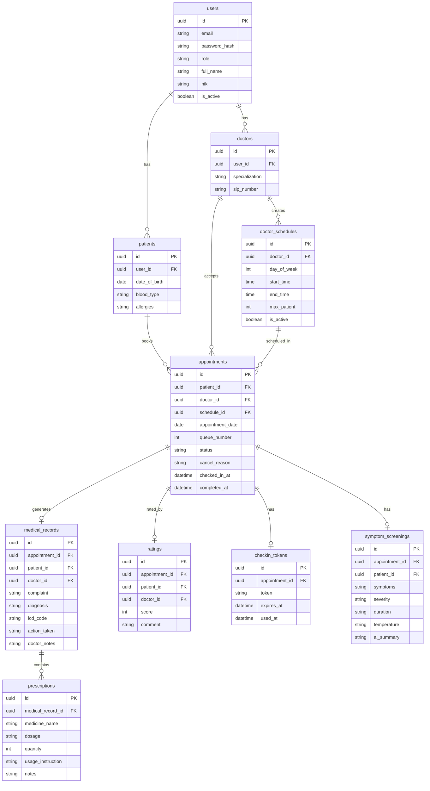
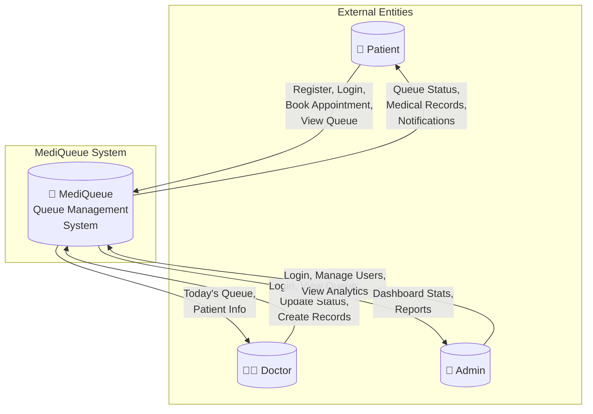
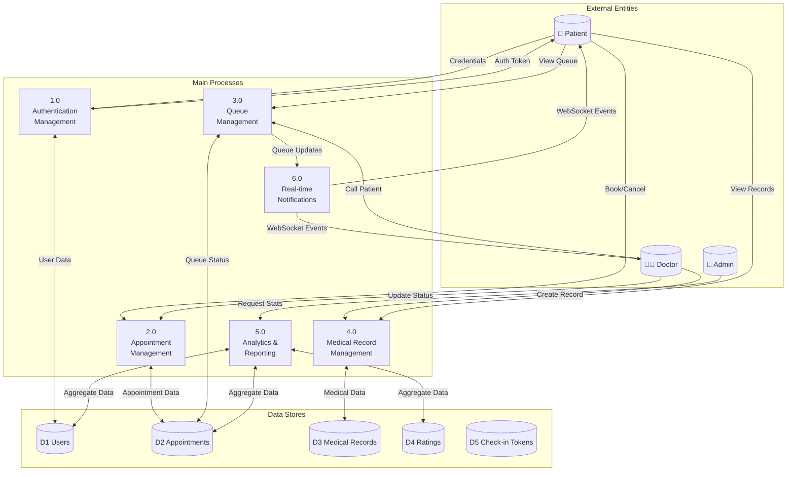
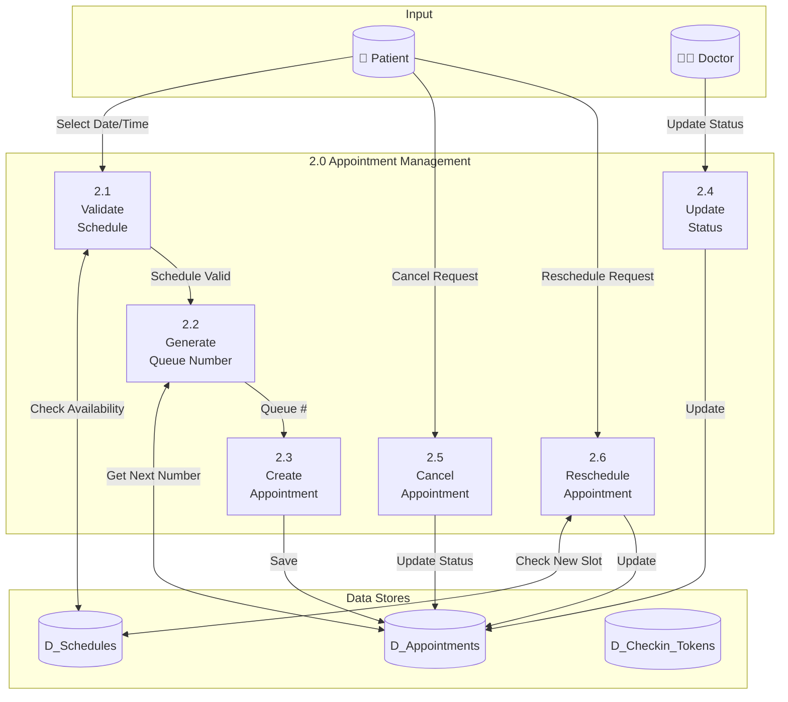

# MediQueue — Backend Wiki

> Sistem backend untuk MediQueue (Aplikasi Antrian Pasien & Klinik Pintar).  
> Dibangun menggunakan **Golang** dengan pola **Clean Architecture**.

---

## 🚀 Technology Stack

| Layer | Technology | Notes |
|-------|-----------|-------|
| Language | Go 1.21+ | Compiled, typed, concurrent |
| HTTP Framework | Gin | High-performance router |
| ORM | GORM v2 | Code-first schema with AutoMigrate |
| Database | PostgreSQL 14+ | UUID primary keys |
| Auth | JWT (golang-jwt v5) + bcrypt | Stateless auth |
| WebSocket | gorilla/websocket | Real-time communication |
| PDF Export | gofpdf | Medical record PDF generation |
| QR Code | skip2/go-qrcode | Patient check-in QR codes |
| Config | godotenv | 12-factor config via `.env` |
| Containerization | Docker + Docker Compose | Prod-ready compose file included |

---

## 📁 Folder Structure (Clean Architecture)

```
backend/
├── cmd/
│   └── main.go              ← Entry point: wire deps, start Gin router
├── config/
│   └── config.go            ← Parse .env → Config struct
├── infrastructure/
│   └── database.go          ← PostgreSQL GORM connection + AutoMigrate
├── internal/
│   ├── entity/              ← Domain models (pure structs, no framework deps)
│   │   ├── user.go
│   │   ├── patient.go
│   │   ├── doctor.go
│   │   ├── doctor_schedule.go
│   │   ├── appointment.go
│   │   ├── medical_record.go
│   │   ├── prescription.go
│   │   ├── rating.go              ⭐ NEW
│   │   ├── checkin_token.go       ⭐ NEW
│   │   └── symptom_screening.go   ⭐ NEW
│   ├── dto/                 ← Request/Response shapes (separate from entities)
│   ├── repository/          ← GORM queries implementing domain interfaces
│   ├── usecase/             ← Pure business logic, calls repository interfaces
│   ├── handler/             ← Gin controllers: parse HTTP, validate, call usecase
│   ├── middleware/          ← JWT auth, RBAC role guard, CORS headers
│   └── ws/                  ← WebSocket hub and client         ⭐ NEW
├── pkg/
│   └── response/            ← Standard JSON response helpers
└── docker-compose.yml       ← Postgres + App container stack
```

### Layer Dependency Rule

```
Handler → Usecase → Repository → Database
  ↑ (no cross-layer imports allowed in opposite direction)
```

---

## 🗄️ Database Schema

### ERD (Entity Relationship Diagram)



---

### ERD Visual Overview

```
┌─────────────────────────────────────────────────────────────────────────────────────┐
│                                    USERS                                            │
│  id (PK) | email | password_hash | role | full_name | nik | is_active              │
└───────────────┬─────────────────────────────────────────────────────────────────────┘
                │
        ┌───────┴───────┐
        ▼               ▼
┌───────────────┐ ┌───────────────┐
│   PATIENTS    │ │    DOCTORS    │
│ id (PK)       │ │ id (PK)       │
│ user_id (FK)  │ │ user_id (FK)  │
│ date_of_birth │ │ specialization│
│ blood_type    │ │ sip_number    │
│ allergies     │ └───────┬───────┘
└───────┬───────┘         │
        │                 │
        │         ┌───────┴───────┐
        │         │DOCTOR_SCHEDULES│
        │         │ id (PK)        │
        │         │ doctor_id (FK) │
        │         │ day_of_week    │
        │         │ start_time     │
        │         │ end_time       │
        │         │ max_patient    │
        │         │ is_active      │
        │         └───────┬───────┘
        │                 │
        └────────┬────────┘
                 ▼
        ┌────────────────────────────────────────────────────────────────┐
        │                      APPOINTMENTS                              │
        │  id (PK) | patient_id (FK) | doctor_id (FK) | schedule_id (FK) │
        │  appointment_date | queue_number | status | cancel_reason      │
        │  checked_in_at | completed_at                                    │
        └───────────────────────────┬────────────────────────────────────┘
                                    │
            ┌───────────────────────┼───────────────────────┐
            ▼                       ▼                       ▼
┌───────────────────┐   ┌───────────────────┐   ┌───────────────────┐
│  MEDICAL_RECORDS  │   │     RATINGS       │   │  CHECKIN_TOKENS   │
│ id (PK)           │   │ id (PK)           │   │ id (PK)           │
│ appointment_id(FK)│   │ appointment_id(FK)│   │ appointment_id(FK)│
│ patient_id (FK)   │   │ patient_id (FK)   │   │ token             │
│ doctor_id (FK)    │   │ doctor_id (FK)    │   │ expires_at        │
│ complaint         │   │ score (1-5)       │   │ used_at           │
│ diagnosis         │   │ comment           │   └───────────────────┘
│ icd_code          │   └───────────────────┘
│ action_taken      │   ┌───────────────────┐
│ doctor_notes      │   │SYMPTOM_SCREENINGS │
└─────────┬─────────┘   │ id (PK)           │
          │             │ appointment_id(FK)│
          ▼             │ patient_id (FK)   │
┌───────────────────┐   │ symptoms          │
│  PRESCRIPTIONS    │   │ severity          │
│ id (PK)           │   │ duration          │
│ medical_record_id │   │ temperature       │
│ medicine_name     │   │ ai_summary        │
│ dosage            │   └───────────────────┘
│ quantity          │
│ usage_instruction │
│ notes             │
└───────────────────┘
```

---

### Table Definitions

| Table | Key Columns |
|-------|-------------|
| `users` | `id UUID PK`, `email`, `password_hash`, `role` (admin/doctor/patient), `full_name`, `nik`, `is_active` |
| `patients` | `id UUID PK`, `user_id FK`, `date_of_birth`, `blood_type`, `allergies` |
| `doctors` | `id UUID PK`, `user_id FK`, `specialization`, `sip_number` |
| `doctor_schedules` | `id UUID PK`, `doctor_id FK`, `day_of_week` (0–6), `start_time`, `end_time`, `max_patient`, `is_active` |
| `appointments` | `id UUID PK`, `patient_id FK`, `doctor_id FK`, `schedule_id FK`, `appointment_date`, `queue_number`, `status`, `cancel_reason`, `checked_in_at`, `completed_at` |
| `medical_records` | `id UUID PK`, `appointment_id FK`, `patient_id FK`, `doctor_id FK`, `complaint`, `diagnosis`, `icd_code`, `action_taken`, `doctor_notes` |
| `prescriptions` | `id UUID PK`, `medical_record_id FK`, `medicine_name`, `dosage`, `quantity`, `usage_instruction`, `notes` |
| `ratings` | `id UUID PK`, `appointment_id FK`, `patient_id FK`, `doctor_id FK`, `score` (1-5), `comment` |
| `checkin_tokens` | `id UUID PK`, `appointment_id FK`, `token`, `expires_at`, `used_at` |
| `symptom_screenings` | `id UUID PK`, `appointment_id FK`, `patient_id FK`, `symptoms`, `severity`, `duration`, `temperature`, `ai_summary` |

---

### Appointment Status Flow

```
POST /appointments → [waiting]
                          │
PATCH status in_progress ─┤→ [in_progress]
                          │
PATCH status completed ───┤→ [completed]
                          │
PATCH /cancel ────────────┴→ [cancelled]
```

---

## 📊 Data Flow Diagram (DFD)

### Level 0 - Context Diagram



---

### Level 1 - Main Processes



---

### Level 2 - Appointment Management Detail



---

## 🔐 Role & Permissions

The system has 3 roles. The JWT payload contains `role` and `user_id`.

| Role | Access Level |
|------|--------------|
| `admin` | Full CRUD on doctors, schedules, users; view all appointments; analytics dashboard |
| `doctor` | View own appointments; update status; create medical records; view patient history |
| `patient` | Register, book appointments, view own queue, view own medical records, rate doctors |

---

## 🌐 API Endpoints

### 🔓 Public Endpoints

| Method | Path | Description |
|--------|------|-------------|
| `POST` | `/auth/register` | Register new patient |
| `POST` | `/auth/login` | Login → JWT |
| `PATCH` | `/check-in/:token` | QR check-in (public) |

---

### 👤 Patient Endpoints

> Header: `Authorization: Bearer <token>`

| Method | Path | Description |
|--------|------|-------------|
| `GET` | `/auth/me` | Current user profile |
| `POST` | `/appointments` | Book new appointment |
| `GET` | `/appointments/my` | My appointments list |
| `GET` | `/appointments/:id` | Appointment detail |
| `GET` | `/appointments/:id/qr` | Get QR code for check-in |
| `PATCH` | `/appointments/:id/cancel` | Cancel own appointment |
| `PATCH` | `/appointments/:id/reschedule` | Reschedule appointment |
| `GET` | `/medical-records/my` | My full medical records + prescriptions |
| `GET` | `/medical-records/:id/pdf` | Download medical record PDF |
| `POST` | `/ratings` | Rate a completed appointment |
| `POST` | `/symptom-screenings` | Submit symptom screening |
| `PUT` | `/auth/profile` | Update own profile |
| `GET` | `/doctors` | List available doctors |
| `GET` | `/schedules` | List active schedules |

---

### 🩺 Doctor Endpoints

> Header: `Authorization: Bearer <token>`

| Method | Path | Description |
|--------|------|-------------|
| `GET` | `/dashboard/doctor` | Stats: today patients, waiting |
| `GET` | `/appointments/today?date=YYYY-MM-DD` | Today's queue list |
| `PATCH` | `/appointments/:id/status` | Update queue status |
| `POST` | `/medical-records` | Create diagnosis + prescriptions |
| `GET` | `/medical-records` | All records created by this doctor |
| `GET` | `/patients` | Patient directory |
| `GET` | `/patients/:id` | Single patient profile |
| `GET` | `/medical-records/patient/:id` | Patient's medical history |
| `GET` | `/ratings/doctor/:id` | Get doctor's ratings |
| `GET` | `/ratings/doctor/:id/summary` | Rating summary |
| `PATCH` | `/schedules/:id/toggle` | Toggle schedule active status |

---

### 🔴 Admin Endpoints

> Header: `Authorization: Bearer <token>`

| Method | Path | Description |
|--------|------|-------------|
| `GET` | `/dashboard/admin` | Full clinic stats |
| `GET` | `/analytics?days=30` | Analytics data for charts |
| `GET` | `/appointments` | All appointments (filterable by date) |
| `GET` | `/export/appointments?format=pdf` | Export appointments to PDF |
| `POST` | `/doctors` | Create doctor account |
| `PUT` | `/doctors/:id` | Update doctor |
| `DELETE` | `/doctors/:id` | Delete doctor |
| `POST` | `/schedules` | Create practice schedule |
| `PUT` | `/schedules/:id` | Update schedule |
| `DELETE` | `/schedules/:id` | Delete schedule |
| `GET` | `/users` | All user accounts |
| `PATCH` | `/users/:id/toggle` | Activate/deactivate user |

---

### 🔌 WebSocket Endpoint

| Path | Description |
|------|-------------|
| `WS /ws` | Real-time queue updates |

**Broadcast Events:**
- `queue_update` - Appointment status changed
- `new_appointment` - New appointment booked
- `checked_in` - Patient checked in via QR

---

## 📱 QR Check-in System

### Overview
The QR Check-in system allows clinic staff to quickly check-in patients by scanning their QR codes.

### Check-in Methods (Frontend)
1. **Camera Scanner** - Real-time QR scanning via webcam
2. **File Upload** - Upload QR code image files (PNG, JPG, etc.)
3. **Manual Entry** - Paste token or URL directly

### Flow
```
Patient Books → Receives QR (64-char token) → 
Admin Scans QR → Token Validated → Patient Checked-in → Queue Updated
```

### Technical Details
- Token: 64-character hex string (32 random bytes)
- Expiration: End of appointment day (23:59:59)
- QR Library: `github.com/skip2/go-qrcode`
- Frontend Scanner: `html5-qrcode` npm package

---

## ⚙️ Environment Variables

| Variable | Required | Description | Example |
|----------|----------|-------------|---------|
| `PORT` | ✅ | HTTP server port | `8080` |
| `DB_HOST` | ✅ | PostgreSQL hostname | `localhost` |
| `DB_PORT` | ✅ | PostgreSQL port | `5432` |
| `DB_USER` | ✅ | Database username | `mediqueue` |
| `DB_PASSWORD` | ✅ | Database password | `secret` |
| `DB_NAME` | ✅ | Database name | `mediqueue` |
| `JWT_SECRET` | ✅ | JWT signing key | `your-secret-key` |
| `JWT_EXPIRY_HOURS` | ⬜ | Token expiry | `24` |
| `APP_ENV` | ⬜ | Environment | `development` |

---

## 🚀 Running the Application

### Using Go directly

```bash
# Install dependencies
go mod tidy

# Run the server
go run ./cmd/main.go
```

### Using Docker Compose

```bash
docker-compose up -d
```

Server starts at `http://localhost:8080`

---

## 📋 Features Implemented

| # | Feature | Status |
|---|---------|--------|
| 1 | Real-time WebSocket Queue | ✅ |
| 2 | QR Code Patient Check-in | ✅ |
| 3 | Doctor Rating System | ✅ |
| 4 | Analytics Dashboard API | ✅ |
| 5 | PDF Export (Appointments & Medical Records) | ✅ |
| 6 | Symptom Pre-screening | ✅ |
| 7 | Appointment Reschedule | ✅ |
| 8 | Search & Filter | ✅ |
| 9 | Admin QR Scanner (Camera/Upload) | ✅ NEW |

---

## 📝 License

MIT License - MediQueue 2026
