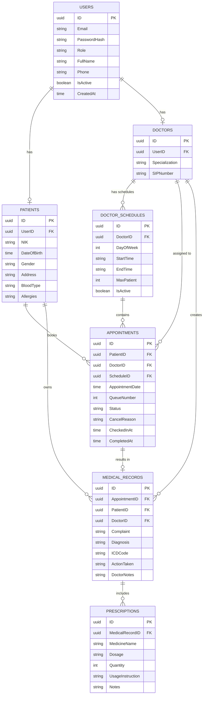
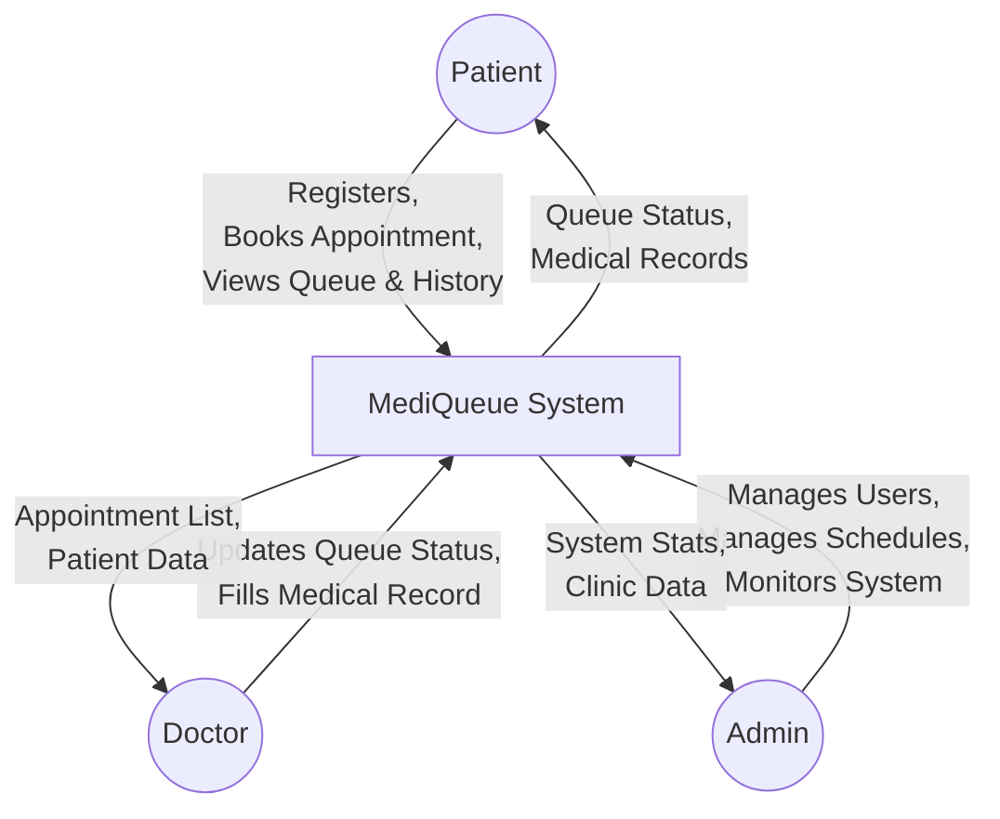
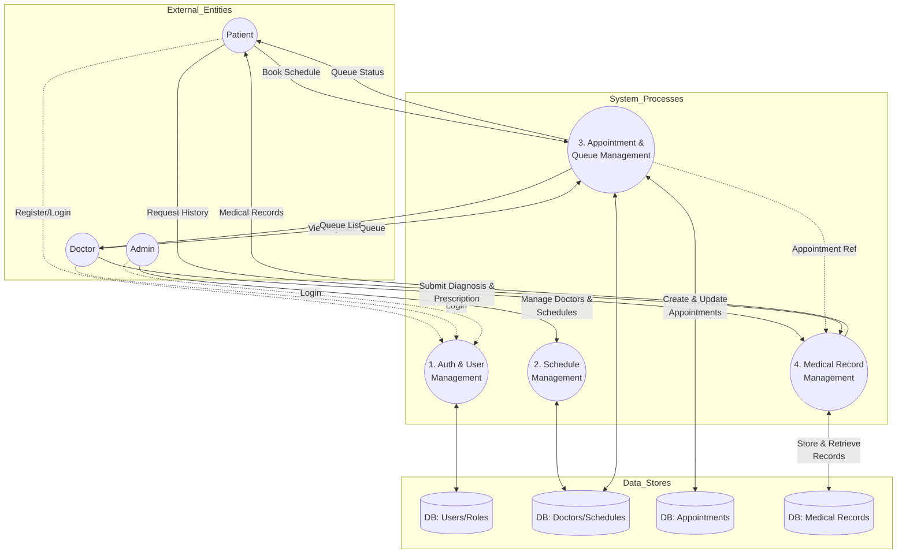

# MediQueue System Diagrams

This document contains the Entity-Relationship Diagram (ERD) and Data Flow Diagram (DFD) for the MediQueue application.

## 1. Entity-Relationship Diagram (ERD)

The ERD maps out the main entities in the database and how they relate to one another.

## 2. Data Flow Diagram (DFD)

### Level 0 Context Diagram
This diagram shows the high-level interactions between external entities (Admin, Doctor, Patient) and the MediQueue system.

### Level 1 DFD
This diagram breaks the system down into its core subsystems/processes and shows how data flows between them and the datastores.

