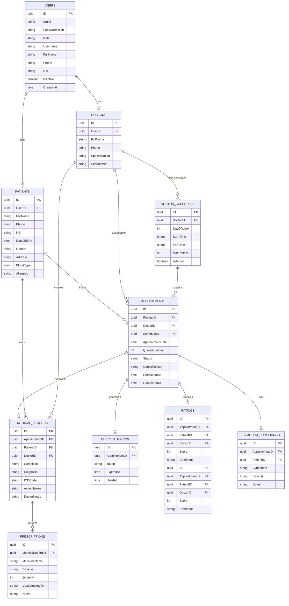
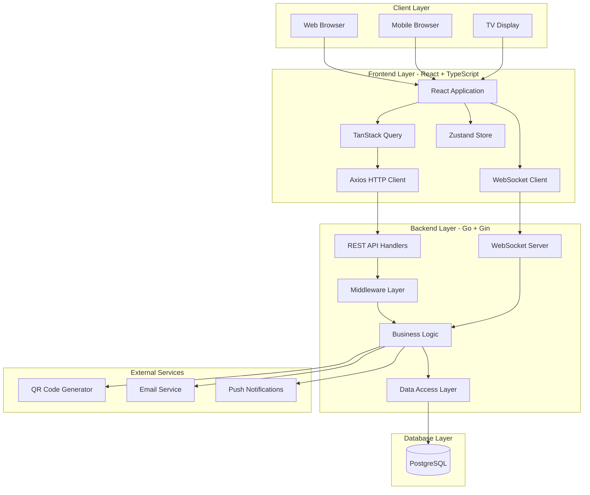
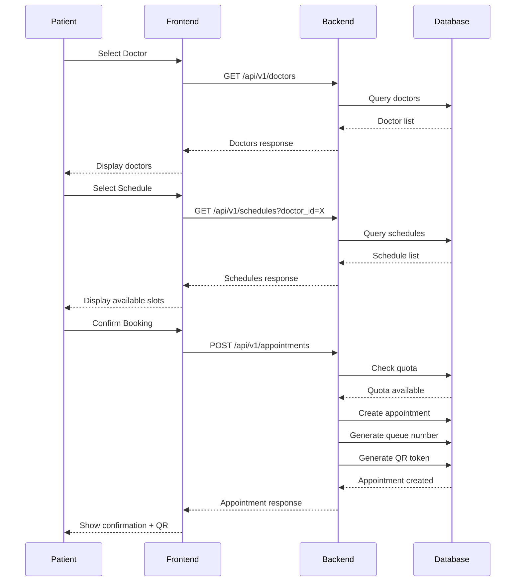
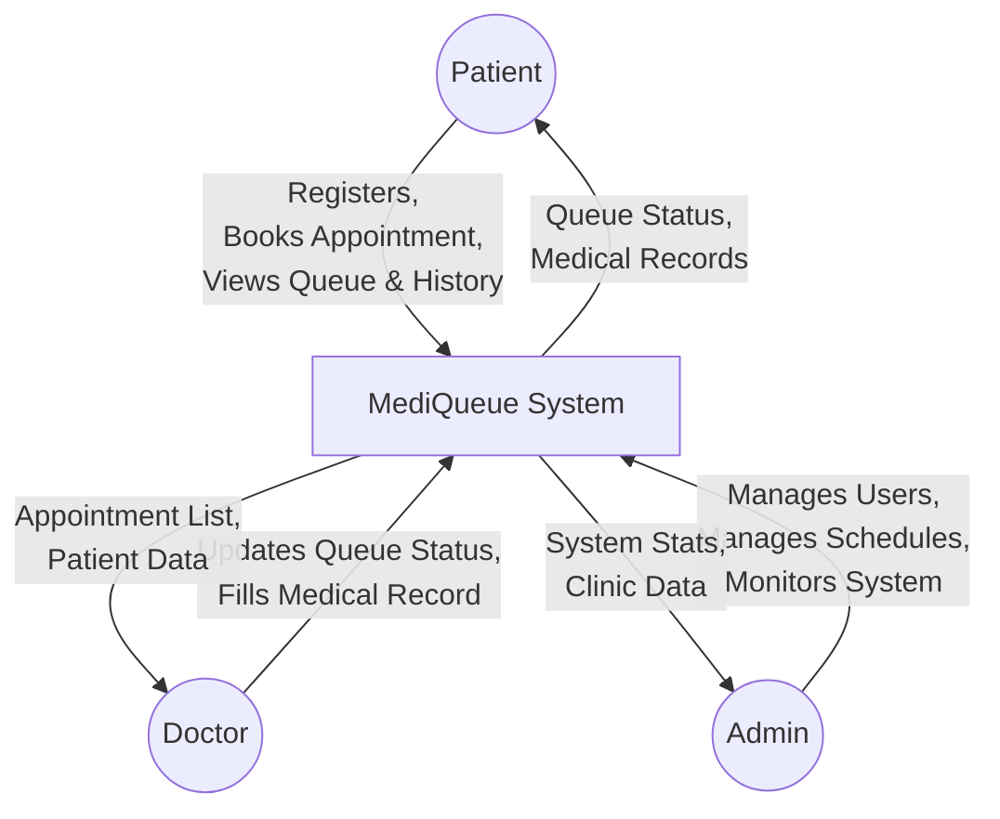
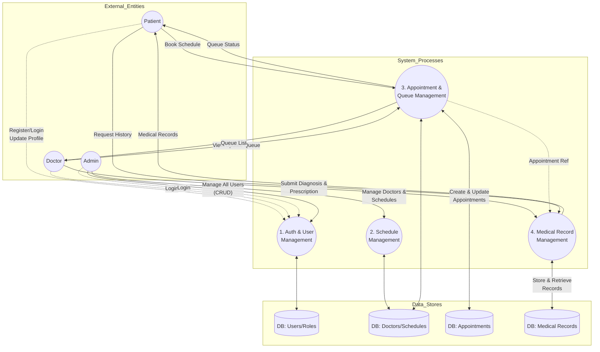
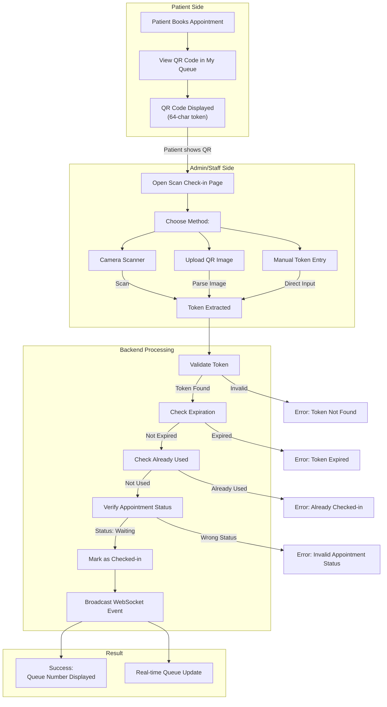
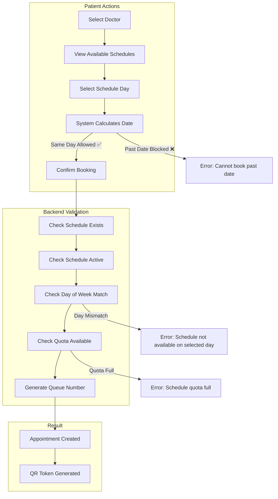

# MediQueue System Diagrams

This document contains the Entity-Relationship Diagram (ERD) and Data Flow Diagram (DFD) for the MediQueue application.

## 1. Entity-Relationship Diagram (ERD)

The ERD maps out the main entities in the database and how they relate to one another.



## 5. Use Case Diagram

This diagram shows the main use cases for each user role in the MediQueue system.

```mermaid
flowchart TD
    subgraph Actors
        Patient((Patient))
        Doctor((Doctor))
        Admin((Admin))
    end

    subgraph Authentication
        UC1[Register Account]
        UC2[Login]
        UC3[Update Profile]
    end

    subgraph Patient_Use_Cases["Patient Use Cases"]
        UC4[Book Appointment]
        UC5[View Queue Status]
        UC6[View Medical History]
        UC7[Cancel Appointment]
        UC8[View QR Code]
        UC9[Rate Doctor]
        UC10[Submit Symptom Screening]
    end

    subgraph Doctor_Use_Cases["Doctor Use Cases"]
        UC11[View Today's Queue]
        UC12[Update Queue Status]
        UC13[Create Medical Record]
        UC14[Add Prescription]
        UC15[View Patient History]
        UC16[View Own Schedules]
    end

    subgraph Admin_Use_Cases["Admin Use Cases"]
        UC17[Manage Users]
        UC18[Manage Doctors]
        UC19[Manage Schedules]
        UC20[View All Appointments]
        UC21[Scan QR Check-in]
        UC22[View Dashboard Analytics]
        UC23[View TV Display]
        UC24[Export Reports]
    end

    Patient --> UC1
    Patient --> UC2
    Patient --> UC3
    Patient --> UC4
    Patient --> UC5
    Patient --> UC6
    Patient --> UC7
    Patient --> UC8
    Patient --> UC9
    Patient --> UC10

    Doctor --> UC2
    Doctor --> UC3
    Doctor --> UC11
    Doctor --> UC12
    Doctor --> UC13
    Doctor --> UC14
    Doctor --> UC15
    Doctor --> UC16

    Admin --> UC2
    Admin --> UC3
    Admin --> UC17
    Admin --> UC18
    Admin --> UC19
    Admin --> UC20
    Admin --> UC21
    Admin --> UC22
    Admin --> UC23
    Admin --> UC24
```



## 6. System Architecture Diagram

This diagram shows the high-level architecture of the MediQueue system.



## 7. Sequence Diagram - Appointment Booking

This diagram shows the sequence of interactions during appointment booking.



## 2. Data Flow Diagram (DFD)

### Level 0 Context Diagram
This diagram shows the high-level interactions between external entities (Admin, Doctor, Patient) and the MediQueue system.



### Level 1 DFD
This diagram breaks the system down into its core subsystems/processes and shows how data flows between them and the datastores.



## 3. QR Check-in Flow Diagram

This diagram shows the patient check-in flow using QR codes.



## 4. Appointment Booking Flow (Updated)

This diagram shows the updated booking flow with same-day booking support.


```
