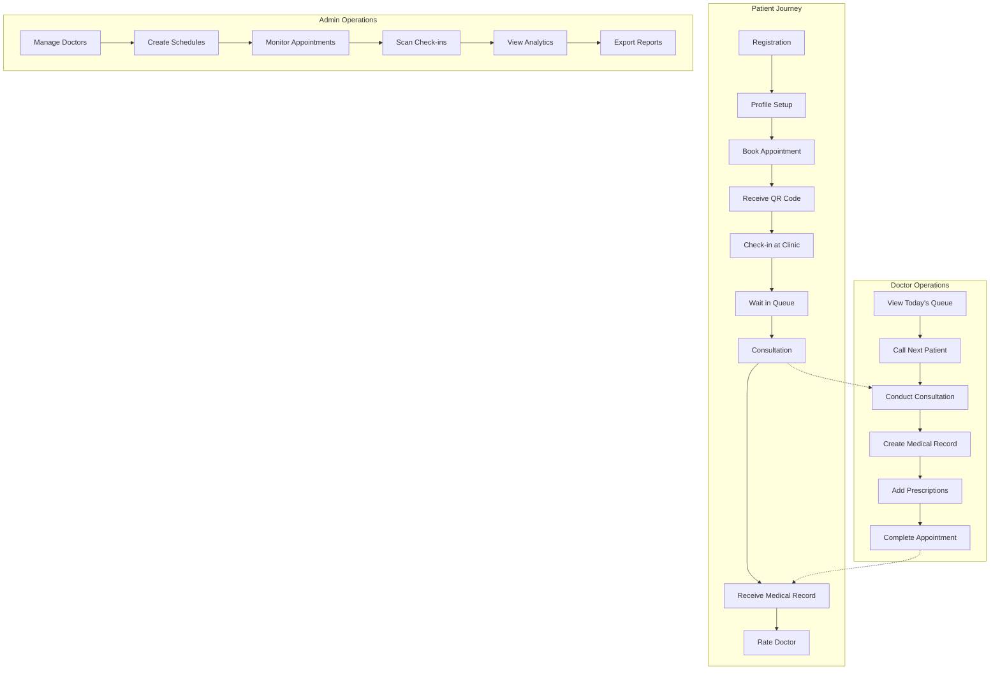

# MediQueue — Business Process Documentation

> **Document Version:** 1.0  
> **Last Updated:** May 25, 2026  
> **System:** MediQueue Clinic Queue Management System

---

## Table of Contents

1. [Overview](#overview)
2. [Process Map](#process-map)
3. [Patient Processes](#patient-processes)
4. [Doctor Processes](#doctor-processes)
5. [Admin Processes](#admin-processes)
6. [Business Rules](#business-rules)
7. [Exception Handling](#exception-handling)

---

## Overview

MediQueue manages the complete patient journey from registration through consultation completion. This document defines all business processes, rules, and decision points.

### Process Categories

| Category | Processes | Primary Actor |
|----------|-----------|---------------|
| **Patient Journey** | Registration, Booking, Check-in, Queue Monitoring, Rating | Patient |
| **Clinical Operations** | Queue Management, Consultation, Medical Records | Doctor |
| **Administrative** | Doctor Management, Schedule Management, User Management, Analytics | Admin |
| **System Operations** | Real-time Updates, Notifications, Data Export | System |

---

## Process Map

---

## Patient Processes

### BP-P01: Patient Registration & Onboarding

**Objective:** Enable new patients to create accounts and complete their profiles.

**Trigger:** Patient visits registration page

**Actors:** Patient, System

**Process Flow:**

1. **Account Creation**
   - Patient provides: email, username, password
   - System validates: email format, password strength (min 8 chars), unique username
   - System creates User record with role="patient"
   - System generates JWT token

2. **Profile Completion**
   - Patient provides: full_name, phone, NIK (national ID), date_of_birth, gender, address
   - Optional: blood_type, allergies
   - System validates: NIK format (16 digits), phone format, age (must be >0 years old)
   - System creates Patient record linked to User

3. **Profile Verification**
   - System checks profile completeness
   - If incomplete: redirect to settings page with warning
   - If complete: enable booking functionality

**Business Rules:**
- BR-P01-01: Email must be unique across all users
- BR-P01-02: Username must be unique and 3-20 characters
- BR-P01-03: Password must be minimum 8 characters
- BR-P01-04: NIK must be exactly 16 digits (Indonesian national ID format)
- BR-P01-05: Patient must be at least 1 year old (date_of_birth validation)
- BR-P01-06: Phone number must be valid Indonesian format (08xx or +62)

**Outputs:**
- User account created
- Patient profile created
- JWT token issued
- Welcome email sent (if email service configured)

**Success Criteria:**
- Patient can log in successfully
- Profile data is complete and valid
- Patient can access booking page

---

### BP-P02: Appointment Booking Process

**Objective:** Allow patients to book appointments with doctors for specific dates and times.

**Trigger:** Patient clicks "Book Appointment" from dashboard

**Actors:** Patient, System

**Process Flow:**

**Step 1: Doctor Selection**
- System displays list of active doctors with:
  - Full name, specialization, photo
  - Average rating (if ratings exist)
  - Available schedule count
- Patient can filter by specialization
- Patient selects a doctor
- System validates doctor is active and has schedules

**Step 2: Schedule & Date Selection**
- System retrieves doctor's active schedules
- System calculates next available dates (30-day window)
- For each schedule, system shows:
  - Day of week (e.g., "Monday")
  - Time slot (e.g., "08:00 - 12:00")
  - Current bookings / max capacity
  - Next available date
- Patient selects schedule and date
- System validates:
  - Date is not in the past
  - Date matches schedule's day_of_week
  - Quota not exceeded

**Step 3: Symptom Screening (Optional)**
- System offers symptom screening form
- If patient chooses to fill:
  - Symptoms (text area)
  - Severity (mild/moderate/severe)
  - Duration (text)
  - Temperature (optional)
  - Additional notes
- System stores screening data linked to appointment

**Step 4: Confirmation & QR Generation**
- System generates queue number (sequential per doctor per day)
- System creates Appointment record:
  - status = "waiting"
  - appointment_date = selected date
  - queue_number = auto-generated
- System generates CheckInToken:
  - 64-character random token
  - expires_at = appointment_date + 24 hours
- System generates QR code image containing token
- System displays confirmation with:
  - Queue number
  - Doctor name
  - Date and time
  - QR code for check-in

**Business Rules:**
- BR-P02-01: Patient profile must be complete before booking
- BR-P02-02: Cannot book appointments in the past
- BR-P02-03: Can book for current day if before schedule end time
- BR-P02-04: Maximum bookings per schedule = schedule.max_patient
- BR-P02-05: Queue number resets daily per doctor
- BR-P02-06: One patient can have multiple active appointments
- BR-P02-07: QR token expires 24 hours after appointment date
- BR-P02-08: Appointment date must match schedule's day_of_week

**Outputs:**
- Appointment created with status="waiting"
- Queue number assigned
- QR check-in token generated
- QR code image available for download
- Symptom screening recorded (if provided)

**Success Criteria:**
- Appointment appears in "My Queue" page
- QR code is scannable
- Queue number is unique for that doctor/date

**Exception Handling:**
- If quota full: show error "Schedule quota full, please select another time"
- If date mismatch: show error "Schedule not available on selected day"
- If profile incomplete: redirect to settings with message

---

### BP-P03: QR Check-in Process

**Objective:** Enable patients to check in at the clinic using QR codes.

**Trigger:** Patient arrives at clinic and shows QR code

**Actors:** Patient, Admin/Staff, System

**Process Flow:**

**Patient Side:**
1. Patient opens "My Queue" page
2. System displays active appointments with QR codes
3. Patient shows QR code to clinic staff

**Admin/Staff Side:**
1. Staff opens "Scan Check-in" page (/admin/scan-checkin)
2. Staff chooses input method:
   - **Option A: Camera Scanner**
     - Request camera permission
     - Scan QR code in real-time
     - Extract token from QR
   - **Option B: File Upload**
     - Upload QR code image (PNG/JPG)
     - Parse image and extract token
   - **Option C: Manual Entry**
     - Paste token or URL manually
     - Extract 64-char token
3. System sends token to backend for validation

**System Validation:**
1. Lookup token in checkin_tokens table
2. Validate token exists
3. Check token not expired (expires_at > now)
4. Check token not already used (used_at IS NULL)
5. Retrieve linked appointment
6. Validate appointment status = "waiting"
7. Mark token as used (used_at = now)
8. Update appointment.checked_in_at = now
9. Broadcast WebSocket event: {type: "checkin", appointment_id}

**Display Result:**
- Success: Show queue number, doctor name, estimated wait time
- Error: Show specific error message

**Business Rules:**
- BR-P03-01: Token must not be expired
- BR-P03-02: Token can only be used once
- BR-P03-03: Only appointments with status="waiting" can be checked in
- BR-P03-04: Check-in updates are broadcast via WebSocket
- BR-P03-05: Token format is exactly 64 alphanumeric characters

**Outputs:**
- Appointment marked as checked-in (checked_in_at timestamp)
- Token marked as used
- Real-time queue update broadcast
- Success confirmation displayed

**Success Criteria:**
- Patient's queue status updates in real-time
- Staff sees confirmation with queue number
- Patient sees "Checked-in" status in My Queue page

**Exception Handling:**
- Token not found: "Invalid QR code"
- Token expired: "QR code has expired"
- Token already used: "Already checked-in"
- Wrong appointment status: "Appointment cannot be checked-in"
- Camera permission denied: Fall back to manual entry

---

### BP-P04: Queue Monitoring Process

**Objective:** Allow patients to monitor their queue position in real-time.

**Trigger:** Patient opens "My Queue" page

**Actors:** Patient, System, WebSocket Server

**Process Flow:**

1. **Initial Load**
   - System retrieves patient's active appointments (status != completed, cancelled)
   - For each appointment, display:
     - Queue number
     - Doctor name and specialization
     - Appointment date and time
     - Current status (waiting/in_progress)
     - Check-in status
     - QR code (if not checked-in)

2. **Real-time Updates**
   - Frontend establishes WebSocket connection
   - Subscribe to queue updates for patient's appointments
   - When doctor updates queue status:
     - WebSocket server broadcasts event
     - Frontend receives update
     - UI updates without page refresh

3. **Status Display**
   - **Waiting**: "You are in the queue. Queue number: X"
   - **In Progress**: "You are being consulted now"
   - **Completed**: "Consultation completed. View medical record"

**Business Rules:**
- BR-P04-01: Only show appointments for current and future dates
- BR-P04-02: WebSocket reconnects automatically if connection drops
- BR-P04-03: Queue position updates in real-time (no polling)
- BR-P04-04: Past appointments moved to "Medical History"

**Outputs:**
- Real-time queue status
- Visual indicators for current status
- Estimated wait time (if available)

---

### BP-P05: Rating & Feedback Process

**Objective:** Enable patients to rate doctors and provide feedback after consultation.

**Trigger:** Patient views completed appointment in Medical History

**Actors:** Patient, System

**Process Flow:**

1. **Access Rating Form**
   - Patient opens "Medical History" page
   - System displays list of completed appointments
   - For each appointment, check if rating exists
   - If not rated: show "Rate Doctor" button
   - If rated: show rating badge with stars

2. **Submit Rating**
   - Patient clicks "Rate Doctor"
   - System opens rating modal
   - Patient selects star rating (1-5)
   - Patient optionally writes comment (max 1000 characters)
   - Patient submits rating

3. **Validation & Storage**
   - System validates:
     - Appointment status = "completed"
     - Appointment belongs to patient
     - Rating not already submitted
     - Score is between 1-5
   - System creates Rating record
   - System updates doctor's average rating
   - System displays success message

**Business Rules:**
- BR-P05-01: Can only rate completed appointments
- BR-P05-02: Can only rate own appointments
- BR-P05-03: One rating per appointment (cannot edit after submission)
- BR-P05-04: Rating score must be 1-5 stars
- BR-P05-05: Comment is optional, max 1000 characters
- BR-P05-06: Rating is visible to admin and doctor
- BR-P05-07: Average rating updates immediately after submission

**Outputs:**
- Rating record created
- Doctor's average rating updated
- "Rated" badge displayed on appointment
- Thank you message shown

**Success Criteria:**
- Rating appears in doctor's profile
- Average rating recalculated correctly
- Patient cannot rate same appointment twice

---

### BP-P06: Medical History Viewing

**Objective:** Allow patients to view their complete medical history and prescriptions.

**Trigger:** Patient opens "Medical History" page

**Actors:** Patient, System

**Process Flow:**

1. **Retrieve Medical Records**
   - System queries medical_records where patient_id = current user
   - System joins with appointments, doctors, prescriptions
   - System orders by created_at DESC (newest first)

2. **Display Records**
   - For each medical record, show:
     - Appointment date
     - Doctor name and specialization
     - Queue number
     - Complaint (chief complaint)
     - Diagnosis
     - ICD-10 code
     - Action taken
     - Doctor notes
     - Prescriptions list (medicine, dosage, quantity, instructions)
     - Rating status (rated/not rated)

3. **Record Actions**
   - Patient can:
     - View full details in modal
     - Download PDF report
     - Rate doctor (if not rated)
     - Print prescription

**Business Rules:**
- BR-P06-01: Only show patient's own medical records
- BR-P06-02: Records are read-only (cannot be edited by patient)
- BR-P06-03: All records are visible (no time limit)
- BR-P06-04: PDF export includes patient info, diagnosis, prescriptions
- BR-P06-05: Prescriptions grouped by medical record

**Outputs:**
- Chronological list of medical records
- Detailed view of each record
- PDF export capability
- Rating interface for unrated appointments

---

## Doctor Processes

### BP-D01: Queue Management Process

**Objective:** Enable doctors to manage their daily appointment queue efficiently.

**Trigger:** Doctor opens "Queue" page (Kanban board)

**Actors:** Doctor, System, WebSocket Server

**Process Flow:**

1. **Load Today's Queue**
   - System retrieves appointments where:
     - doctor_id = current doctor
     - appointment_date = today
     - status IN (waiting, in_progress, completed)
   - System orders by queue_number ASC

2. **Display Kanban Board**
   - Three columns:
     - **Waiting**: status = "waiting", ordered by queue_number
     - **In Progress**: status = "in_progress" (max 1 patient)
     - **Completed**: status = "completed", ordered by completed_at DESC

3. **Queue Actions**
   - **Call Next Patient**:
     - Doctor clicks "Call Next" on first waiting patient
     - System validates: no other patient in_progress
     - System updates status: waiting → in_progress
     - System broadcasts WebSocket event
     - Card moves to "In Progress" column
   
   - **Complete Consultation**:
     - Doctor clicks "Complete" on in_progress patient
     - System prompts: "Create medical record?"
     - If yes: redirect to medical record form
     - If skip: confirm and mark completed
     - System updates status: in_progress → completed
     - System sets completed_at timestamp
     - Card moves to "Completed" column
   
   - **Mark No-Show**:
     - Doctor clicks "No Show" on waiting patient
     - System prompts for confirmation
     - System updates status: waiting → cancelled
     - System sets cancel_reason = "no_show"
     - Card removed from board

4. **Real-time Synchronization**
   - WebSocket broadcasts all queue changes
   - All connected clients (doctor, patient, admin, TV display) receive updates
   - UI updates optimistically with rollback on error

**Business Rules:**
- BR-D01-01: Only one patient can be "in_progress" at a time per doctor
- BR-D01-02: Must call patients in queue_number order (first come, first served)
- BR-D01-03: Cannot skip patients (must call next in line)
- BR-D01-04: Completed appointments cannot be reverted
- BR-D01-05: Queue updates broadcast via WebSocket to all subscribers
- BR-D01-06: Doctor can only manage their own queue
- BR-D01-07: Queue resets daily (only shows today's appointments)

**Outputs:**
- Visual Kanban board with three columns
- Real-time queue position updates
- Patient information cards (name, queue number, check-in time)
- Action buttons per patient

**Success Criteria:**
- Queue updates reflect immediately across all devices
- Only one patient in "In Progress" at any time
- Patients called in correct order

**Exception Handling:**
- If patient already in_progress: show error "Another patient is currently being consulted"
- If WebSocket disconnects: show warning banner, attempt reconnect
- If optimistic update fails: revert UI and show error message

---

### BP-D02: Consultation Process

**Objective:** Guide doctor through patient consultation workflow.

**Trigger:** Doctor moves patient to "In Progress" status

**Actors:** Doctor, Patient, System

**Process Flow:**

1. **Consultation Start**
   - System updates appointment status to "in_progress"
   - System broadcasts WebSocket event to patient
   - Patient's app shows "You are being consulted now"
   - Doctor views patient information:
     - Full name, age, gender
     - Blood type, allergies
     - Previous medical records (if any)
     - Symptom screening (if submitted)

2. **Conduct Examination**
   - Doctor examines patient
   - Doctor reviews symptom screening notes
   - Doctor checks patient's medical history
   - Doctor performs diagnosis

3. **Complete Consultation**
   - Doctor clicks "Complete Consultation"
   - System prompts: "Create medical record now?"
   - **Option A**: Create medical record immediately
     - Redirect to medical record form (BP-D03)
   - **Option B**: Skip for now
     - Confirm skip action
     - Mark appointment as completed without medical record
     - Doctor can create record later from medical records page

**Business Rules:**
- BR-D02-01: Consultation time is tracked (in_progress timestamp)
- BR-D02-02: Doctor can view patient's full medical history during consultation
- BR-D02-03: Symptom screening data is highlighted if available
- BR-D02-04: Medical record creation is recommended but optional
- BR-D02-05: Appointment must be completed before next patient can be called

**Outputs:**
- Patient status updated to "in_progress"
- Real-time notification to patient
- Access to patient's medical history
- Prompt to create medical record

---

### BP-D03: Medical Record Creation Process

**Objective:** Enable doctors to document consultation findings and prescriptions.

**Trigger:** Doctor completes consultation and chooses to create medical record

**Actors:** Doctor, System

**Process Flow:**

1. **Open Medical Record Form**
   - System pre-fills:
     - Patient information
     - Appointment details
     - Doctor information
   - Doctor enters:
     - **Complaint**: Chief complaint (required)
     - **Diagnosis**: Medical diagnosis (required)
     - **ICD-10 Code**: International disease code (required)
     - **Action Taken**: Treatment performed (optional)
     - **Doctor Notes**: Additional notes (optional)

2. **Add Prescriptions**
   - Doctor clicks "Add Prescription"
   - For each prescription, enter:
     - **Medicine Name**: Drug name (required)
     - **Dosage**: e.g., "500mg" (required)
     - **Quantity**: Number of units (required)
     - **Usage Instruction**: e.g., "3x daily after meals" (required)
     - **Notes**: Additional instructions (optional)
   - Doctor can add multiple prescriptions
   - Doctor can remove prescriptions before saving

3. **Validation & Save**
   - System validates:
     - All required fields filled
     - ICD-10 code format valid
     - At least one prescription (recommended but not required)
     - Appointment status = "in_progress" or "completed"
   - System creates MedicalRecord
   - System creates Prescription records
   - System updates appointment status to "completed"
   - System sets completed_at timestamp

4. **Generate PDF**
   - System generates PDF report containing:
     - Patient information
     - Doctor information
     - Diagnosis and ICD code
     - Prescriptions with instructions
     - Doctor signature (digital)
   - PDF available for download

**Business Rules:**
- BR-D03-01: Medical record can only be created by assigned doctor
- BR-D03-02: One medical record per appointment (cannot duplicate)
- BR-D03-03: Medical records are immutable after creation (cannot edit)
- BR-D03-04: ICD-10 code must be valid format (e.g., "A00.0")
- BR-D03-05: Prescriptions must have medicine name, dosage, quantity, instructions
- BR-D03-06: Creating medical record automatically completes appointment
- BR-D03-07: PDF is generated immediately upon save

**Outputs:**
- MedicalRecord created
- Prescription records created
- Appointment marked as completed
- PDF report generated
- Success message displayed

**Success Criteria:**
- Medical record appears in patient's history
- Prescriptions are readable and complete
- PDF is downloadable
- Appointment status = "completed"

**Exception Handling:**
- If appointment already has medical record: show error "Medical record already exists"
- If validation fails: highlight invalid fields with error messages
- If PDF generation fails: save record but show warning "PDF generation failed, try downloading later"

---

### BP-D04: Medical Records Management

**Objective:** Allow doctors to view and manage medical records they've created.

**Trigger:** Doctor opens "Medical Records" page

**Actors:** Doctor, System

**Process Flow:**

1. **Retrieve Records**
   - System queries medical_records where doctor_id = current doctor
   - System joins with patients, appointments
   - System orders by created_at DESC

2. **Display Records List**
   - For each record, show:
     - Patient name
     - Appointment date
     - Diagnosis
     - Number of prescriptions
     - Created date
     - Actions (view, download PDF)

3. **View Record Details**
   - Doctor clicks on record
   - System displays full details in modal:
     - Patient information
     - Complaint and diagnosis
     - ICD-10 code
     - Action taken
     - Doctor notes
     - Complete prescription list
   - Doctor can download PDF

4. **Search & Filter**
   - Doctor can search by patient name
   - Doctor can filter by date range
   - Doctor can filter by diagnosis keyword

**Business Rules:**
- BR-D04-01: Doctor can only view their own medical records
- BR-D04-02: Records are read-only (cannot be edited after creation)
- BR-D04-03: All historical records are accessible
- BR-D04-04: PDF can be regenerated if needed

**Outputs:**
- Searchable list of medical records
- Detailed view of each record
- PDF download capability

---

## Admin Processes

### BP-A01: Doctor Management Process

**Objective:** Enable admins to manage doctor profiles and credentials.

**Trigger:** Admin opens "Doctors" page

**Actors:** Admin, System

**Process Flow:**

1. **View Doctors List**
   - System retrieves all doctors with user information
   - Display table with: name, specialization, SIP number, phone, status, actions

2. **Create New Doctor**
   - Admin clicks "Add Doctor"
   - Admin enters:
     - User credentials (email, username, password)
     - Doctor profile (full_name, phone, specialization, sip_number)
   - System validates:
     - Email unique
     - SIP number unique and valid format
     - Phone number valid
   - System creates User with role="doctor"
   - System creates Doctor profile
   - System sends welcome email (if configured)

3. **Edit Doctor**
   - Admin clicks "Edit" on doctor row
   - Admin can modify: full_name, phone, specialization, sip_number
   - Cannot modify: email, username (user credentials)
   - System validates changes
   - System updates Doctor record

4. **Deactivate/Activate Doctor**
   - Admin toggles doctor status
   - System updates user.is_active
   - If deactivated: doctor cannot login, schedules become inactive
   - If activated: doctor can login, schedules can be reactivated

5. **Delete Doctor**
   - Admin clicks "Delete" (soft delete recommended)
   - System checks for dependencies:
     - Active appointments
     - Future schedules
   - If dependencies exist: show warning, require confirmation
   - System marks user as inactive or deletes record

**Business Rules:**
- BR-A01-01: Only admins can manage doctors
- BR-A01-02: SIP number must be unique across all doctors
- BR-A01-03: Email must be unique across all users
- BR-A01-04: Deactivating doctor deactivates all their schedules
- BR-A01-05: Cannot delete doctor with active/future appointments (must cancel first)
- BR-A01-06: Doctor specialization is free text (no predefined list)

**Outputs:**
- Doctor profile created/updated
- User account created/updated
- Status changes reflected immediately
- Confirmation messages displayed

---

### BP-A02: Schedule Management Process

**Objective:** Enable admins to create and manage doctor schedules.

**Trigger:** Admin opens "Schedules" page

**Actors:** Admin, System

**Process Flow:**

1. **View Schedules**
   - System retrieves all schedules with doctor information
   - Display table with: doctor name, day of week, time slot, max patients, status

2. **Create Schedule**
   - Admin clicks "Add Schedule"
   - Admin selects:
     - Doctor (dropdown of active doctors)
     - Day of week (Monday=1, Tuesday=2, ..., Sunday=7)
     - Start time (HH:MM format)
     - End time (HH:MM format)
     - Max patients (integer, default 20)
   - System validates:
     - Doctor exists and is active
     - Start time < End time
     - No overlapping schedules for same doctor on same day
     - Max patients > 0
   - System creates DoctorSchedule with is_active=true

3. **Edit Schedule**
   - Admin clicks "Edit" on schedule row
   - Admin can modify: day_of_week, start_time, end_time, max_patient
   - Cannot modify: doctor_id (must delete and recreate)
   - System validates no conflicts
   - System updates schedule
   - Warning: "This will affect future appointments"

4. **Deactivate/Activate Schedule**
   - Admin toggles schedule status
   - System updates is_active flag
   - If deactivated: schedule not shown in booking, existing appointments unaffected
   - If activated: schedule available for new bookings

5. **Delete Schedule**
   - Admin clicks "Delete"
   - System checks for future appointments
   - If future appointments exist: show warning, require confirmation
   - System deletes schedule or marks inactive

**Business Rules:**
- BR-A02-01: One doctor can have multiple schedules (different days/times)
- BR-A02-02: Schedules cannot overlap for same doctor
- BR-A02-03: Start time must be before end time
- BR-A02-04: Day of week: 1=Monday, 2=Tuesday, ..., 7=Sunday
- BR-A02-05: Max patients must be positive integer
- BR-A02-06: Deactivating schedule hides it from booking but keeps existing appointments
- BR-A02-07: Deleting schedule with future appointments requires confirmation

**Outputs:**
- Schedule created/updated/deleted
- Booking availability updated
- Confirmation messages displayed

---

### BP-A03: User Management Process

**Objective:** Enable admins to manage all user accounts and permissions.

**Trigger:** Admin opens "Users" page

**Actors:** Admin, System

**Process Flow:**

1. **View Users List**
   - System retrieves all users with role information
   - Display table with: username, email, full name, role, status, created date

2. **Filter & Search**
   - Admin can filter by role (admin/doctor/patient)
   - Admin can filter by status (active/inactive)
   - Admin can search by username, email, or name

3. **View User Details**
   - Admin clicks on user row
   - System displays:
     - User information
     - Related profile (Patient or Doctor)
     - Activity summary (appointments, medical records)
     - Last login timestamp

4. **Activate/Deactivate User**
   - Admin toggles user status
   - System updates is_active flag
   - If deactivated: user cannot login, sessions invalidated
   - If activated: user can login normally

5. **Reset Password**
   - Admin clicks "Reset Password"
   - System generates temporary password
   - System updates password_hash
   - System sends email with temporary password (if configured)
   - User must change password on next login

6. **Delete User**
   - Admin clicks "Delete"
   - System checks for dependencies (appointments, medical records)
   - If dependencies exist: show warning "Cannot delete user with historical data"
   - Recommend deactivation instead of deletion
   - If confirmed: soft delete (mark inactive) or hard delete

**Business Rules:**
- BR-A03-01: Only admins can manage users
- BR-A03-02: Cannot delete users with historical data (appointments, medical records)
- BR-A03-03: Deactivating user invalidates all active sessions
- BR-A03-04: Admin cannot deactivate themselves
- BR-A03-05: Password reset generates secure random password
- BR-A03-06: Soft delete preferred over hard delete for data integrity

**Outputs:**
- User status updated
- Password reset completed
- User details displayed
- Confirmation messages shown

---

### BP-A04: Analytics & Reporting Process

**Objective:** Provide admins with operational insights and performance metrics.

**Trigger:** Admin opens "Analytics" page

**Actors:** Admin, System

**Process Flow:**

1. **Dashboard Overview**
   - System calculates and displays:
     - **Today's Stats**:
       - Total appointments today
       - Completed consultations
       - Waiting patients
       - In-progress consultations
     - **Weekly Trends**:
       - Appointments per day (line chart)
       - Completion rate (percentage)
       - Average wait time
     - **Doctor Performance**:
       - Consultations per doctor (bar chart)
       - Average rating per doctor
       - Busiest doctors

2. **Appointment Analytics**
   - Filter by date range
   - Display metrics:
     - Total appointments
     - Status breakdown (waiting/in_progress/completed/cancelled)
     - Cancellation rate
     - No-show rate
     - Peak hours (heatmap)
     - Busiest days of week

3. **Doctor Analytics**
   - Select doctor or view all
   - Display metrics:
     - Total consultations
     - Average consultation time
     - Patient satisfaction (average rating)
     - Schedule utilization (bookings/capacity)
     - Most common diagnoses (ICD codes)

4. **Patient Analytics**
   - Display metrics:
     - Total registered patients
     - Active patients (with appointments)
     - New registrations (trend)
     - Patient retention rate
     - Most frequent patients

5. **Financial Insights** (if payment module exists)
   - Revenue per day/week/month
   - Revenue per doctor
   - Payment method breakdown

**Business Rules:**
- BR-A04-01: Only admins can view analytics
- BR-A04-02: Data refreshes every 5 minutes
- BR-A04-03: Date range limited to last 12 months
- BR-A04-04: Charts use Recharts library
- BR-A04-05: All metrics calculated in real-time from database

**Outputs:**
- Interactive charts and graphs
- Key performance indicators (KPIs)
- Exportable reports
- Trend analysis

---

### BP-A05: Data Export Process

**Objective:** Enable admins to export data for reporting and compliance.

**Trigger:** Admin clicks "Export" button on various pages

**Actors:** Admin, System

**Process Flow:**

1. **Select Export Type**
   - Admin chooses data to export:
     - Appointments (all or filtered)
     - Medical records (date range)
     - Doctors list
     - Patients list
     - Analytics report

2. **Configure Export**
   - Admin selects:
     - Format (PDF or CSV)
     - Date range (if applicable)
     - Filters (status, doctor, etc.)
     - Fields to include

3. **Generate Export**
   - System queries database with filters
   - System formats data according to selected format
   - **PDF Export**:
     - Uses jung-kurt/gofpdf library
     - Includes headers, footers, page numbers
     - Formatted tables with proper styling
   - **CSV Export**:
     - Standard CSV format with headers
     - UTF-8 encoding
     - Comma-separated values

4. **Download File**
   - System generates file
   - System returns file as download
   - Filename format: `{type}_{date}_{timestamp}.{ext}`
   - Example: `appointments_2026-05-25_143022.pdf`

**Business Rules:**
- BR-A05-01: Only admins can export data
- BR-A05-02: Exports include only data admin has permission to view
- BR-A05-03: Medical records export includes patient consent disclaimer
- BR-A05-04: Large exports (>1000 records) may take time, show progress indicator
- BR-A05-05: Exported files not stored on server (generated on-demand)
- BR-A05-06: Export logs recorded for audit trail

**Outputs:**
- PDF or CSV file download
- Formatted data with headers
- Timestamp in filename
- Success confirmation

---

## Business Rules Summary

### Authentication & Authorization
- **BR-AUTH-01**: JWT tokens expire after 24 hours
- **BR-AUTH-02**: Password must be minimum 8 characters
- **BR-AUTH-03**: Failed login attempts limited to 5 per 15 minutes
- **BR-AUTH-04**: Role-based access control enforced on all endpoints
- **BR-AUTH-05**: Sessions invalidated on password change or account deactivation

### Appointment Management
- **BR-APPT-01**: Queue numbers are sequential per doctor per day
- **BR-APPT-02**: Cannot book appointments in the past
- **BR-APPT-03**: Same-day booking allowed if before schedule end time
- **BR-APPT-04**: Maximum bookings per schedule enforced
- **BR-APPT-05**: Only one patient "in_progress" per doctor at a time
- **BR-APPT-06**: Completed appointments cannot be modified
- **BR-APPT-07**: Cancelled appointments free up quota

### Medical Records
- **BR-MED-01**: Medical records are immutable after creation
- **BR-MED-02**: One medical record per appointment maximum
- **BR-MED-03**: Only assigned doctor can create medical record
- **BR-MED-04**: ICD-10 code required for all diagnoses
- **BR-MED-05**: Prescriptions must include medicine, dosage, quantity, instructions

### Data Integrity
- **BR-DATA-01**: Soft delete preferred over hard delete
- **BR-DATA-02**: Cannot delete records with dependencies
- **BR-DATA-03**: All timestamps in UTC
- **BR-DATA-04**: UUIDs used for all primary keys
- **BR-DATA-05**: Audit trail maintained for critical operations

---

## Exception Handling

### System Errors
- **Database Connection Failure**: Show error page, retry connection, log error
- **WebSocket Disconnection**: Show warning banner, attempt auto-reconnect every 5 seconds
- **API Timeout**: Show error message, allow retry, log timeout
- **Server Error (500)**: Show generic error, log details, notify admin

### Validation Errors
- **Invalid Input**: Highlight field with error message, prevent submission
- **Duplicate Entry**: Show specific error (e.g., "Email already exists")
- **Constraint Violation**: Show user-friendly message explaining constraint
- **Format Error**: Show expected format with example

### Business Logic Errors
- **Quota Exceeded**: "Schedule is full, please select another time"
- **Unauthorized Access**: Redirect to login with message "Session expired"
- **Invalid State Transition**: "Cannot perform this action in current state"
- **Conflict**: "Another user modified this record, please refresh"

### User Errors
- **Not Found (404)**: Show "Resource not found" with navigation options
- **Permission Denied (403)**: Show "You don't have permission to access this"
- **Invalid Token**: Redirect to login with "Invalid or expired session"
- **Rate Limit Exceeded**: "Too many requests, please try again in X minutes"

### Recovery Actions
- **Optimistic Update Failure**: Revert UI to previous state, show error
- **Network Error**: Show offline indicator, queue actions for retry
- **Session Expired**: Redirect to login, preserve intended destination
- **Data Sync Error**: Show warning, offer manual refresh

---

**Document End**

*For technical implementation details, see:*
- `diagrams.md` - System diagrams (ERD, DFD, Architecture)
- `WIKI.md` - Technical documentation (Indonesian)
- `mediqueue_innovation_wiki.md` - Innovation proposals and technical wiki

