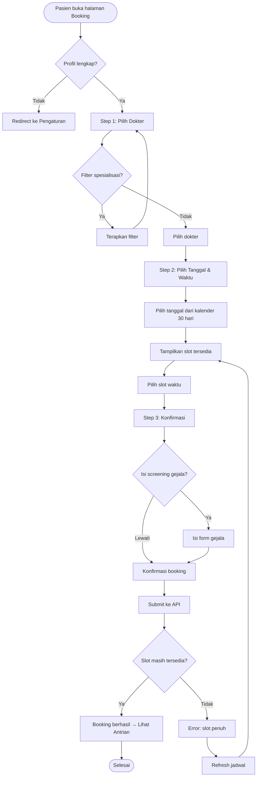
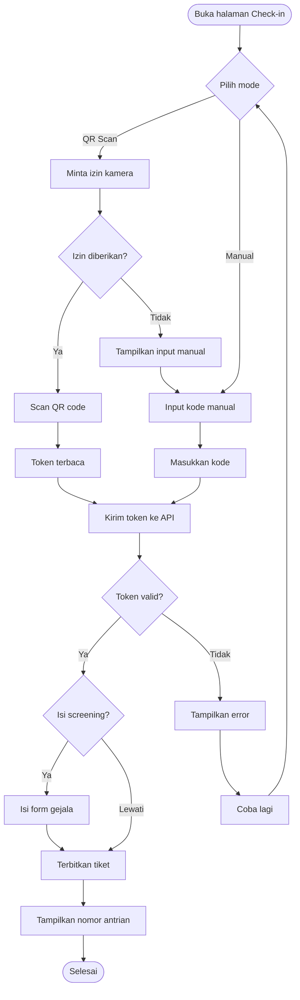
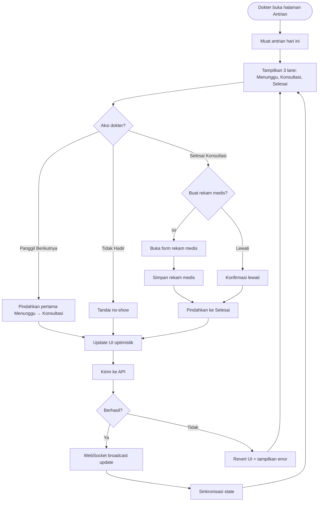
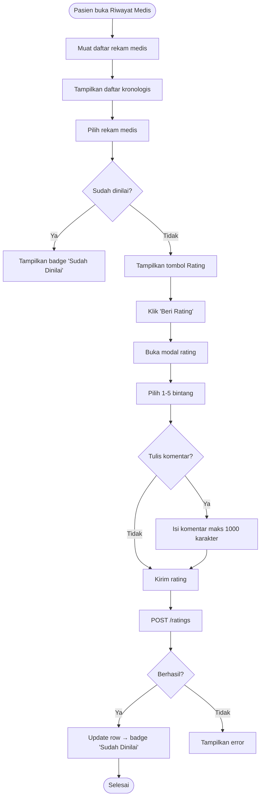
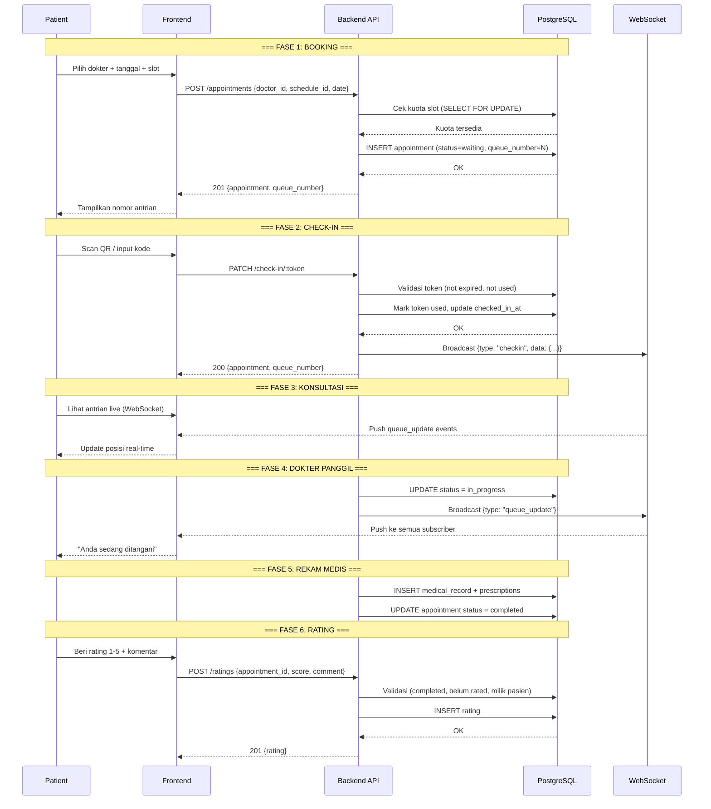
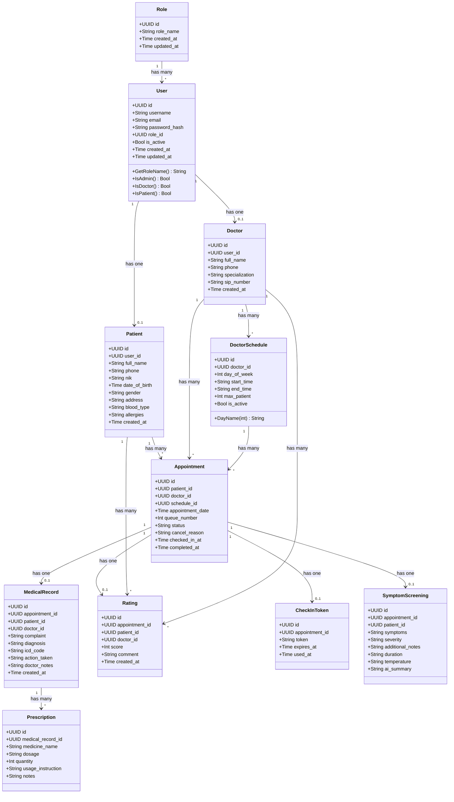

# MediQueue — Dokumentasi Sistem (Wiki)

## Deskripsi Umum

MediQueue adalah sistem antrian klinik pintar berbasis web yang mengelola alur pasien dari pendaftaran hingga konsultasi selesai. Sistem ini dibangun dengan arsitektur modern:

- **Backend**: Go (Gin Framework) + PostgreSQL + GORM + WebSocket
- **Frontend**: React + TypeScript + TanStack Query + Zustand
- **Autentikasi**: JWT (JSON Web Token) dengan role-based access control
- **Real-time**: WebSocket untuk update antrian live

## Arsitektur Sistem

```
┌─────────────────────────────────────────────────────────────────┐
│                        FRONTEND (React + TS)                     │
│  ┌──────────┐  ┌──────────┐  ┌──────────┐  ┌──────────────┐   │
│  │  Admin   │  │  Doctor  │  │ Patient  │  │   Public     │   │
│  │  Pages   │  │  Pages   │  │  Pages   │  │   Pages      │   │
│  └────┬─────┘  └────┬─────┘  └────┬─────┘  └──────┬───────┘   │
│       │              │              │               │            │
│  ┌────┴──────────────┴──────────────┴───────────────┴────────┐  │
│  │              API Client (Axios) + TanStack Query           │  │
│  └────────────────────────────┬──────────────────────────────┘  │
└───────────────────────────────┼──────────────────────────────────┘
                                │ HTTP/WS
┌───────────────────────────────┼──────────────────────────────────┐
│                        BACKEND (Go + Gin)                        │
│  ┌────────────────────────────┴──────────────────────────────┐  │
│  │                    Handler Layer (REST API)                 │  │
│  └────────────────────────────┬──────────────────────────────┘  │
│  ┌────────────────────────────┴──────────────────────────────┐  │
│  │                    Usecase Layer (Business Logic)           │  │
│  └────────────────────────────┬──────────────────────────────┘  │
│  ┌────────────────────────────┴──────────────────────────────┐  │
│  │                    Repository Layer (Data Access)           │  │
│  └────────────────────────────┬──────────────────────────────┘  │
│  ┌────────────────────────────┴──────────────────────────────┐  │
│  │                    PostgreSQL Database                      │  │
│  └────────────────────────────────────────────────────────────┘  │
└──────────────────────────────────────────────────────────────────┘
```

## Role & Hak Akses

| Role    | Deskripsi                                    |
|---------|----------------------------------------------|
| Admin   | Mengelola dokter, jadwal, pasien, pengguna, analitik |
| Doctor  | Mengelola antrian, rekam medis, konsultasi   |
| Patient | Booking antrian, check-in, lihat riwayat medis |

## Fitur Utama

1. **Autentikasi** — Register, Login, JWT, Remember Me
2. **Manajemen Dokter** — CRUD profil dokter (Admin)
3. **Manajemen Jadwal** — Jadwal mingguan per dokter (Admin)
4. **Booking Antrian** — Wizard 3 langkah (Patient)
5. **QR Check-in** — Scan QR code untuk check-in (Public/Admin)
6. **Antrian Live** — Real-time queue position via WebSocket
7. **Konsultasi** — Call next, mark in-progress, complete (Doctor)
8. **Rekam Medis** — Dokumentasi konsultasi + resep (Doctor)
9. **Rating Dokter** — Penilaian 1-5 bintang (Patient)
10. **Symptom Screening** — Pre-screening gejala sebelum konsultasi
11. **Analytics** — Visualisasi data operasional klinik (Admin)
12. **TV Display** — Papan antrian fullscreen untuk ruang tunggu
13. **Export** — PDF/CSV untuk laporan dan rekam medis

---

## Use Case Diagram

```mermaid
graph LR
    subgraph Aktor
        Admin((Admin))
        Doctor((Doctor))
        Patient((Patient))
        Public((Public/Visitor))
    end

    subgraph "Sistem MediQueue"
        %% Auth
        UC_Register[Register]
        UC_Login[Login]
        UC_Logout[Logout]
        UC_UpdateProfile[Update Profile]
        UC_DeleteAccount[Delete Account]

        %% Admin
        UC_ManageDoctors[Kelola Dokter]
        UC_ManageSchedules[Kelola Jadwal]
        UC_ManagePatients[Kelola Pasien]
        UC_ManageUsers[Kelola Pengguna]
        UC_ViewAnalytics[Lihat Analitik]
        UC_AdminDashboard[Dashboard Admin]
        UC_ScanCheckin[Scan QR Check-in]
        UC_ExportData[Export Data]
        UC_ManageAppointments[Kelola Janji Temu]

        %% Doctor
        UC_DoctorDashboard[Dashboard Dokter]
        UC_ManageQueue[Kelola Antrian]
        UC_CallNext[Panggil Berikutnya]
        UC_CompleteConsultation[Selesai Konsultasi]
        UC_CreateMedRecord[Buat Rekam Medis]
        UC_ViewMedRecords[Lihat Rekam Medis]
        UC_MarkNoShow[Tandai Tidak Hadir]

        %% Patient
        UC_PatientDashboard[Dashboard Pasien]
        UC_BookAppointment[Booking Antrian]
        UC_ViewQueue[Lihat Antrian Live]
        UC_ViewHistory[Lihat Riwayat Medis]
        UC_RateDoctor[Beri Rating Dokter]
        UC_SymptomScreening[Isi Screening Gejala]
        UC_Settings[Pengaturan Akun]

        %% Public
        UC_PublicCheckin[Check-in via QR]
        UC_TVDisplay[Papan Antrian TV]
    end

    %% Admin connections
    Admin --> UC_Login
    Admin --> UC_AdminDashboard
    Admin --> UC_ManageDoctors
    Admin --> UC_ManageSchedules
    Admin --> UC_ManagePatients
    Admin --> UC_ManageUsers
    Admin --> UC_ViewAnalytics
    Admin --> UC_ScanCheckin
    Admin --> UC_ExportData
    Admin --> UC_ManageAppointments

    %% Doctor connections
    Doctor --> UC_Login
    Doctor --> UC_DoctorDashboard
    Doctor --> UC_ManageQueue
    Doctor --> UC_CallNext
    Doctor --> UC_CompleteConsultation
    Doctor --> UC_CreateMedRecord
    Doctor --> UC_ViewMedRecords
    Doctor --> UC_MarkNoShow

    %% Patient connections
    Patient --> UC_Register
    Patient --> UC_Login
    Patient --> UC_PatientDashboard
    Patient --> UC_BookAppointment
    Patient --> UC_ViewQueue
    Patient --> UC_ViewHistory
    Patient --> UC_RateDoctor
    Patient --> UC_SymptomScreening
    Patient --> UC_Settings
    Patient --> UC_UpdateProfile
    Patient --> UC_DeleteAccount

    %% Public connections
    Public --> UC_PublicCheckin
    Public --> UC_TVDisplay
    Public --> UC_Register
```



---

## Activity Diagram

### 1. Alur Booking Antrian (Patient)



### 2. Alur Check-in via QR (Public/Admin)



### 3. Alur Konsultasi Dokter



### 4. Alur Rating Dokter (Patient)



---

## Data Flow Diagram

### Alur Data: Booking → Antrian → Konsultasi → Rating



---

## Class Diagram (Entity Relationship)



---

## API Endpoints

### Autentikasi (Public)
| Method | Endpoint | Deskripsi |
|--------|----------|-----------|
| POST | /auth/register | Registrasi pasien baru |
| POST | /auth/login | Login (semua role) |
| GET | /auth/me | Profil user saat ini |
| PUT | /auth/profile | Update profil |
| DELETE | /auth/me | Hapus akun |

### Admin Only
| Method | Endpoint | Deskripsi |
|--------|----------|-----------|
| POST | /doctors | Tambah dokter |
| PUT | /doctors/:id | Edit dokter |
| DELETE | /doctors/:id | Hapus dokter |
| POST | /schedules | Tambah jadwal |
| PUT | /schedules/:id | Edit jadwal |
| DELETE | /schedules/:id | Hapus jadwal |
| GET | /appointments | Semua janji temu |
| GET | /dashboard/admin | Statistik admin |
| GET/PUT/DELETE | /users/:id | Kelola pengguna |
| GET | /analytics | Data analitik |
| GET | /export/appointments | Export PDF |

### Doctor Only
| Method | Endpoint | Deskripsi |
|--------|----------|-----------|
| GET | /appointments/today | Antrian hari ini |
| PATCH | /appointments/:id/status | Update status antrian |
| POST | /medical-records | Buat rekam medis |
| GET | /medical-records/patient/:id | Rekam medis per pasien |
| GET | /dashboard/doctor | Statistik dokter |

### Patient Only
| Method | Endpoint | Deskripsi |
|--------|----------|-----------|
| POST | /appointments | Booking antrian |
| GET | /appointments/my | Antrian saya |
| PUT | /patients/profile | Update profil pasien |
| GET | /dashboard/patient | Statistik pasien |
| GET | /medical-records/my | Rekam medis saya |
| POST | /ratings | Beri rating dokter |

### Shared (Authenticated)
| Method | Endpoint | Deskripsi |
|--------|----------|-----------|
| GET | /doctors | Daftar dokter |
| GET | /schedules/doctor/:id | Jadwal per dokter |
| GET | /appointments/:id | Detail janji temu |
| PATCH | /appointments/:id/cancel | Batalkan janji |
| PATCH | /appointments/:id/reschedule | Jadwalkan ulang |
| GET | /ratings/doctor/:id/summary | Ringkasan rating |
| POST | /symptom-screenings | Isi screening gejala |
| WS | /ws | WebSocket real-time |

### Public (No Auth)
| Method | Endpoint | Deskripsi |
|--------|----------|-----------|
| PATCH | /check-in/:token | Check-in via QR token |

---

## Status Appointment

```
waiting → in_progress → completed
    ↓           ↓
cancelled   cancelled
```

| Status | Deskripsi |
|--------|-----------|
| waiting | Pasien terdaftar, menunggu dipanggil |
| in_progress | Pasien sedang dalam konsultasi |
| completed | Konsultasi selesai |
| cancelled | Dibatalkan oleh pasien/admin |

---

## Teknologi

| Layer | Teknologi |
|-------|-----------|
| Frontend | React 19, TypeScript 5.7, Vite 5, TailwindCSS v4 |
| State Management | Zustand v5 (auth, theme), TanStack Query v5 (server state) |
| UI Components | Radix UI v1-v2, Lucide Icons v1, Recharts v3 |
| Backend | Go 1.25.4, Gin Framework v1.9+ |
| Database | PostgreSQL 14+ |
| ORM | GORM v2 |
| Auth | JWT (HS256) - golang-jwt/jwt v5 |
| Real-time | WebSocket (gorilla/websocket) |
| QR Code | skip2/go-qrcode, html5-qrcode v2.3.8 |
| PDF Export | jung-kurt/gofpdf |
| Containerization | Docker, Docker Compose |
