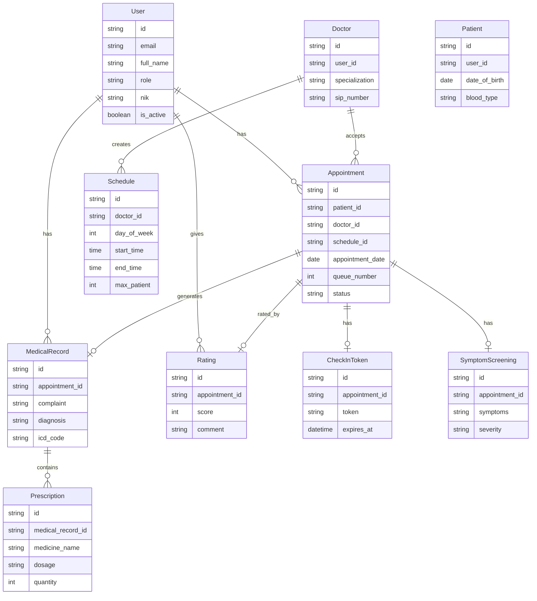
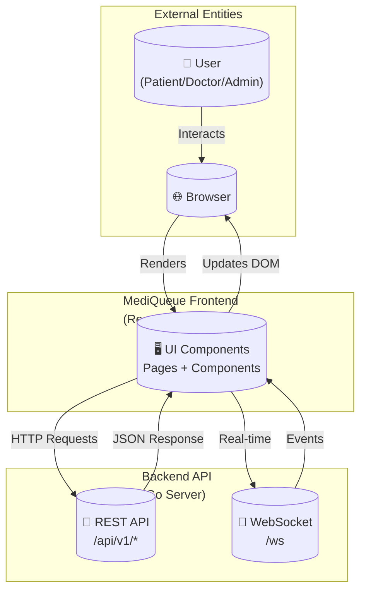
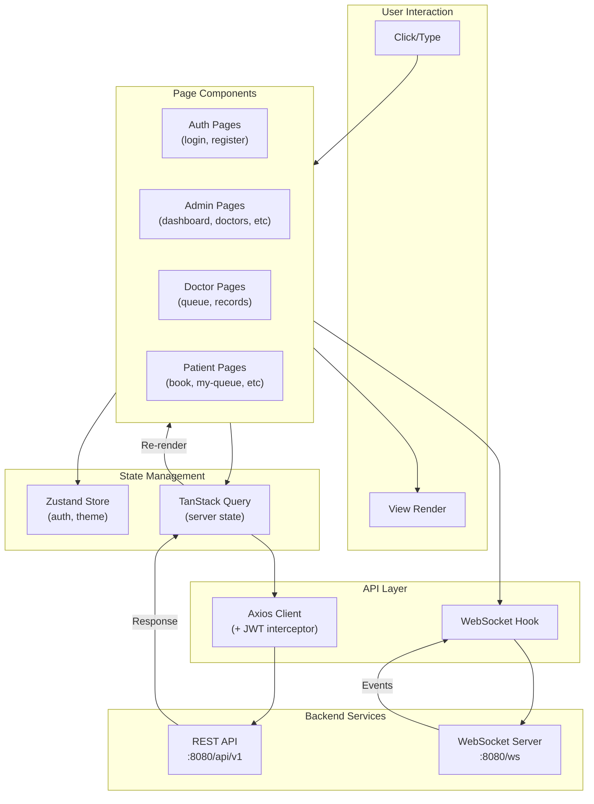
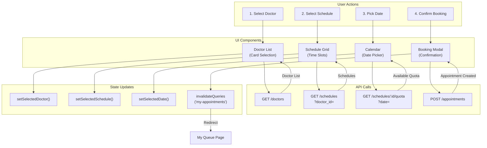

# MediQueue — Frontend Wiki

> React + TypeScript + Vite + TailwindCSS v4 frontend for MediQueue clinic queue system.

---

## 🚀 Technology Stack

| Library | Version | Purpose |
|---------|---------|---------|
| React | 19 | UI framework |
| TypeScript | ~6.0 | Type safety |
| Vite | ^8 | Build tool + dev server |
| TailwindCSS | v4 | Utility-first styling |
| React Router DOM | v7 | Client-side routing |
| TanStack Query | v5 | Server state + caching |
| Zustand | v5 | Global auth state + theme |
| Axios | v1 | HTTP client (with JWT interceptor) |
| Radix UI | Various | Accessible headless components |
| Recharts | v3 | Data charts for analytics |
| Lucide React | v1 | Icon library |
| date-fns | v4 | Date utilities |

---

## 📁 Folder Structure

```
frontend/src/
│
├── api/                       ← Axios API functions per domain
│   ├── auth.ts                  login, register, updateProfile
│   ├── appointments.ts          CRUD + status + cancel + reschedule ⭐
│   ├── dashboard.ts             Stats per role
│   ├── doctors.ts               Doctor list + CRUD
│   ├── schedules.ts             Schedule list + CRUD
│   ├── patients.ts              Patient list
│   ├── medical-records.ts       Records + prescriptions
│   ├── analytics.ts             Analytics data for charts      ⭐
│   ├── ratings.ts               Doctor rating system           ⭐
│   ├── checkin.ts               QR check-in API                ⭐
│   └── symptom-screening.ts     Symptom pre-screening API      ⭐
│
├── components/
│   ├── layout/
│   │   ├── main-layout.tsx      ← Sidebar + TopBar + Outlet
│   │   └── sidebar.tsx          ← Collapsible sidebar (role-aware nav)
│   ├── shared/
│   │   ├── protected-route.tsx  ← RBAC route guard
│   │   ├── star-rating.tsx      ← Star rating component         ⭐
│   │   └── symptom-screening-form.tsx ← Symptom form            ⭐
│   └── ui/                    ← Reusable primitives
│       ├── badge.tsx
│       ├── button.tsx
│       ├── card.tsx
│       ├── dialog.tsx
│       ├── input.tsx
│       ├── textarea.tsx
│       ├── toast.tsx
│       └── toaster.tsx
│
├── hooks/
│   ├── use-toast.ts           ← Toast notification helper
│   └── use-websocket.ts       ← WebSocket hook for real-time   ⭐
│
├── lib/
│   ├── axios.ts               ← Axios instance + JWT interceptor
│   └── utils.ts               ← cn(), formatDate(), etc.
│
├── pages/
│   ├── auth/
│   │   ├── login.tsx          ← Split-screen login page
│   │   └── register.tsx       ← Patient registration
│   │
│   ├── admin/
│   │   ├── dashboard.tsx      ← Stats + live queue table + quick actions
│   │   ├── doctors.tsx        ← Doctor CRUD table
│   │   ├── schedules.tsx      ← Schedule management
│   │   ├── patients.tsx       ← Patient directory
│   │   ├── appointments.tsx   ← All-clinic appointments view + Export PDF ⭐
│   │   ├── users.tsx          ← User account management
│   │   ├── analytics.tsx      ← Analytics dashboard with charts  ⭐
│   │   └── tv-display.tsx     ← Full-screen live queue board (no sidebar)
│   │
│   ├── doctor/
│   │   ├── dashboard.tsx      ← Doctor stats + today summary
│   │   ├── queue.tsx          ← Kanban: Waiting | In Progress | Done
│   │   ├── medical-record-form.tsx  ← Diagnosis + prescription form
│   │   └── medical-records.tsx     ← All records by this doctor
│   │
│   ├── patient/
│   │   ├── dashboard.tsx      ← Welcome + stats + recent appointments
│   │   ├── book-appointment.tsx  ← Book flow: doctor → schedule → date
│   │   ├── my-queue.tsx       ← Live queue + QR Code + Rating     ⭐
│   │   ├── medical-history.tsx  ← Past visits + prescriptions + PDF Download ⭐
│   │   └── settings.tsx       ← Edit profile
│   │
│   └── public/
│       └── check-in.tsx       ← QR check-in page (no auth)       ⭐
│
├── store/
│   ├── auth-store.ts          ← Zustand: user, token, login(), logout()
│   └── theme-store.ts         ← Zustand: dark mode persistence   ⭐
│
├── types/
│   └── index.ts               ← Shared TypeScript interfaces
│
├── App.tsx                    ← Router + QueryClient + Toaster
├── main.tsx                   ← ReactDOM.createRoot
└── index.css                  ← Design system + CSS tokens + animations
```

---

## 🗄️ Frontend Data Model

### Entity Relationship Diagram (Frontend View)



---

## 📊 Data Flow Diagram (DFD)

### Level 0 - Context Diagram



---

### Level 1 - Frontend Architecture



---

### Level 2 - Patient Booking Flow



---

## 🔐 Authentication Flow

```
User visits /
   │
   ├── Not logged in → /login
   │      │
   │      └── POST /auth/login
   │              ↓ { token, user }
   │              ↓ Zustand.login(user, token)
   │              ↓ Axios interceptor attaches token
   │              └── Navigate to /[role]/dashboard
   │
   └── Logged in → Role redirect
        admin   → /admin/dashboard
        doctor  → /doctor/dashboard
        patient → /patient/dashboard
```

### ProtectedRoute Guard

```tsx
// App.tsx pattern
<Route element={<ProtectedRoute allowedRoles={['admin']} />}>
  <Route element={<MainLayout />}>
    <Route path="/admin/dashboard" element={<AdminDashboard />} />
  </Route>
</Route>
```

---

## 🎨 Design System

### Color Tokens (index.css :root)

| Token | HSL Value | Usage |
|-------|-----------|-------|
| `--primary` | `199 89% 48%` | Buttons, active nav, badges |
| `--success` | `152 69% 40%` | Completed status |
| `--warning` | `38 92% 50%` | Waiting status |
| `--destructive` | `0 84.2% 60.2%` | Cancel/error |
| `--sidebar-background` | `220 27% 14%` | Sidebar bg |
| `--radius` | `0.75rem` | Global border radius |

### Utility Classes

| Class | Effect |
|-------|--------|
| `.gradient-primary` | Blue-to-indigo gradient bg |
| `.gradient-success` | Emerald gradient bg |
| `.gradient-warning` | Amber gradient bg |
| `.gradient-danger` | Red gradient bg |
| `.gradient-purple` | Purple gradient bg |
| `.glass` | White 8% + blur-16 backdrop |
| `.glass-card` | White 82% + blur-12 card |
| `.glass-dark` | Dark + blur overlay |
| `.gradient-text` | Animated shimmer text |
| `.card-hover` | Lift + shadow on hover |
| `.skeleton` | Loading shimmer placeholder |
| `.stagger-item` | Fade + slide-up entry |
| `.number-animate` | Bounce-in for stat numbers |
| `.dot-pulse` | Pulsing live status dot |
| `.float-anim` | Gentle floating animation |
| `.glow-primary` | Blue glow box-shadow |
| `.queue-call-anim` | Pulsing ring for active queue |
| `.shake` | Error shake animation |
| `.slide-in-bottom` | Slide up entry for panels |
| `.hide-scrollbar` | Hide scrollbar utility |

### Animations Available

- `fadeSlideUp` — main page entry
- `scaleIn` — modal content
- `overlayShow` — modal overlay
- `numberPop` — stats counter reveal
- `shimmer` — gradient text cycling
- `skeleton-loading` — loading placeholder
- `float` — floating decoration
- `shake` — error feedback
- `ticker` — bottom ticker tape
- `queueCall` — pulsing active queue ring
- `bounceIn` — alert/badge pop-in

---

## ⚡ Data Fetching Patterns

### Standard Query
```tsx
const { data, isLoading } = useQuery({
  queryKey: ['resource', param],
  queryFn: () => resourceApi.getAll({ page: 1, per_page: 10 }),
  refetchInterval: 30_000, // optional auto-refresh
})

const items = data?.data?.data ?? []
```

### Standard Mutation
```tsx
const mutation = useMutation({
  mutationFn: (payload: CreateDto) => resourceApi.create(payload),
  onSuccess: () => {
    queryClient.invalidateQueries({ queryKey: ['resource'] })
    toast.success('Berhasil!', 'Data berhasil disimpan.')
  },
  onError: () => {
    toast.error('Gagal', 'Terjadi kesalahan.')
  }
})

// Call it
mutation.mutate({ name: 'New Item' })
```

### refetchInterval Recommendations

| Page | Interval | Reason |
|------|----------|--------|
| TV Display | 5s | Real-time queue board |
| Doctor Queue | 10s | Near-real-time queue management |
| Admin Dashboard | 15–30s | Live stats |
| Patient Dashboard | 30s | Occasional status changes |
| Tables (doctors, patients, etc.) | None | Static data |

---

## 🗂️ State Management

### Zustand Auth Store

```ts
// store/auth-store.ts
interface AuthState {
  user: User | null        // full user object
  token: string | null     // JWT token
  isAuthenticated: boolean // derived
  login(user, token): void  // saves to localStorage
  logout(): void            // clears state + localStorage
}
```

### Zustand Theme Store

```ts
// store/theme-store.ts
interface ThemeState {
  isDark: boolean
  toggle(): void
}
```

The Axios instance reads the token from `localStorage` on every request:
```ts
// lib/axios.ts
instance.interceptors.request.use((config) => {
  const token = localStorage.getItem('token')
  if (token) config.headers.Authorization = `Bearer ${token}`
  return config
})
```

---

## 📄 Pages Summary

### Auth Pages
| Page | Route | Description |
|------|-------|-------------|
| Login | `/login` | Split-screen auth with demo accounts & floating icons |
| Register | `/register` | Patient self-registration form |

### Admin Pages
| Page | Route | Description |
|------|-------|-------------|
| Dashboard | `/admin/dashboard` | Stats cards + live queue + quick actions |
| Doctors | `/admin/doctors` | CRUD table: add, edit, delete doctors |
| Schedules | `/admin/schedules` | Practice schedule management |
| Patients | `/admin/patients` | Read-only patient directory |
| Appointments | `/admin/appointments` | All-clinic queue view + Export PDF ⭐ |
| Users | `/admin/users` | Activate/deactivate user accounts |
| Analytics | `/admin/analytics` | Charts: daily trends, peak hours ⭐ |
| TV Display | `/admin/tv-display` | Full-screen queue board (no sidebar) |

### Doctor Pages
| Page | Route | Description |
|------|-------|-------------|
| Dashboard | `/doctor/dashboard` | Stats + today's queue summary |
| Queue | `/doctor/queue` | Kanban board: Waiting / In Progress / Done |
| Medical Records | `/doctor/medical-records` | All records created by this doctor |

### Patient Pages
| Page | Route | Description |
|------|-------|-------------|
| Dashboard | `/patient/dashboard` | Welcome banner + stats + recent queue |
| Book | `/patient/book` | Step-by-step booking wizard |
| My Queue | `/patient/my-queue` | Live queue + QR Code + Rating ⭐ |
| Medical History | `/patient/medical-history` | Past visits + prescriptions + PDF Download ⭐ |
| Settings | `/patient/settings` | Edit profile data |

### Public Pages
| Page | Route | Description |
|------|-------|-------------|
| Check-in | `/check-in` | QR token check-in (no auth required) ⭐ |

---

## 🌐 API Integration

### API Base URL Configuration

```ts
// vite.config.ts
export default defineConfig({
  plugins: [react()],
  server: {
    proxy: {
      '/api': {
        target: 'http://localhost:8080',
        changeOrigin: true,
      },
    },
  },
})
```

### Environment Variables

Create `.env` file:
```env
VITE_API_URL=http://localhost:8080/api/v1
VITE_WS_URL=ws://localhost:8080
```

---

## 🚀 Running the Frontend

```bash
cd frontend/

# Install dependencies
npm install

# Start development server
npm run dev
# → http://localhost:5173

# Type-check
npx tsc --noEmit

# Build for production
npm run build
```

> **Proxy:** `vite.config.ts` proxies `/api/*` to `http://localhost:8080`. Ensure backend is running first.

---

## ➕ Adding a New Page (Checklist)

- [ ] Create `src/pages/[role]/new-page.tsx`
- [ ] Add API call in `src/api/[resource].ts` if needed
- [ ] Add TypeScript type in `src/types/index.ts` if needed
- [ ] Register route in `App.tsx` under correct `ProtectedRoute` + `MainLayout`
- [ ] Add nav item in `sidebar.tsx` `navItems` array for the correct role
- [ ] Add path label in `main-layout.tsx` `pathLabels` map for breadcrumb
- [ ] Follow the standard page layout pattern (see below)

### Standard Page Template

```tsx
import { useQuery } from '@tanstack/react-query'
import { Card, CardContent, CardHeader, CardTitle } from '@/components/ui/card'

export default function MyPage() {
  const { data, isLoading } = useQuery({
    queryKey: ['my-data'],
    queryFn: () => myApi.getAll(),
  })
  const items = data?.data?.data ?? []

  return (
    <div className="space-y-6">
      {/* Page Header */}
      <div>
        <h1 className="text-2xl sm:text-3xl font-bold text-slate-900 tracking-tight">
          Page Title
        </h1>
        <p className="text-slate-500 mt-1">Page description</p>
      </div>

      {/* Stat Cards */}
      <div className="grid grid-cols-1 sm:grid-cols-3 gap-4">
        {/* ... */}
      </div>

      {/* Main Content Card */}
      <Card className="border-0 shadow-sm">
        <CardHeader>
          <CardTitle>Section Title</CardTitle>
        </CardHeader>
        <CardContent>
          {isLoading ? (
            <div className="space-y-3">
              {[...Array(3)].map((_, i) => (
                <div key={i} className="h-12 skeleton rounded-xl" />
              ))}
            </div>
          ) : items.length === 0 ? (
            <div className="text-center py-12 text-slate-400">
              <p className="font-medium">Tidak ada data</p>
            </div>
          ) : (
            <div className="space-y-3">
              {items.map((item, idx) => (
                <div
                  key={item.id}
                  className="stagger-item p-4 rounded-xl border border-slate-100 hover:shadow-sm transition-all"
                  style={{ animationDelay: `${idx * 60}ms` }}
                >
                  {/* Item content */}
                </div>
              ))}
            </div>
          )}
        </CardContent>
      </Card>
    </div>
  )
}
```

---

## 💡 Innovation Features Guide

### 1. WebSocket (Real-time Queue) ⭐

```tsx
// hooks/use-websocket.ts
import { useEffect, useRef } from 'react'
import { useQueryClient } from '@tanstack/react-query'

export function useWebSocket(url: string) {
  const queryClient = useQueryClient()
  const wsRef = useRef<WebSocket | null>(null)

  useEffect(() => {
    wsRef.current = new WebSocket(url)
    
    wsRef.current.onmessage = (event) => {
      const data = JSON.parse(event.data)
      // Invalidate relevant queries based on event type
      if (data.type === 'queue_update') {
        queryClient.invalidateQueries({ queryKey: ['appointments'] })
      }
    }

    return () => wsRef.current?.close()
  }, [url])
}
```

### 2. QR Code Check-in ⭐

```tsx
// Generate QR Code
const response = await fetch(`${API_URL}/appointments/${id}/qr`, {
  headers: { 'Authorization': `Bearer ${token}` }
})
const blob = await response.blob()
const qrImageUrl = URL.createObjectURL(blob)

// Check-in via token
const checkIn = async (token: string) => {
  await fetch(`${API_URL}/check-in/${token}`, { method: 'PATCH' })
}
```

### 3. Dark Mode Toggle ⭐

```tsx
// store/theme-store.ts
import { create } from 'zustand'
import { persist } from 'zustand/middleware'

export const useThemeStore = create(
  persist(
    (set) => ({
      isDark: false,
      toggle: () => set((state) => {
        const newDark = !state.isDark
        document.documentElement.classList.toggle('dark', newDark)
        return { isDark: newDark }
      }),
    }),
    { name: 'theme-store' }
  )
)
```

### 4. PDF Export ⭐

```tsx
// Download medical record as PDF
const downloadPDF = async (recordId: string) => {
  const response = await fetch(`${API_URL}/medical-records/${recordId}/pdf`, {
    headers: { 'Authorization': `Bearer ${token}` }
  })
  const blob = await response.blob()
  const url = URL.createObjectURL(blob)
  const a = document.createElement('a')
  a.href = url
  a.download = `medical_record.pdf`
  a.click()
}
```

### 5. Doctor Rating System ⭐

```tsx
// components/shared/star-rating.tsx
function StarRating({ rating, onChange, interactive = false }) {
  return (
    <div className="flex gap-1">
      {[1, 2, 3, 4, 5].map((star) => (
        <button
          key={star}
          onClick={() => interactive && onChange?.(star)}
          className={cn(
            "transition-colors",
            star <= rating ? "text-yellow-400" : "text-slate-200"
          )}
        >
          <Star className="size-5 fill-current" />
        </button>
      ))}
    </div>
  )
}
```

---

## 📋 Features Implemented

| # | Feature | Status |
|---|---------|--------|
| 1 | Real-time WebSocket Queue | ✅ |
| 2 | QR Code Patient Check-in | ✅ |
| 3 | Doctor Rating System | ✅ |
| 4 | Analytics Dashboard | ✅ |
| 5 | PDF Export (Medical Records) | ✅ |
| 6 | Dark Mode Toggle | ✅ |
| 7 | Estimated Wait Time | ✅ |
| 8 | Appointment Reschedule UI | ✅ |
| 9 | Mobile Responsive Design | ✅ |
| 10 | PWA Ready | ✅ |

---

## 🔧 Troubleshooting

### Common Issues

1. **CORS Error**
   - Ensure backend is running on port 8080
   - Check `vite.config.ts` proxy settings

2. **Authentication Issues**
   - Clear localStorage: `localStorage.clear()`
   - Re-login to get fresh token

3. **Build Errors**
   - Run `npm install` to update dependencies
   - Check TypeScript errors: `npx tsc --noEmit`

4. **WebSocket Connection Failed**
   - Ensure backend WebSocket is running
   - Check `VITE_WS_URL` environment variable

---

## 📝 License

MIT License - MediQueue 2026

---

*MediQueue Frontend Wiki · v2.0 · May 2026*