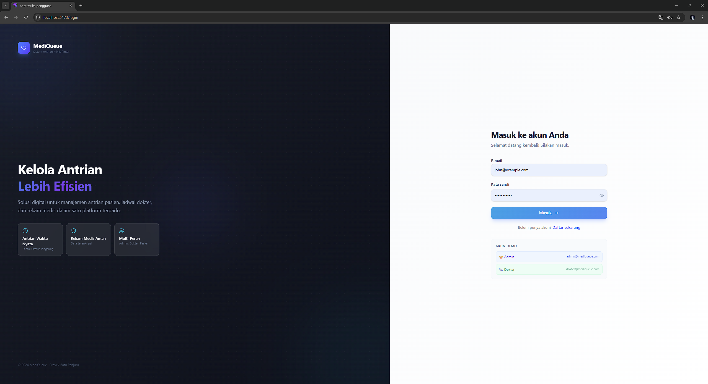
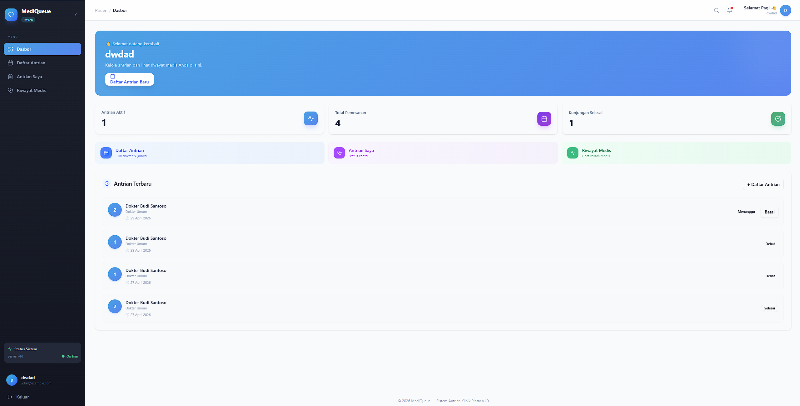
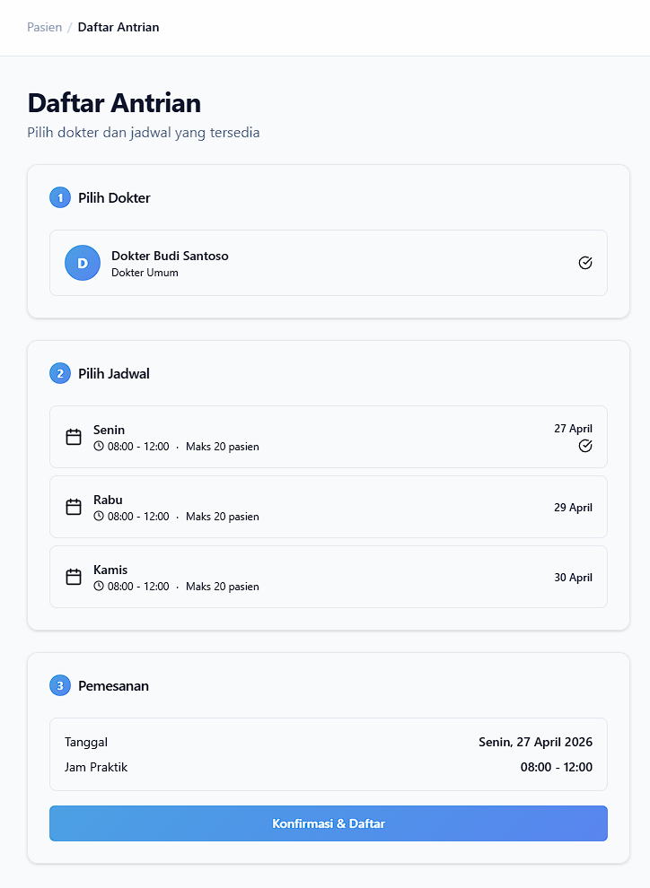
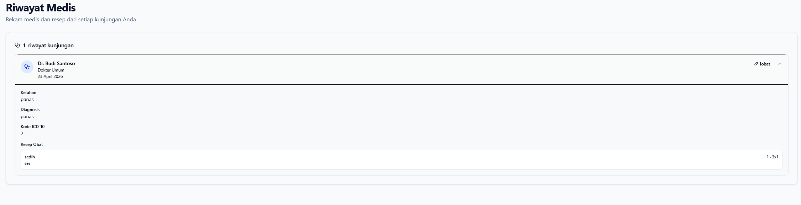

# MediQueue - Frontend Wiki

Sistem antarmuka pengguna (UI/UX) untuk aplikasi MediQueue. Dirancang menggunakan teknologi web modern untuk memberikan pengalaman pengguna yang cepat, dinamis, dan responsif (Mobile-Friendly).

## 🚀 Teknologi yang Digunakan
*   **Core:** React 18, TypeScript, Vite
*   **State Management (Server):** `@tanstack/react-query` (Caching & Auto-refetching API)
*   **State Management (Client):** `zustand` (Manajemen Session & Auth)
*   **Routing:** `react-router-dom` v6
*   **Styling:** Tailwind CSS & komponen `shadcn/ui` (Radix UI)
*   **Ikonografi:** `lucide-react`
*   **HTTP Client:** `axios`

---

## 📁 Struktur Folder

```text
frontend/
├── public/            # Aset statis seperti favicon.
├── src/
│   ├── api/           # Konfigurasi Axios & pemanggilan endpoints API Backend.
│   ├── components/    # Komponen React yang dapat digunakan ulang (Re-usable).
│   │   ├── layout/    # Komponen Sidebar, MainLayout, Navbar.
│   │   ├── shared/    # Komponen global seperti ProtectedRoute.
│   │   └── ui/        # Komponen UI dasar dari Shadcn (Button, Card, Input, Badge, dll).
│   ├── hooks/         # Custom React hooks (contoh: use-toast untuk notifikasi popup).
│   ├── lib/           # Fungsi utilitas (formatting tanggal, penggabungan CSS classes `cn()`).
│   ├── pages/         # Halaman aplikasi, dipisahkan berdasarkan Role (Auth, Admin, Doctor, Patient).
│   ├── store/         # Zustand global state (Auth Store untuk menyimpan Data User & Token).
│   ├── types/         # Definisi interface TypeScript (Type Checking).
│   ├── App.tsx        # Konfigurasi Routing Utama & Guard Role.
│   ├── index.css      # Custom CSS & Tailwind Directives.
│   └── main.tsx       # Entry point React.
```

---

## 🎨 Fitur UI/UX Unggulan

1.  **Role-Based Layouts:** 
    Aplikasi memisahkan alur navigasi berdasarkan 3 role (Admin, Dokter, Pasien). Pengguna akan otomatis diarahkan ke *Dashboard* yang sesuai setelah Login.
2.  **Dynamic Mobile Sidebar:** 
    Tampilan responsif dengan *sidebar* yang meluncur dari kiri pada perangkat seluler, dan dapat menutup otomatis saat link ditekan.
3.  **Real-time UI Updates:** 
    Dengan `TanStack Query`, data antrian pasien dan riwayat akan otomatis diperbarui (*cache invalidation*) setiap kali ada aksi (seperti mendaftar atau membatalkan antrian) tanpa perlu memuat ulang halaman secara penuh.
4.  **Auto Polling Notification:**
    Halaman Dokter dilengkapi fitur *polling* (*refetch interval* 10 detik) untuk mendeteksi pasien baru yang mendaftar pada hari tersebut, kemudian memunculkan *Pop-up Toast* notifikasi secara *real-time*.
5.  **Custom Interactive Modals:**
    Aplikasi menggunakan interaksi modern (bukan pop-up alert bawaan browser), seperti Modal Detail Antrian dan Modal Konfirmasi Batal.

---

## 🗺 Peta Halaman (Routing)

*   `/login` & `/register` : Halaman Autentikasi Publik.
*   **Khusus Admin:**
    *   `/admin/dashboard` : Statistik klinik harian.
    *   `/admin/doctors` : Kelola daftar dokter.
    *   `/admin/patients` : Lihat direktori pasien.
    *   `/admin/schedules` : Mengatur hari dan jam buka praktek dokter.
    *   `/admin/appointments` : Memantau seluruh antrian berjalan.
*   **Khusus Dokter:**
    *   `/doctor/dashboard` : Statistik ringkas dokter.
    *   `/doctor/queue` : Fitur utama dokter (Mengubah status pasien, memulai konsultasi, menyelesaikan antrian).
    *   `/doctor/medical-records` : Mengisi dan melihat rekam medis + resep obat.
*   **Khusus Pasien:**
    *   `/patient/dashboard` : Halaman awal pasien dengan *quick actions*.
    *   `/patient/book` : Mengambil nomor antrian berdasarkan dokter, jadwal (hari), dan kuota yang tersedia.
    *   `/patient/my-queue` : Status antrian saat ini (Menunggu/Ditangani).
    *   `/patient/medical-history` : Melihat hasil pemeriksaan dan resep obat yang telah selesai.

---

## 🛠 Cara Menjalankan Aplikasi

1.  Pastikan Server Backend (Golang) sudah menyala di `http://localhost:8080`.
2.  Buka terminal di folder `frontend/`.
3.  Jalankan perintah:
    ```bash
    npm install
    npm run dev
    ```
4.  Buka browser dan akses `http://localhost:5173`.



